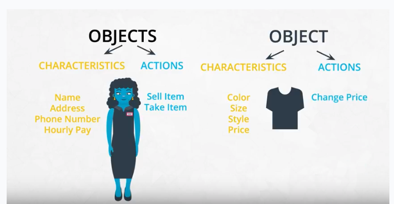

# Udacity Data Science Nanodegree: Introduction

These are my personal notes taken while following the [Udacity Data Science Nanodegree](https://www.udacity.com/course/data-scientist-nanodegree--nd025).

The Nanodegree asssumes basic data analysis skills with python libraries (pandas, numpy, matplotlib, sklearn, etc.) and has 5 modules that build up on those skills:

1. Introduction to Data Science
2. Software Engineering
3. Data Engineering
4. Experimental Design & Recommendations
5. Data Scientist Capstone

This folder & guide refer to the **second module**: Software Engineering.

Mikel Sagardia, 2022.
No guarantees.

Overview of Contents:

1. [Introduction to Software Engineering](#1.-Introduction-to-Software-Engineering)
2. [Software Engineering Pratices Part 1](#2.-Software-Engineering-Pratices-Part-1)
3. [Software Engineering Pratices Part 2](#3.-Software-Engineering-Pratices-Part-2)
4. [Introduction to Object Oriented Programming & Python Packages](#4.-Introduction-to-Object-Oriented-Programming-&-Python-Packages)
	- [4.1 Procedural vs. Object Oriented Programming](4.1-Procedural-vs.-Object-Oriented-Programming)
	- [4.2 OOP Syntax in Python](#4.2-OOP-Syntax-in-Python)
		- [Getters & Setters](#Getters-&-Setters)
	- [4.3 Commenting Object-Oriented Code](#4.3-Commenting-Object-Oriented-Code)
	- [4.4 Gaussian and Binomial Distirbutions](#4.4-Gaussian-and-Binomial-Distirbutions)
		- Gaussian Distribution
		- Binomial Distribution
	- [4.5 A Gaussian Class Implementation](#4.5-A-Gaussian-Class-Implementation)
	- [4.6 Magic Methods: Application to the Summation of Gaussians](#4.6-Magic-Methods:-Application-to-the-Summation-of-Gaussians)
	- [4.7 Inheritance](#4.7-Inheritance)
		- Gaussian Class and Virtual Methods
	- [4.8 More OOP Concepts](#4.8-More-OOP-Concepts)
		- Polymorphism
		- Class Methods, Instance Methods, Static Methods
		- Class Attributes, Instance Attributes
		- Multiple Inheritance and Mixins
		- Python Decorators
5. Portfolio Exercise: Upload a Package to PyPi
6. Web Development
7. Portfolio Exercise: Deploy a Data Dashboard

## 1. Introduction to Software Engineering

This module has 3 major parts and 2 projects that are not compulsory.

Parts:

1. Software Engineering
2. Object Oriented Programming
3. Web Development

Projects:

1. PyPi Package
2. Data Dashboard

The first part is 1:1 the first module of the [Udacity Nanodegree Machine Learning DevOps Engineer](https://www.udacity.com/course/machine-learning-dev-ops-engineer-nanodegree--nd0821). My notes and practice exercises can be found in this repository:

[mlops_udacity](https://github.com/mxagar/mlops_udacity) `/ 01_Clean_Code`

In order to be up to date with the Web Development requirements, I also watched and made notes on the following course:

[Intro to HTML and CSS](https://learn.udacity.com/courses/ud001)

My notes can be found in my Jekyll guide repo:

[jekyll_web_guide](https://github.com/mxagar/jekyll_web_guide) `/ html_css_bootstrap_guide.md`

The notes are linked on my local computer in the upper folder.

## 2. Software Engineering Pratices Part 1

This section is fully covered in the [Udacity Nanodegree Machine Learning DevOps Engineer](https://www.udacity.com/course/machine-learning-dev-ops-engineer-nanodegree--nd0821). My notes and practice exercises can be found in this repository:

[mlops_udacity](https://github.com/mxagar/mlops_udacity) `/ 01_Clean_Code`

Topics:

- Clean, efficient and modular code
- Documentation: Code & READMEs
- Git Version Control: Working with Teams

## 3. Software Engineering Pratices Part 2

This section is fully covered in the [Udacity Nanodegree Machine Learning DevOps Engineer](https://www.udacity.com/course/machine-learning-dev-ops-engineer-nanodegree--nd0821). My notes and practice exercises can be found in this repository:

[mlops_udacity](https://github.com/mxagar/mlops_udacity) `/ 01_Clean_Code`

Topics:

- Testing with `pytest`
- Logging
- Code reviews

## 4. Introduction to Object Oriented Programming & Python Packages

This section has two parts:

1. Object Oriented Programming (OOP)
2. How to build python packages

OOP brings two important advantages:

1. We can write modular programs that can scale more easily.
2. The implementation can be hidden to the user, so that they focus on the functionality.

The ultimate practical goal of the section is to build a Gaussian distirbution class which will be set up as a package and uploaded to PyPi.

Even though the link to the repository with examples provided by Udacity is broken, I found and forked it: [udacity-cd0171--software-engineering-for-data-scientists](https://github.com/mxagar/udacity-cd0171--software-engineering-for-data-scientists).

### 4.1 Procedural vs. Object Oriented Programming

In procedural programming we have variables and functions, which either receive those variables or define new ones in them.

In Object Oriented Programming (OOP), code is **encapsulated** in classes, which are **instantiated** in objects. Classes are like generic blueprints that have:

- Characteristics: **attributes** = variables or other complex objects.
- Actions: **methods** = functions that perform procedures expected from the object.




### 4.2 OOP Syntax in Python

```python
# Class definition.
# Always capitalize class names!
# Note: __init__(), self
class Shirt:
	def __init__(self, shirt_color, shirt_size, shirt_size, shirt_price):
		self.color=  shirt_color
		self.size =  shirt_size
		self.style = shirt_style
		self.price = shirt_price

	def change_price(self, new_price):
		self.price = new_price

	def discount(self, discount):
		return self.price * (1-discount)

# Object instantiation: __init__() is the constructor
Shirt('red', 'S', 'short sleeve', 15)

# Object instatiation: object is stored in a variable
new_shirt = Shirt('red', 'S', 'short sleeve', 15)

# We can access the attributes of the objects
print(new_shirt.color)
print(new_shirt.size)
print(new_shirt.style)
print(new_shirt.price)

# Use methods of the object/class
new_shirt.change_price(10)
print(new_shirt.price
print(new_shirt.discount_price(.2))

# Another object
shirt_two = Shirt('orange', 'L', 'short-sleeve', 10)

# Working with two objects
total = shirt_one.price + shirt_two.price
total_discount =  shirt_one.discount(.14) + shirt_two.discount(.06) 

# We can build arrays or other structures that contain objects
tshirt_collection = []
shirt_one = Shirt('orange', 'M', 'short sleeve', 25)
shirt_two = Shirt('red', 'S', 'short sleeve', 15)
shirt_three = Shirt('purple', 'XL', 'short sleeve', 10)
tshirt_collecetion.append(shirt_one)
tshirt_collecetion.append(shirt_two)
tshirt_collecetion.append(shirt_three)

for i in range(tshirt_collection)):
	print (tshirt_collection[i].color)
```

Important notes:

- Capitalize class names.
- `__init__()` is used as a constructor, when classes are instantiated.
- `self` is like a dictionary that holds all attributes & methods and makes them available throughout the class; but all functions need to receive it as the first argument if they want to access the attributes. Behind the scenes, `self` also contains the memory address where the object is located; thus, when a method of a class is called in an instantiated object, the class knows which specific values to catch through `self`.
- Classes are usually defined in python modules/scripts, e.g., `shirt.py`, and we import them: `from shirt import Shirt`.

#### Getters & Setters

In python, the class/object arributes are public: they can be accessed directly: `shirt_one.price`. However, we should write setter and getter functions to access them. Examples why this matters:

1. If we want to get/set the price, the user should not care about any conversions to be made, e.g., EUR <-> USD; now, we might internally modify how prices are stored (EUR/USD), so any conversion should be done by `get_price()` or `set_price()`.
2. What if the attribute is a container of some type (e.g., a set) but we want to return it as another type (e.g., a list). That conversion should be hidden from the user.

Even though all attributes are always public in python, a widespread convenction is to prefix an attribute with `_` when the programmer wants the user to use the associated getters/setters:

```python
# Price is preceded by _ to denote we should use
# its associated getters/setters
class Shirt:
    def __init__(self, shirt_color, shirt_size, shirt_style, shirt_price):
        self._price = shirt_price
		self.color=  shirt_color
		self.size =  shirt_size
		self.style = shirt_style

    def get_price(self):
    	return self._price

    def set_price(self, new_price):
    	self._price = new_price

# However, _price is still accessible
shirt_one = Shirt('yellow', 'M', 'long-sleeve', 15)
shirt_one._price = 12
```

### 4.3 Commenting Object-Oriented Code

Interesting link on how to write docstrings: [Example Google Style Python Docstrings](https://sphinxcontrib-napoleon.readthedocs.io/en/latest/example_google.html)

Notes:

- Document modules, functions and classes.
- Mind the indentation; e.g., in classes, indent the class docstring.
- In functions: args & returns; additionally, write types.

Follow this blueprint:

```python
class Pants:
    """The Pants class represents an article of clothing sold in a store
    """

    def __init__(self, color, waist_size, length, price):
        """Method for initializing a Pants object

        Args: 
            color (str)
            waist_size (int)
            length (int)
            price (float)

        Attributes:
            color (str): color of a pants object
            waist_size (str): waist size of a pants object
            length (str): length of a pants object
            price (float): price of a pants object
        """

        self.color = color
        self.waist_size = waist_size
        self.length = length
        self.price = price

    def change_price(self, new_price):
        """The change_price method changes the price attribute of a pants object

        Args: 
            new_price (float): the new price of the pants object

        Returns: None

        """
        self.price = new_price

    def discount(self, percentage):
        """The discount method outputs a discounted price of a pants object

        Args:
            percentage (float): a decimal representing the amount to discount

        Returns:
            float: the discounted price
        """
        return self.price * (1 - percentage)
```

### 4.4 Gaussian and Binomial Distirbutions

We want to build a Gaussian distribution class and upload it to PyPi. The package will be able to:

- Read in dataset
- Calculate mean
- Calculate the standard deviation
- Plot histogram
- Plot probability density function
- Add two Gaussian distributions

We need to extend the package to handle binomial distirbutions, too.

#### Gaussian Distribution

Probability density function:

`f(x; m, s) = (1/sqrt(2*pi*s^2)) * exp(-((x-m)^2)/(2*s^2))`

#### Binomial Distribution

`mean = n * p`

> A fair coin has a probability of a positive outcome (heads) p = 0.5. If you flip a coin 20 times, the mean would be 20 * 0.5 = 10; you'd expect to get 10 heads.

`variance = n * p*(1−p)`

Probability mass function: [Binomial distribution](https://en.wikipedia.org/wiki/Binomial_distribution).

`f(k,n,p) = (n!/(k!*(n-k)!)) * p^k * (1-p)^(n-k)`

> Assume that 15% of the population is allergic to cats. If you randomly select 60 people for a medical trial, what is the probability that 7 of those people are allergic to cats?

p = 0.15
n = 60
k = 7 (often called x)

`f = 60!/7!*53! * (0.15)^7 * (0.85)^53 = 0.12`.

### 4.5 A Gaussian Class Implementation

We need to implement the following functions of the `Gaussian` class:

	init
	calculate_mean
	calculate_std_dev
	read_data_file
	pdf
	plot_histogram
	plot_histogram_pdf

Notes:

- In an instantiated class, both attributes and methods of the class object are accessed via `self`.
- Use default argument values.

The final code:

```python
import math
import matplotlib.pyplot as plt

class Gaussian():
    """ Gaussian distribution class for calculating and 
    visualizing a Gaussian distribution.
    
    Attributes:
        mean (float) representing the mean value of the distribution
        stdev (float) representing the standard deviation of the distribution
        data_list (list of floats) a list of floats extracted from the data file
    """
    def __init__(self, mu = 0, sigma = 1):
        self.mean = mu
        self.stdev = sigma
        self.data = []
        self.epsilon = 1e-6

    def calculate_mean(self):    
        """Method to calculate the mean of the data set.
        
        Args: 
            None
        Returns: 
            float: mean of the data set
        """
        #TODO: Calculate the mean of the data set. Remember that the data set is stored in self.data
        # Change the value of the mean attribute to be the mean of the data set
        # Return the mean of the data set           
        mu = 0
        for d in self.data:
            mu += d
        self.mean = mu/len(self.data)
        
        return self.mean

    def calculate_stdev(self, sample=True):
        """Method to calculate the standard deviation of the data set.
        
        Args: 
            sample (bool): whether the data represents a sample or population
        Returns: 
            float: standard deviation of the data set
        """
        # TODO:
        #   Calculate the standard deviation of the data set
        #   
        #   The sample variable determines if the data set contains a sample or a population
        #   If sample = True, this means the data is a sample. 
        #   Keep the value of sample in mind for calculating the standard deviation
        #
        #   Make sure to update self.stdev and return the standard deviation as well    
        self.sample = sample
        if math.fabs(self.mean) < self.epsilon:
            self.calculate_mean()
        sigma = 0
        for d in self.data:
            sigma += math.pow((d-self.mean), 2)
        if self.sample:
            sigma /= len(self.data) - 1
        else:
            sigma /= len(self.data)
        sigma = math.sqrt(sigma)
        self.stdev = sigma

        return self.stdev

    def read_data_file(self, file_name, sample=True):    
        """Method to read in data from a txt file. The txt file should have
        one number (float) per line. The numbers are stored in the data attribute. 
        After reading in the file, the mean and standard deviation are calculated
                
        Args:
            file_name (string): name of a file to read from
        Returns:
            None
        """
        # This code opens a data file and appends the data to a list called data_list
        with open(file_name) as file:
            data_list = []
            line = file.readline()
            while line:
                data_list.append(int(line))
                line = file.readline()
        file.close()
        # TODO: 
        #   Update the self.data attribute with the data_list
        #   Update self.mean with the mean of the data_list. 
        #       You can use the calculate_mean() method with self.calculate_mean()
        #   Update self.stdev with the standard deviation of the data_list. Use the 
        #       calculate_stdev() method.
        self.data = data_list
        self.calculate_mean()
        self.calculate_stdev(sample=sample)
        
    def plot_histogram(self):
        """Method to output a histogram of the instance variable data using 
        matplotlib pyplot library.
        
        Args:
            None
        Returns:
            None
        """
        # TODO: Plot a histogram of the data_list using the matplotlib package.
        #       Be sure to label the x and y axes and also give the chart a title
        # make the plot
        fig = plt.figure()
        fig.hist(self.data, density=False)
        fig.set_title('Histogram of Data')
        fig.set_ylabel('Freq. / Count')
        plt.show()
    
    def pdf(self, x):
        """Probability density function calculator for the gaussian distribution.
        
        Args:
            x (float): point for calculating the probability density function
        Returns:
            float: probability density function output
        """
        # TODO: Calculate the probability density function of the Gaussian distribution
        #       at the value x. You'll need to use self.stdev and self.mean to do the calculation
        # `f(x; m, s) = (1/sqrt(2*pi*s^2)) * exp(-((x-m)^2)/(2*s^2))`
        v = math.pow(self.stdev,2)
        m = 1.0/math.sqrt(2.0*math.pi*v)
        f = m*math.exp(-math.pow((x-self.mean),2)/(2.0*v))

        return f

    def plot_histogram_pdf(self, n_spaces = 50):

        """Method to plot the normalized histogram of the data and a plot of the 
        probability density function along the same range
        
        Args:
            n_spaces (int): number of data points 
        
        Returns:
            list: x values for the pdf plot
            list: y values for the pdf plot
        """
        #TODO: Nothing to do for this method. Try it out and see how it works.
        mu = self.mean
        sigma = self.stdev

        min_range = min(self.data)
        max_range = max(self.data)
        
         # calculates the interval between x values
        interval = 1.0 * (max_range - min_range) / n_spaces

        x = []
        y = []
        
        # calculate the x values to visualize
        for i in range(n_spaces):
            tmp = min_range + interval*i
            x.append(tmp)
            y.append(self.pdf(tmp))

        # make the plots
        fig, axes = plt.subplots(2,sharex=True)
        fig.subplots_adjust(hspace=.5)
        axes[0].hist(self.data, density=True)
        axes[0].set_title('Normed Histogram of Data')
        axes[0].set_ylabel('Density')

        axes[1].plot(x, y)
        axes[1].set_title('Normal Distribution for \n Sample Mean and Sample Standard Deviation')
        axes[0].set_ylabel('Density')
        plt.show()

        return x, y
```

### 4.6 Magic Methods: Application to the Summation of Gaussians

Gaussians can be summed simply by summing their parameters:

	Gaussian_C = Gaussian_A + Gaussian_B
	mean_C = mean_A + mean_B
	var_C = var_A + var_B
	std_C = sqrt(var_C)

Python has special magic methods which allow to overload common operators defined for objects; among others, the `__add__` function implements the `+` operator, which can be used to sum to instantiated classes.

Examples for the `Gaussian` class:

```python
    def __add__(self, other):    
        """Magic method to add together two Gaussian distributions
        
        Args:
            other (Gaussian): Gaussian instance
        Returns:
            Gaussian: Gaussian distribution
        """
        result = Gaussian()
        result.mean = self.mean + other.mean
        result.stdev = math.sqrt(math.pow(self.stdev,2) + math.pow(other.stdev,2))
        
        return result

    def __repr__(self):
        """Magic method to output the characteristics of the Gaussian instance.
        
        Args:
            None
        Returns:
            string: characteristics of the Gaussian
        """
        return f"mean {self.mean}, standard deviation {self.stdev}"
```

We can check all the methods (including magic ones) of a type/class with `dir()`:

	dir(int)
	dir(Gaussian)

There are many magic methods; some of them are listed here:

- `__add__`: `+` operator
- `__repr__`: representation string of the object; invoked, for instance when just object is typed or when we `print()` the object.
- `__str__`: stringify an object; similar to `__repr__`.
- `__ge__`: `>=`.
- `__sub__`: `-`
- `__len__`: `len()`
- ...

More on the topic: [Python Magic Methods](https://www.tutorialsteacher.com/python/magic-methods-in-python).

### 4.7 Inheritance

With inheritance, we write the class of a high level class which is passed to more specific children classes; the main advantage is that we save writing code and a change in the parent class is reflected in all its children.

Notes:

- Inherit with `class Child(Parent)`.
- Remember calling the `__init__` of the `Parent` in the `__init__` of the `Child`; we can use the `Parent`class name, or the `super()` function, which connects to the immediately prior parent class (we can inherit several levels). Note that we need to pass `self` to the `__init__` of `Parent`, but not if we use `super()`!
- The `Child` can overwrite the methods of the `Parent`.
- We can freely add new attrbutes and mehods to the `Child` class.

```python
class Clothing:
    def __init__(self, color, size, style, price):
        self.color = color
        self.size = size
        self.style = style
        self.price = price

    def change_price(self, price):
        self.price = price

    def calculate_discount(self, discount):
        return self.price * (1 - discount)

class Shirt(Clothing): # Inheritance
    def __init__(self, color, size, style, price, long_or_short):
        # We can call __init__ via Clothing or super()
        # If we use Clothing, we need to use self, with super() we don't
        #Clothing.__init__(self, color, size, style, price)
        super().__init__(color, size, style, price)
        # New attribute
        self.long_or_short = long_or_short

    # New method
    def double_price(self):
        self.price = 2*self.price

class Pants(Clothing):
    def __init__(self, color, size, style, price, waist):
        #Clothing.__init__(self, color, size, style, price)
        super().__init__(color, size, style, price)
        self.waist = waist

    # We overwrite the method
    def calculate_discount(self, discount):
        return self.price * (1 - discount / 2)
```

#### Gaussian Class and Virtual Methods

We can define a `Distribution` class from which we inherit the `Gaussian` an `Binomial` classes.

Even though not commented in the videos, I added some *virtual methods* to the base class. Virtual methods are non-implemented methods that are defined/overwritten in the children classes. Advantage: we can use them in the base class, but each derived class will call their specific implementations! That is called **polymorphism**. 

However, in reality, all functions are automatically virtual in python, but by convention, virtual classes are defined with `raise NotImplementedError("Subclass should implement method.")` inside, if we want the base class to be **abstract**: whenever we define a virtual method with `raise NotImplementedError()`, the class with it becomes an abstract class which is not meant to be instantiated! If we instantiate it, we get the `NotImplementedError()` when using its classes.

There is no need of having abstract classes always; we can achieve polymorphism without them in python; see next section.

```python
class Distribution:
    def __init__(self, mu=0, sigma=1):
        """ Generic distribution class for calculating and 
        visualizing a probability distribution.
    
        Attributes:
            mean (float) representing the mean value of the distribution
            stdev (float) representing the standard deviation of the distribution
            data_list (list of floats) a list of floats extracted from the data file
        """
        self.mean = mu
        self.stdev = sigma
        self.data = []

    def read_data_file(self, file_name):    
        """Function to read in data from a txt file. The txt file should have
        one number (float) per line. The numbers are stored in the data attribute.
                
        Args:
            file_name (string): name of a file to read from
        Returns:
            None
        """
        with open(file_name) as file:
            data_list = []
            line = file.readline()
            while line:
                data_list.append(int(line))
                line = file.readline()
        file.close()
    
        self.data = data_list

        # Since calculate_stdev() and calculate_mean() will be overwritten
        # in derived classes, the following method calls refer to the children methods!
        #self.calculate_mean() # already called in calculate_stdev()
        self.calculate_stdev()

    # Virtual classes: not implemented, specified in derived classes
    # However, this is a convention, in Python all classes are virtual
    def calculate_mean(self):
    	raise NotImplementedError("Subclass should implement mean computation!")

    def calculate_stdev(self):
    	raise NotImplementedError("Subclass should implement stdev. computation!")

import math
import matplotlib.pyplot as plt

class Gaussian(Distribution):
    """ Gaussian distribution class for calculating and 
    visualizing a Gaussian distribution.
    
    Attributes:
        mean (float) representing the mean value of the distribution
        stdev (float) representing the standard deviation of the distribution
        data_list (list of floats) a list of floats extracted from the data file         
    """
    def __init__(self, mu=0, sigma=1):
        Distribution.__init__(self, mu, sigma)
    
    def calculate_mean(self):    
        """Function to calculate the mean of the data set.
        
        Args: 
            None
        Returns: 
            float: mean of the data set
        """
        avg = 1.0 * sum(self.data) / len(self.data)
        self.mean = avg
        
        return self.mean

    def calculate_stdev(self, sample=True):
        """Function to calculate the standard deviation of the data set.
        
        Args: 
            sample (bool): whether the data represents a sample or population
        Returns: 
            float: standard deviation of the data set
        """
        if sample:
            n = len(self.data) - 1
        else:
            n = len(self.data)
        mean = self.calculate_mean()
        sigma = 0
        for d in self.data:
            sigma += (d - mean) ** 2
        sigma = math.sqrt(sigma / n)
        self.stdev = sigma
        
        return self.stdev
        
    def plot_histogram(self):
        """Function to output a histogram of the instance variable data using 
        matplotlib pyplot library.
        
        Args:
            None            
        Returns:
            None
        """
        plt.hist(self.data)
        plt.title('Histogram of Data')
        plt.xlabel('data')
        plt.ylabel('count')
        
    def pdf(self, x):
        """Probability density function calculator for the gaussian distribution.
        
        Args:
            x (float): point for calculating the probability density function
        Returns:
            float: probability density function output
        """        
        return (1.0 / (self.stdev * math.sqrt(2*math.pi))) * math.exp(-0.5*((x - self.mean) / self.stdev) ** 2)
        
    def plot_histogram_pdf(self, n_spaces = 50):
        """Function to plot the normalized histogram of the data and a plot of the 
        probability density function along the same range
        
        Args:
            n_spaces (int): number of data points 
        Returns:
            list: x values for the pdf plot
            list: y values for the pdf plot
        """        
        mu = self.mean
        sigma = self.stdev
        min_range = min(self.data)
        max_range = max(self.data)
        
         # calculates the interval between x values
        interval = 1.0 * (max_range - min_range) / n_spaces

        x = []
        y = []
        
        # calculate the x values to visualize
        for i in range(n_spaces):
            tmp = min_range + interval*i
            x.append(tmp)
            y.append(self.pdf(tmp))

        # make the plots
        fig, axes = plt.subplots(2,sharex=True)
        fig.subplots_adjust(hspace=.5)
        axes[0].hist(self.data, density=True)
        axes[0].set_title('Normed Histogram of Data')
        axes[0].set_ylabel('Density')

        axes[1].plot(x, y)
        axes[1].set_title('Normal Distribution for \n Sample Mean and Sample Standard Deviation')
        axes[0].set_ylabel('Density')
        plt.show()

        return x, y
        
    def __add__(self, other):
        """Function to add together two Gaussian distributions
        
        Args:
            other (Gaussian): Gaussian instance
        Returns:
            Gaussian: Gaussian distribution
        """
        result = Gaussian()
        result.mean = self.mean + other.mean
        result.stdev = math.sqrt(self.stdev ** 2 + other.stdev ** 2)
        
        return result
        
    def __repr__(self):    
        """Function to output the characteristics of the Gaussian instance
        
        Args:
            None
        Returns:
            string: characteristics of the Gaussian
        """
        return "mean {}, standard deviation {}".format(self.mean, self.stdev)
```

### 4.8 More OOP Concepts

#### Polymorphism

Virtual methods, abstract classes and polymorphism were introduced in the previous section.

In short, polymorphism consists in having different object types (classes) that share methods with same name.
A function can call this method no matter which object type is being treated.
This is related to virtual functions; however, note that classes/types don't need to be even related! That's the reason I wrote that using `raise NotImplementedError()` in a virtual method is a convention: all methods are virtual and polymorphic in python!

Polymorfism is automatical in python.

```python
class Dog():
    def __init__(self,name):
        self.name = name
    def speak():
        return self.name + 'says woof!'

class Cat():
    def __init__(self,name):
        self.name = name
    def speak():
        return self.name + 'says meow!'

niko = Dog('Niko')
felix = Cat('Felix')

print(niko.speak()) # Niko says woof!
print(felix.speak()) # Felix says woof!

## Polymorphism 1: create a list of different object types and call thier common method
for pet in [niko,felix]:
    print(pet.speak())

## Polymorphism 2: create a function for different object types and call their common method
def pet_speak(pet):
    print(pet.speak())

pet_speak(niko)
pet_speak(felix)
```

#### Class Methods, Instance Methods, Static Methods

Source: [Python's Instance, Class, and Static Methods Demystified](https://realpython.com/instance-class-and-static-methods-demystified/).

We distinguish:

- the class
- and the object or class instance.

While a class itself is a a structure with a memory address, the class instances are usually the ones used for computations. Inside the class instances we can reference the objects itself or the class from which it was instatiated. Thus, we have several types of methods and attributes: instance/class methods and attributes.

```python
class MyClass:
	# Instance method: regular method which takes self.
	# Can access/modify the instance via self an the class vis self.__class__.
	# We need an object to use them: obj.method(), MyClass.method(obj).
    def method(self):
        return 'instance method called', self

    # Class method: can access/modify the class only.
    # Can be used from the object/instance or the class.
    # Employed for factory functions or defining several constructors (__init__).
    @classmethod
    def classmethod(cls):
        return 'class method called', cls

    # Static method: it cannot access/modify either the instance or the class
    # but it can be used from both.
    # They signal that the function is independent from the class/object,
    # i.e., some kind of utility procedure; that improves mantainability.
    @staticmethod
    def staticmethod():
        return 'static method called'

obj = MyClass()
obj.method() # ('instance method called', <MyClass instance at 0x10205d190>)
MyClass.method(obj) # ('instance method called', <MyClass instance at 0x10205d190>)
obj.classmethod() # ('class method called', <class MyClass at 0x101a2f4c8>)
obj.staticmethod() # 'static method called'

MyClass.classmethod() # ('class method called', <class MyClass at 0x101a2f4c8>)
MyClass.staticmethod() # 'static method called'
MyClass.method() # TypeError: if not called in instance or passed an instance, error!
```

Note: the names `self` and `cls` are a convention; we can use any name - BUT: the important thing is that they are the first argument of the method.

**Instance methods** are usual class methods which receive the object or class instance as first argument: `self`. Through `self`, they can access and extend any *object* attributes and methods. They can also access the class itself via `self.__class__`. Thus, class instances can also modify the class state! So they are really powerful.

**Class methods** have the decorator `@classmethod` and accept the `cls` argument, which refers to the class structure in memory. Thus, they can modify the class state, but not instance states! However, they can be used from the instance or the class. They are applied in two situations, which are actually the same:

- When we want to use *factory functions*, which instantiate classes with predefined arguments; that avoids inheriting too many children classes and decreases the code complexity.
- When we want to define several constructors; python accepts only one `__init__`, but with *factory functions*, it's like we had several constructors!

```python
class Pizza:
    def __init__(self, ingredients):
        self.ingredients = ingredients

    def __repr__(self):
        return f'Pizza({self.ingredients!r})'

    @classmethod
    def margherita(cls):
        return cls(['mozzarella', 'tomatoes'])

    @classmethod
    def prosciutto(cls):
        return cls(['mozzarella', 'tomatoes', 'ham'])

Pizza.margherita() # Pizza(['mozzarella', 'tomatoes'])
Pizza.prosciutto() # Pizza(['mozzarella', 'tomatoes', 'ham'])
```

**Static methods** have the decorator `@staticmethod` and they receive no `self` or `cls` argument, altough they can accept arbiitraty arguments. They cannot change either the class or the instance. They can be called from the class or the instance, but they cannot access/modify any of their attributes!

Static methods are used to signal the programmers that the method does not need anything from the class/object; thus, they are like utility procedures independent from them. Factoring the code that way makes it easier to maintain.

```python
import math

class Pizza:
    def __init__(self, radius, ingredients):
        self.radius = radius
        self.ingredients = ingredients

    def __repr__(self):
        return (f'Pizza({self.radius!r}, '
                f'{self.ingredients!r})')

    def area(self):
        return self.circle_area(self.radius)

    @staticmethod
    def circle_area(r):
        return r ** 2 * math.pi

p = Pizza(4, ['mozzarella', 'tomatoes'])
p.area() # 50.26548245743669
Pizza.circle_area(4) # 50.26548245743669
```

#### Class Attributes, Instance Attributes

Source: [Class vs. Instance Attributes](https://python-course.eu/oop/class-instance-attributes.php).

**Instance attributes** are the usual ones accessed via `self`, i.e., they belong to the object or class instance.

**Class attributes** belong to the class: all instances share them! They can be accessed via object or class, but modified *only* via the class. Common application: instance counters.

```python
class Pizza:
	# Class attribute
	counter = 0
    def __init__(self, radius, ingredients):
        self.radius = radius
        self.ingredients = ingredients
        Pizza.counter += 1 # we could also do: type(self).counter += 1

p1 = Pizza(4, ['mozzarella', 'tomatoes'])
p1.counter # 1
Pizza.counter # 1
p2 = Pizza(4, ['mozzarella', 'ham'])
p2.counter # 2
p1.counter # 2
Pizza.counter = 100 # WORKS
p1.counter = 200 # DOES NOT WORK: no change in Pizza.counter, but a new instance attribute is created 
```

#### Multiple Inheritance and Mixins

Source: [Mixins for Fun and Profit](https://easyaspython.com/mixins-for-fun-and-profit-cb9962760556).

```python
# Base class
class Car:
    def __init__(self, wheels = 4):
	    self.wheels = wheels
    	# All cars have wheels

# Simple Inheritance
class Gasoline(Car):
    def __init__(self, engine = 'Gasoline', tank_cap = 20):
        Car.__init__(self)
        self.engine = engine
        self.tank_cap = tank_cap # represents fuel tank capacity in gallons
        self.tank = 0
        
    def refuel(self):
        self.tank = self.tank_cap
        
class Electric(Car):
    def __init__(self ,engine = 'Electric', kWh_cap = 60):
        Car.__init__(self)
        self.engine = engine
        self.kWh_cap = kWh_cap # represents battery capacity in kilowatt-hours
        self.kWh = 0
    
    def recharge(self):
        self.kWh = self.kWh_cap

# Multiple Inheritance
class Hybrid(Gasoline, Electric):
    def __init__(self, engine = 'Hybrid', tank_cap = 11, kWh_cap = 5):
        Gasoline.__init__(self, engine, tank_cap)
        Electric.__init__(self, engine, kWh_cap)
        
prius = Hybrid()
print(prius.tank) # 0
print(prius.kWh) # 0
prius.recharge()
print(prius.kWh) # 5

```

When we inherit from several parent classes, we might have method overloading order doubts. The **Method Resolution Order (MRO)** is defined as follows:

```python
class A:
	pass
class B(A):
	pass
class C(A):
	pass
class D(B, C):
	pass
```

The order for finding already defined functions/variables is `D, B, C, A, object`.
The first in the sequence is the one used for `D`.
This important for `super()`: `super()` always refers to the next class in the MRO list; when called in `D`, it would mean `B`. In a simple inheritance, it means the base class.

**Mixins** are examples of inheritance in which the parent class doesn't feel like a parent or a similar/related class; tthey just extend the functionality. One practical example could be logging: we can add module and class-speciifc loggers using a logger Mixin:

```python
import logging

class LoggerMixin():
    @property # property decorator; see next section
    def logger(self):
        name = '.'.join([
            self.__module__,
            self.__class__.__name__
        ])
        return logging.getLogger(name)

class EssentialFunctioner(LoggerMixin):
    def do_the_thing(self):
        try:
            ...
        except BadThing:
        	# LoggerMixin.logger is called, which returns the object specific logger!
            self.logger.error('OH NOES')

class BusinessLogicer(LoggerMixin):
    def __init__(self):
        super().__init__()
        # LoggerMixin.logger is called, which returns the object specific logger!
        self.logger.debug('Giving the logic the business...')
```

#### Python Decorators

Source: [Primer on Python Decorators](https://realpython.com/primer-on-python-decorators/).

Functions are objects in python, which can be created inside functions and returned or passed as arguments.

Decorators are functions that take functions as arguments so that they wrap them with some additional actions before or/and after the argument function. After being defined, we can simply put place them with an `@` before the argument function.

```python
# Decorator wrapping function defined
def my_decorator(original_func):
    def wrap_func():
        print('Text BEFORE code')
        original_func()
        print('Text AFTER code')
    return wrap_func

# A decorator of a function with arguments
def do_twice(original_func):
    def wrap_func(*args, **kwargs):
        original_func(*args, **kwargs)
        original_func(*args, **kwargs)
    return wrap_func

# My function to be decorated, decorated with @...
@my_decorator
def my_func_1():
	print('MAIN code to be decorated')

@do_twice
def my_func_2(name):
	print(f'Hi there, {name}!')

###

my_func_1()
# Text BEFORE code
# MAIN to be decorated
# Text AFTER code

my_func_2('Mikel')
# Hi there, Mikel!
# Hi there, Mikel!
```

Python has some built-in **decorators used in class methods**: `@classmethod`, `@staticmethod`, `@property`.

The first two (`@classmethod`, `@staticmethod`) are explained above.

The decorator `@property` is used for defining attribute setters and getters, often for attributes we'd like to handle like private. The idea is to prefix an attribute with `_` so that we signal it should be treated as private. Simultaneously, we define a getter with `@property`, which returns the attribute with a layer of control. That makes sense in case we'd like to apply some transformations to the attribute (e.g., unit conversions). Similarly, a setter can be defined.

```python
class Circle:
    def __init__(self, radius):
        self._radius = radius

    @property # getter: now, _radius can be get with obj.radius
    def radius(self):
        """Get value of radius"""
        return self._radius

    @radius.setter # setter: now, _radius can be set with obj.radius = value
    def radius(self, value):
        """Set radius, raise error if negative"""
        if value >= 0:
            self._radius = value
        else:
            raise ValueError("Radius must be positive")

    @property # getter, but no setter
    def area(self):
        """Calculate area inside circle"""
        return self.pi() * self.radius**2

    def cylinder_volume(self, height):
        """Calculate volume of cylinder with circle as base"""
        return self.area * height

    @classmethod # factory function: instance of class with radius = 1 created
    def unit_circle(cls):
        """Factory method creating a circle with radius 1"""
        return cls(1)

    @staticmethod # function independent from class / instance
    def pi():
        """Value of π, could use math.pi instead though"""
        return 3.1415926535

###

c = Circle(5)
c.radius # 5 (get)
c.area # 78.5398163375 (get)

c.radius = 2
c.area # 12.566370614 (get)

c.area = 100 # AttributeError: can't set attribute; we haven't defined @area.setter

c.cylinder_volume(height=4) # 50.265482456

c.radius = -1 # ValueError: Radius must be positive

c = Circle.unit_circle() # Factory function: custom constructor
c.radius # 1

c.pi() # 3.1415926535
Circle.pi() # 3.1415926535
```

Other common applications:

- Request logging
- Timer
- Debugging
- Registering plugins
- Slowing down code


```python
# Python module which contains several handy decorators
from decorators import debug, timer

class TimeWaster:
    @debug
    def __init__(self, max_num):
        self.max_num = max_num

    @timer
    def waste_time(self, num_times):
        for _ in range(num_times):
            sum([i**2 for i in range(self.max_num)])

###

tw = TimeWaster(1000)
# Calling __init__(<time_waster.TimeWaster object at 0x7efccce03908>, 1000)
# '__init__' returned None

tw.waste_time(999)
# Finished 'waste_time' in 0.3376 secs

```