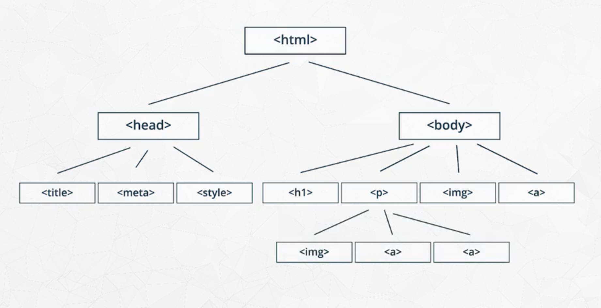

# Udacity Data Science Nanodegree: Introduction

These are my personal notes taken while following the [Udacity Data Science Nanodegree](https://www.udacity.com/course/data-scientist-nanodegree--nd025).

The Nanodegree asssumes basic data analysis skills with python libraries (pandas, numpy, matplotlib, sklearn, etc.) and has 5 modules that build up on those skills:

1. Introduction to Data Science
2. Software Engineering
3. Data Engineering
4. Experimental Design & Recommendations
5. Data Scientist Capstone

This folder & guide refer to the **second module**: Software Engineering.

Mikel Sagardia, 2022.
No guarantees.

Overview of Contents:

1. [Introduction to Software Engineering](#1.-Introduction-to-Software-Engineering)
2. [Software Engineering Pratices Part 1](#2.-Software-Engineering-Pratices-Part-1)
3. [Software Engineering Pratices Part 2](#3.-Software-Engineering-Pratices-Part-2)
4. [Introduction to Object Oriented Programming & Python Packages](#4.-Introduction-to-Object-Oriented-Programming-&-Python-Packages)
	- [4.1 Procedural vs. Object Oriented Programming](4.1-Procedural-vs.-Object-Oriented-Programming)
	- [4.2 OOP Syntax in Python](#4.2-OOP-Syntax-in-Python)
		- [Getters & Setters](#Getters-&-Setters)
	- [4.3 Commenting Object-Oriented Code](#4.3-Commenting-Object-Oriented-Code)
	- [4.4 Gaussian and Binomial Distirbutions](#4.4-Gaussian-and-Binomial-Distirbutions)
		- Gaussian Distribution
		- Binomial Distribution
	- [4.5 A Gaussian Class Implementation](#4.5-A-Gaussian-Class-Implementation)
	- [4.6 Magic Methods: Application to the Summation of Gaussians](#4.6-Magic-Methods:-Application-to-the-Summation-of-Gaussians)
	- [4.7 Inheritance](#4.7-Inheritance)
		- Gaussian Class and Virtual Methods
	- [4.8 More OOP Concepts](#4.8-More-OOP-Concepts)
		- Polymorphism
		- Class Methods, Instance Methods, Static Methods
		- Class Attributes, Instance Attributes
		- Multiple Inheritance and Mixins
		- Python Decorators
5. Portfolio Exercise: Upload a Package to PyPi
6. Web Development
7. Portfolio Exercise: Deploy a Data Dashboard

## 1. Introduction to Software Engineering

This module has 3 major parts and 2 projects that are not compulsory.

Parts:

1. Software Engineering
2. Object Oriented Programming
3. Web Development

Projects:

1. PyPi Package
2. Data Dashboard

The first part is 1:1 the first module of the [Udacity Nanodegree Machine Learning DevOps Engineer](https://www.udacity.com/course/machine-learning-dev-ops-engineer-nanodegree--nd0821). My notes and practice exercises can be found in this repository:

[mlops_udacity](https://github.com/mxagar/mlops_udacity) `/ 01_Clean_Code`

In order to be up to date with the Web Development requirements, I also watched and made notes on the following course:

[Intro to HTML and CSS](https://learn.udacity.com/courses/ud001)

My notes can be found in my Jekyll guide repo:

[jekyll_web_guide](https://github.com/mxagar/jekyll_web_guide) `/ html_css_bootstrap_guide.md`

The notes are linked on my local computer in the upper folder.

## 2. Software Engineering Pratices Part 1

This section is fully covered in the [Udacity Nanodegree Machine Learning DevOps Engineer](https://www.udacity.com/course/machine-learning-dev-ops-engineer-nanodegree--nd0821). My notes and practice exercises can be found in this repository:

[mlops_udacity](https://github.com/mxagar/mlops_udacity) `/ 01_Clean_Code`

Topics:

- Clean, efficient and modular code
- Documentation: Code & READMEs
- Git Version Control: Working with Teams

## 3. Software Engineering Pratices Part 2

This section is fully covered in the [Udacity Nanodegree Machine Learning DevOps Engineer](https://www.udacity.com/course/machine-learning-dev-ops-engineer-nanodegree--nd0821). My notes and practice exercises can be found in this repository:

[mlops_udacity](https://github.com/mxagar/mlops_udacity) `/ 01_Clean_Code`

Topics:

- Testing with `pytest`
- Logging
- Code reviews

## 4. Introduction to Object Oriented Programming & Python Packages

This section has two parts:

1. Object Oriented Programming (OOP)
2. How to build python packages

OOP brings two important advantages:

1. We can write modular programs that can scale more easily.
2. The implementation can be hidden to the user, so that they focus on the functionality.

The ultimate practical goal of the section is to build a Gaussian distirbution class which will be set up as a package and uploaded to PyPi.

Even though the link to the repository with examples provided by Udacity is broken, I found and forked it: [udacity-cd0171--software-engineering-for-data-scientists](https://github.com/mxagar/udacity-cd0171--software-engineering-for-data-scientists).

### 4.1 Procedural vs. Object Oriented Programming

In procedural programming we have variables and functions, which either receive those variables or define new ones in them.

In Object Oriented Programming (OOP), code is **encapsulated** in classes, which are **instantiated** in objects. Classes are like generic blueprints that have:

- Characteristics: **attributes** = variables or other complex objects.
- Actions: **methods** = functions that perform procedures expected from the object.


### 4.2 OOP Syntax in Python

```python
# Class definition.
# Always capitalize class names!
# Note: __init__(), self
class Shirt:
	def __init__(self, shirt_color, shirt_size, shirt_size, shirt_price):
		self.color=  shirt_color
		self.size =  shirt_size
		self.style = shirt_style
		self.price = shirt_price

	def change_price(self, new_price):
		self.price = new_price

	def discount(self, discount):
		return self.price * (1-discount)

# Object instantiation: __init__() is the constructor
Shirt('red', 'S', 'short sleeve', 15)

# Object instatiation: object is stored in a variable
new_shirt = Shirt('red', 'S', 'short sleeve', 15)

# We can access the attributes of the objects
print(new_shirt.color)
print(new_shirt.size)
print(new_shirt.style)
print(new_shirt.price)

# Use methods of the object/class
new_shirt.change_price(10)
print(new_shirt.price
print(new_shirt.discount_price(.2))

# Another object
shirt_two = Shirt('orange', 'L', 'short-sleeve', 10)

# Working with two objects
total = shirt_one.price + shirt_two.price
total_discount =  shirt_one.discount(.14) + shirt_two.discount(.06) 

# We can build arrays or other structures that contain objects
tshirt_collection = []
shirt_one = Shirt('orange', 'M', 'short sleeve', 25)
shirt_two = Shirt('red', 'S', 'short sleeve', 15)
shirt_three = Shirt('purple', 'XL', 'short sleeve', 10)
tshirt_collecetion.append(shirt_one)
tshirt_collecetion.append(shirt_two)
tshirt_collecetion.append(shirt_three)

for i in range(tshirt_collection)):
	print (tshirt_collection[i].color)
```

Important notes:

- Capitalize class names.
- `__init__()` is used as a constructor, when classes are instantiated.
- `self` is like a dictionary that holds all attributes & methods and makes them available throughout the class; but all functions need to receive it as the first argument if they want to access the attributes. Behind the scenes, `self` also contains the memory address where the object is located; thus, when a method of a class is called in an instantiated object, the class knows which specific values to catch through `self`.
- Classes are usually defined in python modules/scripts, e.g., `shirt.py`, and we import them: `from shirt import Shirt`.

#### Getters & Setters

In python, the class/object arributes are public: they can be accessed directly: `shirt_one.price`. However, we should write setter and getter functions to access them. Examples why this matters:

1. If we want to get/set the price, the user should not care about any conversions to be made, e.g., EUR <-> USD; now, we might internally modify how prices are stored (EUR/USD), so any conversion should be done by `get_price()` or `set_price()`.
2. What if the attribute is a container of some type (e.g., a set) but we want to return it as another type (e.g., a list). That conversion should be hidden from the user.

Even though all attributes are always public in python, a widespread convenction is to prefix an attribute with `_` when the programmer wants the user to use the associated getters/setters:

```python
# Price is preceded by _ to denote we should use
# its associated getters/setters
class Shirt:
    def __init__(self, shirt_color, shirt_size, shirt_style, shirt_price):
        self._price = shirt_price
		self.color=  shirt_color
		self.size =  shirt_size
		self.style = shirt_style

    def get_price(self):
    	return self._price

    def set_price(self, new_price):
    	self._price = new_price

# However, _price is still accessible
shirt_one = Shirt('yellow', 'M', 'long-sleeve', 15)
shirt_one._price = 12
```

### 4.3 Commenting Object-Oriented Code

Interesting link on how to write docstrings: [Example Google Style Python Docstrings](https://sphinxcontrib-napoleon.readthedocs.io/en/latest/example_google.html)

Notes:

- Document modules, functions and classes.
- Mind the indentation; e.g., in classes, indent the class docstring.
- In functions: args & returns; additionally, write types.

Follow this blueprint:

```python
class Pants:
    """The Pants class represents an article of clothing sold in a store
    """

    def __init__(self, color, waist_size, length, price):
        """Method for initializing a Pants object

        Args: 
            color (str)
            waist_size (int)
            length (int)
            price (float)

        Attributes:
            color (str): color of a pants object
            waist_size (str): waist size of a pants object
            length (str): length of a pants object
            price (float): price of a pants object
        """

        self.color = color
        self.waist_size = waist_size
        self.length = length
        self.price = price

    def change_price(self, new_price):
        """The change_price method changes the price attribute of a pants object

        Args: 
            new_price (float): the new price of the pants object

        Returns: None

        """
        self.price = new_price

    def discount(self, percentage):
        """The discount method outputs a discounted price of a pants object

        Args:
            percentage (float): a decimal representing the amount to discount

        Returns:
            float: the discounted price
        """
        return self.price * (1 - percentage)
```

### 4.4 Gaussian and Binomial Distirbutions

We want to build a Gaussian distribution class and upload it to PyPi. The package will be able to:

- Read in dataset
- Calculate mean
- Calculate the standard deviation
- Plot histogram
- Plot probability density function
- Add two Gaussian distributions

We need to extend the package to handle binomial distirbutions, too.

#### Gaussian Distribution

Probability density function:

`f(x; m, s) = (1/sqrt(2*pi*s^2)) * exp(-((x-m)^2)/(2*s^2))`

#### Binomial Distribution

`mean = n * p`

> A fair coin has a probability of a positive outcome (heads) p = 0.5. If you flip a coin 20 times, the mean would be 20 * 0.5 = 10; you'd expect to get 10 heads.

`variance = n * p*(1−p)`

Probability mass function: [Binomial distribution](https://en.wikipedia.org/wiki/Binomial_distribution).

`f(k,n,p) = (n!/(k!*(n-k)!)) * p^k * (1-p)^(n-k)`

> Assume that 15% of the population is allergic to cats. If you randomly select 60 people for a medical trial, what is the probability that 7 of those people are allergic to cats?

p = 0.15
n = 60
k = 7 (often called x)

`f = 60!/7!*53! * (0.15)^7 * (0.85)^53 = 0.12`.

### 4.5 A Gaussian Class Implementation

We need to implement the following functions of the `Gaussian` class:

	init
	calculate_mean
	calculate_std_dev
	read_data_file
	pdf
	plot_histogram
	plot_histogram_pdf

Notes:

- In an instantiated class, both attributes and methods of the class object are accessed via `self`.
- Use default argument values.

The final code:

```python
import math
import matplotlib.pyplot as plt

class Gaussian():
    """ Gaussian distribution class for calculating and 
    visualizing a Gaussian distribution.
    
    Attributes:
        mean (float) representing the mean value of the distribution
        stdev (float) representing the standard deviation of the distribution
        data_list (list of floats) a list of floats extracted from the data file
    """
    def __init__(self, mu = 0, sigma = 1):
        self.mean = mu
        self.stdev = sigma
        self.data = []
        self.epsilon = 1e-6

    def calculate_mean(self):    
        """Method to calculate the mean of the data set.
        
        Args: 
            None
        Returns: 
            float: mean of the data set
        """
        #TODO: Calculate the mean of the data set. Remember that the data set is stored in self.data
        # Change the value of the mean attribute to be the mean of the data set
        # Return the mean of the data set           
        mu = 0
        for d in self.data:
            mu += d
        self.mean = mu/len(self.data)
        
        return self.mean

    def calculate_stdev(self, sample=True):
        """Method to calculate the standard deviation of the data set.
        
        Args: 
            sample (bool): whether the data represents a sample or population
        Returns: 
            float: standard deviation of the data set
        """
        # TODO:
        #   Calculate the standard deviation of the data set
        #   
        #   The sample variable determines if the data set contains a sample or a population
        #   If sample = True, this means the data is a sample. 
        #   Keep the value of sample in mind for calculating the standard deviation
        #
        #   Make sure to update self.stdev and return the standard deviation as well    
        self.sample = sample
        if math.fabs(self.mean) < self.epsilon:
            self.calculate_mean()
        sigma = 0
        for d in self.data:
            sigma += math.pow((d-self.mean), 2)
        if self.sample:
            sigma /= len(self.data) - 1
        else:
            sigma /= len(self.data)
        sigma = math.sqrt(sigma)
        self.stdev = sigma

        return self.stdev

    def read_data_file(self, file_name, sample=True):    
        """Method to read in data from a txt file. The txt file should have
        one number (float) per line. The numbers are stored in the data attribute. 
        After reading in the file, the mean and standard deviation are calculated
                
        Args:
            file_name (string): name of a file to read from
        Returns:
            None
        """
        # This code opens a data file and appends the data to a list called data_list
        with open(file_name) as file:
            data_list = []
            line = file.readline()
            while line:
                data_list.append(int(line))
                line = file.readline()
        file.close()
        # TODO: 
        #   Update the self.data attribute with the data_list
        #   Update self.mean with the mean of the data_list. 
        #       You can use the calculate_mean() method with self.calculate_mean()
        #   Update self.stdev with the standard deviation of the data_list. Use the 
        #       calculate_stdev() method.
        self.data = data_list
        self.calculate_mean()
        self.calculate_stdev(sample=sample)
        
    def plot_histogram(self):
        """Method to output a histogram of the instance variable data using 
        matplotlib pyplot library.
        
        Args:
            None
        Returns:
            None
        """
        # TODO: Plot a histogram of the data_list using the matplotlib package.
        #       Be sure to label the x and y axes and also give the chart a title
        # make the plot
        fig = plt.figure()
        fig.hist(self.data, density=False)
        fig.set_title('Histogram of Data')
        fig.set_ylabel('Freq. / Count')
        plt.show()
    
    def pdf(self, x):
        """Probability density function calculator for the gaussian distribution.
        
        Args:
            x (float): point for calculating the probability density function
        Returns:
            float: probability density function output
        """
        # TODO: Calculate the probability density function of the Gaussian distribution
        #       at the value x. You'll need to use self.stdev and self.mean to do the calculation
        # `f(x; m, s) = (1/sqrt(2*pi*s^2)) * exp(-((x-m)^2)/(2*s^2))`
        v = math.pow(self.stdev,2)
        m = 1.0/math.sqrt(2.0*math.pi*v)
        f = m*math.exp(-math.pow((x-self.mean),2)/(2.0*v))

        return f

    def plot_histogram_pdf(self, n_spaces = 50):

        """Method to plot the normalized histogram of the data and a plot of the 
        probability density function along the same range
        
        Args:
            n_spaces (int): number of data points 
        
        Returns:
            list: x values for the pdf plot
            list: y values for the pdf plot
        """
        #TODO: Nothing to do for this method. Try it out and see how it works.
        mu = self.mean
        sigma = self.stdev

        min_range = min(self.data)
        max_range = max(self.data)
        
         # calculates the interval between x values
        interval = 1.0 * (max_range - min_range) / n_spaces

        x = []
        y = []
        
        # calculate the x values to visualize
        for i in range(n_spaces):
            tmp = min_range + interval*i
            x.append(tmp)
            y.append(self.pdf(tmp))

        # make the plots
        fig, axes = plt.subplots(2,sharex=True)
        fig.subplots_adjust(hspace=.5)
        axes[0].hist(self.data, density=True)
        axes[0].set_title('Normed Histogram of Data')
        axes[0].set_ylabel('Density')

        axes[1].plot(x, y)
        axes[1].set_title('Normal Distribution for \n Sample Mean and Sample Standard Deviation')
        axes[0].set_ylabel('Density')
        plt.show()

        return x, y
```

### 4.6 Magic Methods: Application to the Summation of Gaussians

Gaussians can be summed simply by summing their parameters:

	Gaussian_C = Gaussian_A + Gaussian_B
	mean_C = mean_A + mean_B
	var_C = var_A + var_B
	std_C = sqrt(var_C)

Python has special magic methods which allow to overload common operators defined for objects; among others, the `__add__` function implements the `+` operator, which can be used to sum to instantiated classes.

Examples for the `Gaussian` class:

```python
    def __add__(self, other):    
        """Magic method to add together two Gaussian distributions
        
        Args:
            other (Gaussian): Gaussian instance
        Returns:
            Gaussian: Gaussian distribution
        """
        result = Gaussian()
        result.mean = self.mean + other.mean
        result.stdev = math.sqrt(math.pow(self.stdev,2) + math.pow(other.stdev,2))
        
        return result

    def __repr__(self):
        """Magic method to output the characteristics of the Gaussian instance.
        
        Args:
            None
        Returns:
            string: characteristics of the Gaussian
        """
        return f"mean {self.mean}, standard deviation {self.stdev}"
```

We can check all the methods (including magic ones) of a type/class with `dir()`:

	dir(int)
	dir(Gaussian)

There are many magic methods; some of them are listed here:

- `__add__`: `+` operator
- `__repr__`: representation string of the object; invoked, for instance when just object is typed or when we `print()` the object.
- `__str__`: stringify an object; similar to `__repr__`.
- `__ge__`: `>=`.
- `__sub__`: `-`
- `__len__`: `len()`
- ...

More on the topic: [Python Magic Methods](https://www.tutorialsteacher.com/python/magic-methods-in-python).

### 4.7 Inheritance

With inheritance, we write the class of a high level class which is passed to more specific children classes; the main advantage is that we save writing code and a change in the parent class is reflected in all its children.

Notes:

- Inherit with `class Child(Parent)`.
- Remember calling the `__init__` of the `Parent` in the `__init__` of the `Child`; we can use the `Parent`class name, or the `super()` function, which connects to the immediately prior parent class (we can inherit several levels). Note that we need to pass `self` to the `__init__` of `Parent`, but not if we use `super()`!
- The `Child` can overwrite the methods of the `Parent`.
- We can freely add new attrbutes and mehods to the `Child` class.

```python
class Clothing:
    def __init__(self, color, size, style, price):
        self.color = color
        self.size = size
        self.style = style
        self.price = price

    def change_price(self, price):
        self.price = price

    def calculate_discount(self, discount):
        return self.price * (1 - discount)

class Shirt(Clothing): # Inheritance
    def __init__(self, color, size, style, price, long_or_short):
        # We can call __init__ via Clothing or super()
        # If we use Clothing, we need to use self, with super() we don't
        #Clothing.__init__(self, color, size, style, price)
        super().__init__(color, size, style, price)
        # New attribute
        self.long_or_short = long_or_short

    # New method
    def double_price(self):
        self.price = 2*self.price

class Pants(Clothing):
    def __init__(self, color, size, style, price, waist):
        #Clothing.__init__(self, color, size, style, price)
        super().__init__(color, size, style, price)
        self.waist = waist

    # We overwrite the method
    def calculate_discount(self, discount):
        return self.price * (1 - discount / 2)
```

#### Gaussian Class and Virtual Methods

We can define a `Distribution` class from which we inherit the `Gaussian` an `Binomial` classes.

Even though not commented in the videos, I added some *virtual methods* to the base class. Virtual methods are non-implemented methods that are defined/overwritten in the children classes. Advantage: we can use them in the base class, but each derived class will call their specific implementations! That is called **polymorphism**. 

However, in reality, all functions are automatically virtual in python, but by convention, virtual classes are defined with `raise NotImplementedError("Subclass should implement method.")` inside, if we want the base class to be **abstract**: whenever we define a virtual method with `raise NotImplementedError()`, the class with it becomes an abstract class which is not meant to be instantiated! If we instantiate it, we get the `NotImplementedError()` when using its classes.

There is no need of having abstract classes always; we can achieve polymorphism without them in python; see next section.

```python
class Distribution:
    def __init__(self, mu=0, sigma=1):
        """ Generic distribution class for calculating and 
        visualizing a probability distribution.
    
        Attributes:
            mean (float) representing the mean value of the distribution
            stdev (float) representing the standard deviation of the distribution
            data_list (list of floats) a list of floats extracted from the data file
        """
        self.mean = mu
        self.stdev = sigma
        self.data = []

    def read_data_file(self, file_name):    
        """Function to read in data from a txt file. The txt file should have
        one number (float) per line. The numbers are stored in the data attribute.
                
        Args:
            file_name (string): name of a file to read from
        Returns:
            None
        """
        with open(file_name) as file:
            data_list = []
            line = file.readline()
            while line:
                data_list.append(int(line))
                line = file.readline()
        file.close()
    
        self.data = data_list

        # Since calculate_stdev() and calculate_mean() will be overwritten
        # in derived classes, the following method calls refer to the children methods!
        #self.calculate_mean() # already called in calculate_stdev()
        self.calculate_stdev()

    # Virtual classes: not implemented, specified in derived classes
    # However, this is a convention, in Python all classes are virtual
    def calculate_mean(self):
    	raise NotImplementedError("Subclass should implement mean computation!")

    def calculate_stdev(self):
    	raise NotImplementedError("Subclass should implement stdev. computation!")

import math
import matplotlib.pyplot as plt

class Gaussian(Distribution):
    """ Gaussian distribution class for calculating and 
    visualizing a Gaussian distribution.
    
    Attributes:
        mean (float) representing the mean value of the distribution
        stdev (float) representing the standard deviation of the distribution
        data_list (list of floats) a list of floats extracted from the data file         
    """
    def __init__(self, mu=0, sigma=1):
        Distribution.__init__(self, mu, sigma)
    
    def calculate_mean(self):    
        """Function to calculate the mean of the data set.
        
        Args: 
            None
        Returns: 
            float: mean of the data set
        """
        avg = 1.0 * sum(self.data) / len(self.data)
        self.mean = avg
        
        return self.mean

    def calculate_stdev(self, sample=True):
        """Function to calculate the standard deviation of the data set.
        
        Args: 
            sample (bool): whether the data represents a sample or population
        Returns: 
            float: standard deviation of the data set
        """
        if sample:
            n = len(self.data) - 1
        else:
            n = len(self.data)
        mean = self.calculate_mean()
        sigma = 0
        for d in self.data:
            sigma += (d - mean) ** 2
        sigma = math.sqrt(sigma / n)
        self.stdev = sigma
        
        return self.stdev
        
    def plot_histogram(self):
        """Function to output a histogram of the instance variable data using 
        matplotlib pyplot library.
        
        Args:
            None            
        Returns:
            None
        """
        plt.hist(self.data)
        plt.title('Histogram of Data')
        plt.xlabel('data')
        plt.ylabel('count')
        
    def pdf(self, x):
        """Probability density function calculator for the gaussian distribution.
        
        Args:
            x (float): point for calculating the probability density function
        Returns:
            float: probability density function output
        """        
        return (1.0 / (self.stdev * math.sqrt(2*math.pi))) * math.exp(-0.5*((x - self.mean) / self.stdev) ** 2)
        
    def plot_histogram_pdf(self, n_spaces = 50):
        """Function to plot the normalized histogram of the data and a plot of the 
        probability density function along the same range
        
        Args:
            n_spaces (int): number of data points 
        Returns:
            list: x values for the pdf plot
            list: y values for the pdf plot
        """        
        mu = self.mean
        sigma = self.stdev
        min_range = min(self.data)
        max_range = max(self.data)
        
         # calculates the interval between x values
        interval = 1.0 * (max_range - min_range) / n_spaces

        x = []
        y = []
        
        # calculate the x values to visualize
        for i in range(n_spaces):
            tmp = min_range + interval*i
            x.append(tmp)
            y.append(self.pdf(tmp))

        # make the plots
        fig, axes = plt.subplots(2,sharex=True)
        fig.subplots_adjust(hspace=.5)
        axes[0].hist(self.data, density=True)
        axes[0].set_title('Normed Histogram of Data')
        axes[0].set_ylabel('Density')

        axes[1].plot(x, y)
        axes[1].set_title('Normal Distribution for \n Sample Mean and Sample Standard Deviation')
        axes[0].set_ylabel('Density')
        plt.show()

        return x, y
        
    def __add__(self, other):
        """Function to add together two Gaussian distributions
        
        Args:
            other (Gaussian): Gaussian instance
        Returns:
            Gaussian: Gaussian distribution
        """
        result = Gaussian()
        result.mean = self.mean + other.mean
        result.stdev = math.sqrt(self.stdev ** 2 + other.stdev ** 2)
        
        return result
        
    def __repr__(self):    
        """Function to output the characteristics of the Gaussian instance
        
        Args:
            None
        Returns:
            string: characteristics of the Gaussian
        """
        return "mean {}, standard deviation {}".format(self.mean, self.stdev)
```

### 4.8 More OOP Concepts

#### Polymorphism

Virtual methods, abstract classes and polymorphism were introduced in the previous section.

In short, polymorphism consists in having different object types (classes) that share methods with same name.
A function can call this method no matter which object type is being treated.
This is related to virtual functions; however, note that classes/types don't need to be even related! That's the reason I wrote that using `raise NotImplementedError()` in a virtual method is a convention: all methods are virtual and polymorphic in python!

Polymorfism is automatical in python.

```python
class Dog():
    def __init__(self,name):
        self.name = name
    def speak():
        return self.name + 'says woof!'

class Cat():
    def __init__(self,name):
        self.name = name
    def speak():
        return self.name + 'says meow!'

niko = Dog('Niko')
felix = Cat('Felix')

print(niko.speak()) # Niko says woof!
print(felix.speak()) # Felix says woof!

## Polymorphism 1: create a list of different object types and call thier common method
for pet in [niko,felix]:
    print(pet.speak())

## Polymorphism 2: create a function for different object types and call their common method
def pet_speak(pet):
    print(pet.speak())

pet_speak(niko)
pet_speak(felix)
```

#### Class Methods, Instance Methods, Static Methods

Source: [Python's Instance, Class, and Static Methods Demystified](https://realpython.com/instance-class-and-static-methods-demystified/).

We distinguish:

- the class
- and the object or class instance.

While a class itself is a a structure with a memory address, the class instances are usually the ones used for computations. Inside the class instances we can reference the objects itself or the class from which it was instatiated. Thus, we have several types of methods and attributes: instance/class methods and attributes.

```python
class MyClass:
	# Instance method: regular method which takes self.
	# Can access/modify the instance via self an the class vis self.__class__.
	# We need an object to use them: obj.method(), MyClass.method(obj).
    def method(self):
        return 'instance method called', self

    # Class method: can access/modify the class only.
    # Can be used from the object/instance or the class.
    # Employed for factory functions or defining several constructors (__init__).
    @classmethod
    def classmethod(cls):
        return 'class method called', cls

    # Static method: it cannot access/modify either the instance or the class
    # but it can be used from both.
    # They signal that the function is independent from the class/object,
    # i.e., some kind of utility procedure; that improves mantainability.
    @staticmethod
    def staticmethod():
        return 'static method called'

obj = MyClass()
obj.method() # ('instance method called', <MyClass instance at 0x10205d190>)
MyClass.method(obj) # ('instance method called', <MyClass instance at 0x10205d190>)
obj.classmethod() # ('class method called', <class MyClass at 0x101a2f4c8>)
obj.staticmethod() # 'static method called'

MyClass.classmethod() # ('class method called', <class MyClass at 0x101a2f4c8>)
MyClass.staticmethod() # 'static method called'
MyClass.method() # TypeError: if not called in instance or passed an instance, error!
```

Note: the names `self` and `cls` are a convention; we can use any name - BUT: the important thing is that they are the first argument of the method.

**Instance methods** are usual class methods which receive the object or class instance as first argument: `self`. Through `self`, they can access and extend any *object* attributes and methods. They can also access the class itself via `self.__class__`. Thus, class instances can also modify the class state! So they are really powerful.

**Class methods** have the decorator `@classmethod` and accept the `cls` argument, which refers to the class structure in memory. Thus, they can modify the class state, but not instance states! However, they can be used from the instance or the class. They are applied in two situations, which are actually the same:

- When we want to use *factory functions*, which instantiate classes with predefined arguments; that avoids inheriting too many children classes and decreases the code complexity.
- When we want to define several constructors; python accepts only one `__init__`, but with *factory functions*, it's like we had several constructors!

```python
class Pizza:
    def __init__(self, ingredients):
        self.ingredients = ingredients

    def __repr__(self):
        return f'Pizza({self.ingredients!r})'

    @classmethod
    def margherita(cls):
        return cls(['mozzarella', 'tomatoes'])

    @classmethod
    def prosciutto(cls):
        return cls(['mozzarella', 'tomatoes', 'ham'])

Pizza.margherita() # Pizza(['mozzarella', 'tomatoes'])
Pizza.prosciutto() # Pizza(['mozzarella', 'tomatoes', 'ham'])
```

**Static methods** have the decorator `@staticmethod` and they receive no `self` or `cls` argument, altough they can accept arbiitraty arguments. They cannot change either the class or the instance. They can be called from the class or the instance, but they cannot access/modify any of their attributes!

Static methods are used to signal the programmers that the method does not need anything from the class/object; thus, they are like utility procedures independent from them. Factoring the code that way makes it easier to maintain.

```python
import math

class Pizza:
    def __init__(self, radius, ingredients):
        self.radius = radius
        self.ingredients = ingredients

    def __repr__(self):
        return (f'Pizza({self.radius!r}, '
                f'{self.ingredients!r})')

    def area(self):
        return self.circle_area(self.radius)

    @staticmethod
    def circle_area(r):
        return r ** 2 * math.pi

p = Pizza(4, ['mozzarella', 'tomatoes'])
p.area() # 50.26548245743669
Pizza.circle_area(4) # 50.26548245743669
```

#### Class Attributes, Instance Attributes

Source: [Class vs. Instance Attributes](https://python-course.eu/oop/class-instance-attributes.php).

**Instance attributes** are the usual ones accessed via `self`, i.e., they belong to the object or class instance.

**Class attributes** belong to the class: all instances share them! They can be accessed via object or class, but modified *only* via the class. Common application: instance counters.

```python
class Pizza:
	# Class attribute
	counter = 0
    def __init__(self, radius, ingredients):
        self.radius = radius
        self.ingredients = ingredients
        Pizza.counter += 1 # we could also do: type(self).counter += 1

p1 = Pizza(4, ['mozzarella', 'tomatoes'])
p1.counter # 1
Pizza.counter # 1
p2 = Pizza(4, ['mozzarella', 'ham'])
p2.counter # 2
p1.counter # 2
Pizza.counter = 100 # WORKS
p1.counter = 200 # DOES NOT WORK: no change in Pizza.counter, but a new instance attribute is created 
```

#### Multiple Inheritance and Mixins

Source: [Mixins for Fun and Profit](https://easyaspython.com/mixins-for-fun-and-profit-cb9962760556).

```python
# Base class
class Car:
    def __init__(self, wheels = 4):
	    self.wheels = wheels
    	# All cars have wheels

# Simple Inheritance
class Gasoline(Car):
    def __init__(self, engine = 'Gasoline', tank_cap = 20):
        Car.__init__(self)
        self.engine = engine
        self.tank_cap = tank_cap # represents fuel tank capacity in gallons
        self.tank = 0
        
    def refuel(self):
        self.tank = self.tank_cap
        
class Electric(Car):
    def __init__(self ,engine = 'Electric', kWh_cap = 60):
        Car.__init__(self)
        self.engine = engine
        self.kWh_cap = kWh_cap # represents battery capacity in kilowatt-hours
        self.kWh = 0
    
    def recharge(self):
        self.kWh = self.kWh_cap

# Multiple Inheritance
class Hybrid(Gasoline, Electric):
    def __init__(self, engine = 'Hybrid', tank_cap = 11, kWh_cap = 5):
        Gasoline.__init__(self, engine, tank_cap)
        Electric.__init__(self, engine, kWh_cap)
        
prius = Hybrid()
print(prius.tank) # 0
print(prius.kWh) # 0
prius.recharge()
print(prius.kWh) # 5

```

When we inherit from several parent classes, we might have method overloading order doubts. The **Method Resolution Order (MRO)** is defined as follows:

```python
class A:
	pass
class B(A):
	pass
class C(A):
	pass
class D(B, C):
	pass
```

The order for finding already defined functions/variables is `D, B, C, A, object`.
The first in the sequence is the one used for `D`.
This important for `super()`: `super()` always refers to the next class in the MRO list; when called in `D`, it would mean `B`. In a simple inheritance, it means the base class.

**Mixins** are examples of inheritance in which the parent class doesn't feel like a parent or a similar/related class; tthey just extend the functionality. One practical example could be logging: we can add module and class-speciifc loggers using a logger Mixin:

```python
import logging

class LoggerMixin():
    @property # property decorator; see next section
    def logger(self):
        name = '.'.join([
            self.__module__,
            self.__class__.__name__
        ])
        return logging.getLogger(name)

class EssentialFunctioner(LoggerMixin):
    def do_the_thing(self):
        try:
            ...
        except BadThing:
        	# LoggerMixin.logger is called, which returns the object specific logger!
            self.logger.error('OH NOES')

class BusinessLogicer(LoggerMixin):
    def __init__(self):
        super().__init__()
        # LoggerMixin.logger is called, which returns the object specific logger!
        self.logger.debug('Giving the logic the business...')
```

#### Python Decorators

Source: [Primer on Python Decorators](https://realpython.com/primer-on-python-decorators/).

Functions are objects in python, which can be created inside functions and returned or passed as arguments.

Decorators are functions that take functions as arguments so that they wrap them with some additional actions before or/and after the argument function. After being defined, we can simply put place them with an `@` before the argument function.

```python
# Decorator wrapping function defined
def my_decorator(original_func):
    def wrap_func():
        print('Text BEFORE code')
        original_func()
        print('Text AFTER code')
    return wrap_func

# A decorator of a function with arguments
def do_twice(original_func):
    def wrap_func(*args, **kwargs):
        original_func(*args, **kwargs)
        original_func(*args, **kwargs)
    return wrap_func

# My function to be decorated, decorated with @...
@my_decorator
def my_func_1():
	print('MAIN code to be decorated')

@do_twice
def my_func_2(name):
	print(f'Hi there, {name}!')

###

my_func_1()
# Text BEFORE code
# MAIN to be decorated
# Text AFTER code

my_func_2('Mikel')
# Hi there, Mikel!
# Hi there, Mikel!
```

Python has some built-in **decorators used in class methods**: `@classmethod`, `@staticmethod`, `@property`.

The first two (`@classmethod`, `@staticmethod`) are explained above.

The decorator `@property` is used for defining attribute setters and getters, often for attributes we'd like to handle like private. The idea is to prefix an attribute with `_` so that we signal it should be treated as private. Simultaneously, we define a getter with `@property`, which returns the attribute with a layer of control. That makes sense in case we'd like to apply some transformations to the attribute (e.g., unit conversions). Similarly, a setter can be defined.

```python
class Circle:
    def __init__(self, radius):
        self._radius = radius

    @property # getter: now, _radius can be get with obj.radius
    def radius(self):
        """Get value of radius"""
        return self._radius

    @radius.setter # setter: now, _radius can be set with obj.radius = value
    def radius(self, value):
        """Set radius, raise error if negative"""
        if value >= 0:
            self._radius = value
        else:
            raise ValueError("Radius must be positive")

    @property # getter, but no setter
    def area(self):
        """Calculate area inside circle"""
        return self.pi() * self.radius**2

    def cylinder_volume(self, height):
        """Calculate volume of cylinder with circle as base"""
        return self.area * height

    @classmethod # factory function: instance of class with radius = 1 created
    def unit_circle(cls):
        """Factory method creating a circle with radius 1"""
        return cls(1)

    @staticmethod # function independent from class / instance
    def pi():
        """Value of π, could use math.pi instead though"""
        return 3.1415926535

###

c = Circle(5)
c.radius # 5 (get)
c.area # 78.5398163375 (get)

c.radius = 2
c.area # 12.566370614 (get)

c.area = 100 # AttributeError: can't set attribute; we haven't defined @area.setter

c.cylinder_volume(height=4) # 50.265482456

c.radius = -1 # ValueError: Radius must be positive

c = Circle.unit_circle() # Factory function: custom constructor
c.radius # 1

c.pi() # 3.1415926535
Circle.pi() # 3.1415926535
```

Other common applications:

- Request logging
- Timer
- Debugging
- Registering plugins
- Slowing down code


```python
# Python module which contains several handy decorators
from decorators import debug, timer

class TimeWaster:
    @debug
    def __init__(self, max_num):
        self.max_num = max_num

    @timer
    def waste_time(self, num_times):
        for _ in range(num_times):
            sum([i**2 for i in range(self.max_num)])

###

tw = TimeWaster(1000)
# Calling __init__(<time_waster.TimeWaster object at 0x7efccce03908>, 1000)
# '__init__' returned None

tw.waste_time(999)
# Finished 'waste_time' in 0.3376 secs

```

### 4.9 Organizing into Modules

Modules are single python scripts which contain functions, classes and global variables. They are called modules because the code is modular. Modules are organized into packages: a package is a folder which contains several modules.

All the code related to the Gaussian distribution explained in Section 4.7 is modularized and transferred to scripts.

- `Generaldistriubtion.py`
- `Gaussiandistribution.py`


Then, we have a script which imports the Gaussian class code and instantiates it:

```python
from Gaussiandistribution import Gaussian

gaussian_one = Gaussian(22, 2)
print(gaussian_one.mean)
```

That script is run as follows:

```bash
python 2_modularized_code/example_code.py
```

### 4.10 Making a Package

When we create a package that contains modules we can `pip install` it.

The general structure of a package is as follows:

```
├.
├── package-name/
│ ├── module_1.py
│ ├── module_2.py
│ └── __init__.py
└── setup.py
```

- Inside the `package-name/` folder we have
	- All module files. Note that any imports from one module to the other must be preceded with `.` inside the module code: `from .module_1 import my_function`.
	- A file `__init__.py`, which can be empty, but which signals this is a package. In this file, we can write imports and configurations which facilitate the use of our package.
- In the same level as `package-name/` we have `setup.py`, which is used by `pip` to configure the installation of our package. 

#### Example with the Gaussian class

```
├.
├── distributions/
│ ├── Generaldistriubtion.py
│ ├── Gaussiandistribution.py
│ └── __init__.py
└── setup.py
```

Module files have the same code; the exception are the imports from modules inside the package that is being defined; those need to be preceeded by `.`. For instance, in `Gaussiandistribution.py`:

```python
import math
import matplotlib.pyplot as plt
# Add . before module names in the package that is being defined!
from .Generaldistribution import Distribution

class Gaussian(Distribution):
	#...
```

File `__init__.py`:

```python
# This import makes possible to use this import later on:
# 		from distributions import Gaussian
# instead of 
# 		from distributions.Gaussiandistrubtion import Gaussian
from .Gaussiandistrubtion import Gaussian
```

File `setup.py`:

```python
from setuptools import setup

setup(name="distributions", # name of the package
	  version="0.1",
	  description="Gaussian distributions", 
	  packages=['distributions'], # folder names
	  zip_safe=False)
```

To install it, we go to the folder where `setup.py` is and execute:

```bash
# The first time
pip install .
# If we change things in the package
pip install --upgrade .
```

With that command, the package files are copied and installed to our python distribution/environment. Thus, we have access to them rom anywhere! To use our package:

``` python
from distributions import Gaussian

gaussian_one = Gaussian(10,5)
gaussian_one.mean
gaussian_one.stdev

import distributions
distributions.__file__ # this will output the path to the installed __init__.py file
```

### 4.11 Virtual Environments

A virtual environment is an independent python installation in which we can install the package version we need for a given project.

Two popular virtual environment managers are **conda** and **venv**.

However, note that `conda` does two things: environment andd package management.

One alternative to `conda` is using the two Python native tools:

- `venv` for environment managing
- `pip` for package managing

However, note that `pip` handles only python packages, while `conda` is language agnostic. In fact, `conda` emerged because of the need to install data science packages such as `numpy` which are developed in another language than Python.

We can use `pip` within `conda`, but we need to add `pip` to the creation of our environment:

`conda create --name env_name pip`

Otherwise, any `pip install` we do applies to the global Anaconda Python installation, not the environment we're in, even if we do `conda install pip`!

Which one should we use?

- Conda works well with data science projects, because packagees for that are well curated and handled; however, it is more difficult for general package development.
- `pip` and `venv` are for general python development.

#### Examples

```bash
# conda
conda create --name my_env pip
source activate my_env
conda install numpy
pip istall package # installed in my_env BECAUSE pip added when creation of my_env 

# venv
python3 -m venv my_env # my_env folder is created locally and a python kernel installed there
source my_env/bin/activate
pip install numpy # pip installs locally always in venv
# if we remove the my_env folder the virtual env is removed
# nothing bad happens happens
```

### 4.12 Exercise: Adding the Binomial Class to the Package

In this section, a `Binomialdistribution.py` module is created and added to the package. Then, the package is reinstalled.

Files changed:

- `__init__.py`
- `Binomialdistribution.py`

To re-install the package: `pip install --upgrade .`

This exercise is a summary of the section; as such, I add a copy to `lab/`.

File `__init__.py`:

```python
from .Gaussiandistribution import Gaussian
from .Binomialdistribution import Binomial
```

File `Binomialdistribution.py`:

```python
import math
import matplotlib.pyplot as plt
from .Generaldistribution import Distribution

class Binomial(Distribution):
    """ Binomial distribution class for calculating and 
    visualizing a Binomial distribution.
    
    Attributes:
        mean (float) representing the mean value of the distribution
        stdev (float) representing the standard deviation of the distribution
        data_list (list of floats) a list of floats to be extracted from the data file
        p (float) representing the probability of an event occurring
        n (int) number of trials
    """
    def __init__(self, prob=.5, size=20):
                
        self.n = size
        self.p = prob
        
        Distribution.__init__(self, self.calculate_mean(), self.calculate_stdev())

    def calculate_mean(self):
        """Function to calculate the mean from p and n.
        
        Args: 
            None
        Returns: 
            float: mean of the data set
        """
        self.mean = self.p * self.n
                
        return self.mean

    def calculate_stdev(self):
        """Function to calculate the standard deviation from p and n.
        
        Args: 
            None       
        Returns: 
            float: standard deviation of the data set
        """
        self.stdev = math.sqrt(self.n * self.p * (1 - self.p))
        
        return self.stdev
        
    def replace_stats_with_data(self):
        """Function to calculate p and n from the data set
        
        Args: 
            None
        Returns: 
            float: the p value
            float: the n value
        """
        self.n = len(self.data)
        self.p = 1.0 * sum(self.data) / len(self.data)
        self.mean = self.calculate_mean()
        self.stdev = self.calculate_stdev()
        
        return self.p, self.n
        
    def plot_bar(self):
        """Function to output a histogram of the instance variable data using 
        matplotlib pyplot library.
        
        Args:
            None            
        Returns:
            None
        """
        plt.bar(x = ['0', '1'], height = [(1 - self.p) * self.n, self.p * self.n])
        plt.title('Bar Chart of Data')
        plt.xlabel('outcome')
        plt.ylabel('count')
        
    def pdf(self, k):
        """Probability density function calculator for the binomial distribution.
        
        Args:
            x (float): point for calculating the probability density function
        Returns:
            float: probability density function output
        """
        a = math.factorial(self.n) / (math.factorial(k) * (math.factorial(self.n - k)))
        b = (self.p ** k) * (1 - self.p) ** (self.n - k)
        
        return a * b
        
    def plot_bar_pdf(self):
        """Function to plot the pdf of the binomial distribution
        
        Args:
            None
        Returns:
            list: x values for the pdf plot
            list: y values for the pdf plot
        """
        x = []
        y = []
        
        # calculate the x values to visualize
        for i in range(self.n + 1):
            x.append(i)
            y.append(self.pdf(i))

        # make the plots
        plt.bar(x, y)
        plt.title('Distribution of Outcomes')
        plt.ylabel('Probability')
        plt.xlabel('Outcome')

        plt.show()

        return x, y
        
    def __add__(self, other):
        """Function to add together two Binomial distributions with equal p.
        
        Args:
            other (Binomial): Binomial instance
        Returns:
            Binomial: Binomial distribution 
        """
        
        try:
            assert self.p == other.p, 'p values are not equal'
        except AssertionError as error:
            raise
        
        result = Binomial()
        result.n = self.n + other.n
        result.p = self.p
        result.calculate_mean()
        result.calculate_stdev()
        
        return result
        
    def __repr__(self):
        """Function to output the characteristics of the Binomial instance
        
        Args:
            None
        Returns:
            string: characteristics of the Gaussian
        
        """
        return "mean {}, standard deviation {}, p {}, n {}".\
        format(self.mean, self.stdev, self.p, self.n)

```

### 4.13 Complex Projects

In this section, the source code of [Scikit-Learn](https://scikit-learn.org/stable/) is shown briefly and links for contributing to open source projects are provided:

- [Beginner's Guide to Contributing to a Github Project](https://akrabat.com/the-beginners-guide-to-contributing-to-a-github-project/)
- [Contributing to a Github Project](https://github.com/MarcDiethelm/contributing/blob/master/README.md)

### 4.14 Uploading Packages to PyPi

PyPi = Python Package Index. Un-reviewed repository of python packages. We can download and install packages from there using `pip`.

There are actually two repositories or indices:

1. The actual PyPi: [https://pypi.org/](https://pypi.org/)
2. The test version: [https://test.pypi.org/](https://test.pypi.org/)

We should first use the test index/repository; when we see that everything works fine, we can upload our package to the real index.

We need to register in both: mxagar.

Then, we follow the steps in this section. However, note that the guidelines outlined here, although correct, are not updated. Udacity instructs to use `python setup.py` while the new guidelines suggest using `python -m build` instead. Additionally, the definition of the `project.toml` is missing. For more information, look at the following links after reading this section. Additionally, the repository [deploying-machine-learning-models](https://github.com/mxagar/deploying-machine-learning-models) from the Udemy course [Deployment of Machine Learning Models](https://www.udemy.com/course/deployment-of-machine-learning-models) covers the new approach:

- [Transition your Python project to use pyproject.toml and setup.cfg](http://ivory.idyll.org/blog/2021-transition-to-pyproject.toml-example.html)
- [Why you shouldn't invoke setup.py directly](https://blog.ganssle.io/articles/2021/10/setup-py-deprecated.html)
- [What the heck is pyproject.toml?](https://snarky.ca/what-the-heck-is-pyproject-toml/)
- [Building and Distributing Packages with Setuptools](https://setuptools.pypa.io/en/latest/setuptools.html#configuring-setup-using-setup-cfg-files)
- [Python Packaging User Guide](https://packaging.python.org/en/latest/)
- [Packaging Python Projects](https://packaging.python.org/en/latest/tutorials/packaging-projects/)

#### Building and Uploading Steps

I created a folder in `lab/` in which the `distributions` package is set up and uploaded to PyPi:

`./lab/distributions_package` 

In there, we have the following files, which must have a content:

```
setup.py # setup configuration
distributions_mxagar/ # package folder
	__init__.py # it signals that's a package
	license.txt # license; e.g., MIT -- see link below
	REAMDE.md # documentation
	setup.cfg # configuration
	Binomialdistribution.py # module, code
	Gaussiandistribution.py # module, code
	Generaldistribution.py # module, code
```

The rest of the files are not really necessary: `test.py`, `numbers.txt`, `numbers_binomial.txt`.

`setup.cfg` contains metadata of the package:

```
[metadata]
description-file = README.md
```

`setup.py` defines parameters for installation:

```python
from setuptools import setup

setup(name = 'distributions_mxagar', # every package on PyPi needs a UNIQUE name
      version = '0.1', # every upload needs a new version
      description = 'Gaussian and Binomial distributions',
      packages = ['distributions_mxagar'], # package folder with __init__.py in it; use same as in name
      author = 'Mikel Sagardia',
      author_email = 'mxagar@gmail.com',
      zip_safe=False) # whether we can execute the package while zipped; e.g., if we use an ASCII file from the package folder we can't
```

Upload and install:

```bash
# Create the package
cd .../lab/distributions_package
# Build the package; every time we change something, we need to change the version and rebuild the package
python setup.py sdist bdist_wheel
# New folders with files appear
# - dist/: it contains a tar.gz and a wheel of the package to be uploaded; the tar.gz is the un-compiled old version, the wheel is the compiled new version
# - distributions_mxagar.egg-info/: some package uploading info: paths, deppendencies, etc.
# - build/: build folder

# Commands to upload to the pypi TEST repository
pip install twine # tool to upload packages
# Upload the package; we need to log in in the Terminal
# If we re-upload it, we need to change the version and rebuild the package
twine upload --repository-url https://test.pypi.org/legacy/ dist/*
# Now, check the https://test.pypi.org repository/index
# NOTE: _ is parsed as -, so the package is called distributions-mxagar
# Install the package
pip install --index-url https://test.pypi.org/simple/ distributions-mxagar
# Re-install/Upgrade a package version
pip install --upgrade --index-url https://test.pypi.org/simple/ distributions-mxagar

# Command to upload to the pypi repository: analogous to before
twine upload dist/*
pip install distributions-mxagar
```

Usage:

```python
# Note that the index package name was changed by PyPi to distributions-mxagar
# but we still use the original name in the code: distributions_mxagar
from distributions_mxagar import Gaussian, Binomial

gaussian_one = Gaussian(10,5)
gaussian_one.mean # 10
gaussian_one.stdev # 5

gaussian_two = Gaussian(1,2)
gaussian_three = gaussian_one + gaussian_two

binomial = Binomial() # prob=.5, size=20
binomial # mean 10.0, standard deviation 2.23606797749979, p 0.5, n 20
```

Rekevant links:

- [MIT License](https://opensource.org/licenses/MIT)
- [Python Packaging User Guide](https://packaging.python.org/en/latest/)
- [Packaging Python Projects](https://packaging.python.org/en/latest/tutorials/packaging-projects/)

## 5. Portfolio Exercise: Upload a Package to PyPi

I uploaded the Gaussian package to the test registry, as explained in Section 4.14.

## 6. Web Development

In this section a data dashboard is created.

The contents:

- HTML, CSS, Javascript.
- Bootstrap for out-of-the-box CSS styling.
- Plotly visualizations.
- Flask Back-End with Python.
- Deployment to Heroku.

Usually, we talk about:

- Front-end
    - Content: HTML
    - Design: CSS
    - Interactivities: Javascript
- Back-end: we can code it with PHP, Java, Ruby... or Python
    - Server
    - Database
    - All files related to the website

Note that I have two guides on several topics dealt here:

- [flask_guide](https://github.com/mxagar/flask_guide) `/ flask_guide.md`
- [jekyll_web_guide](https://github.com/mxagar/jekyll_web_guide) `/ html_css_bootstrap_guide.md`

Even though the exercises of this section are in the repository

[udacity-cd0171--software-engineering-for-data-scientists](https://github.com/udacity/https-github.com-)

I copied and completed them in the `./lab/` folder.

Useful tip: use extensively the Chrome `View > Developer > Developer Tools`, or equivalent.

### 6.1 HTML Basics

It is common to think of HTML as a tree of elements or tags which contain the content in the form of paragraphs, headlines, links, bulleted lists, etc.



Common elements of tags:

- `<head>`: we add the `<title>` and some other meta information, such as CSS and Javascript file links or paths.
- `<body>` has the page content:
    - `<p>`: paragraphs
    - `<h1>`: headings
    - ``: images
    - `<a>`: anchors or links
    - `<form>`: forms
    - `<ol>`, `<ul>`: ordered and unordered lists, with `<li>` list items.

Some interesting links:

- [HTML Element Reference](https://www.w3schools.com/tags/default.asp)
- [HTML Tutorial](https://www.w3schools.com/html/)

#### Exercise 1

Example of HTML code; open it with a web browser.

`exercise_1.html`:

```html
<! DOCTYPE html>

<html>
  
  <head>
    <title>Udacity Task List</title>
  </head>
  <body>
    <h1>Today's TODO list</h1>
    
    <a href="https://www.udacity.com">Udacity</a>    
    <!-- TODO: Use a paragraph tag. Inside the paragraph tag, introduce yourself -->
    <p>Hi, my name is Mikel. These are my tasks:</p>
    <ul>
      <li>Watch ten videos</li>
      <li>Answer all the quizzes</li>
      <li>Work on the project for 2 hours</li>
    </ul>
    
    <!-- TODO: Get creative and add anything else youl would like to add. The W3Schools website has a wealth of information about html tags. See: https://www.w3schools.com/tags -->
    <table>
      <caption>Breakdown of Tasks Completed</caption>
      <tr>
        <th>Day</th>
        <th>Tasks Completed</th>
      </tr>
      <tr>
        <td>Monday</td>
        <td>Completed five concepts</td>
      </tr>
      <tr>
        <td>Tuesday</td>
        <td>Did three quizzes</td>
    </table>

    <br>
    <nav>
      <a href="https://www.w3schools.com/html/">HTML</a> |
      <a href="https://www.w3schools.com/w3css/">CSS</a> |
      <a href="https://www.w3schools.com/js/default.asp">JavaScript</a> |
      <a href="https://www.w3schools.com/Jquery/default.asp">jQuery</a>
    </nav>
  </body>
  
</html>
```

### 6.2 HTML: Divs, Spans, Classes, Ids

We can separate the content in groups and apply a concrete style class to each group:

- `<div>` is used to group larger pieces of content; we can apply CSS style classes to each group/division.
- `<span>` is similar to `<div>`, but it's used for smaller pieces of content, like some few words.

```html
<div>
   <p>This is an example of when to use a div elements versus a span element. A span element goes around <span>a small chunk of html</span></p>
</div>
```

Every element in HTML can have two attributes which are defined in the CSS stylesheet:

- `id`: a particular HTML element gets an `id="myId"` which is used in the CSS as `#myId{}`.
    - Uniquely identify a piece of content
    - Should only be used once per HTML page
    - IDs can go in any tag
    - Elements can only have one id
- `class`: we define a style for a group of different element types. It is very common to use classes in `divs`: `<div class="myDivClass">`; then, we define the class in the CSS file as `.myDivClass{}`.
    - Groups multiple pieces of content together
    - Class names can be used multiple times in an HTML page
    - Elements can have more than one class

```html
<div class="firstDiv">
    <p>I'm inside the first div</p>
</div>

<div class="secondDiv">
    <p>I'm inside the second div</p>
</div>

<p id="singeParagraph">I'm outside any div</p>
```

```css
.firstDiv{
    color: blue;
}

.secondDiv{
    background-color: gray;
}

#singeParagraph{
    color: red;
}
```

#### Exercise 2

Note that a provided CSS stylesheet is used.

`exercise_2.html`:

```html
<! DOCTYPE html>

<html>
  
  <head>
    <title>Udacity Task List</title>
        <!-- Ignore the following link to the css stylesheet. You will learn more about this in the next exercise. -->
     <link rel="stylesheet" type="text/css" href="style.css">
  </head>
  <body>
    <h1>Today's TODO list</h1>
    
    <!-- TODO: add an id to the Udacity link tag -->
    <a id="main-link" href="https://www.udacity.com">Udacity</a>  
     <!-- NOTE - Adding id and class attributes to HTML does not change the appearance of the page. The changes made in this exercise affect how the page is displayed because this page has been linked to a style sheet. You'll be learning more about that shortly. -->
    <!-- TODO: Wrap the following paragraphs and list with a 
       div tag. Add an id to the div tag called main-content -->
    <!-- TODO: add a class to the the next two paragraphs
after this comment. Call the class bold-paragraph -->
    <div id="main-content">
      <p class="bold-paragraph">Hi, my name is Mikel.</p>
      <p class="bold-paragraph">I am a Udacity student from Los Angeles, California</p>
        <!-- TODO: add a span around the terms data scientist after this comment. Add a class attribute called green-text -->
      <p>I'm currently studying for the <span class="green-text">data scientist</span> nanodegree program</p>
      <p>These are my tasks:</p>
      <ul>
          <li>Watch ten videos</li>
          <li>Answer all the quizzes</li>
          <li>Work on the project for 2 hours</li>
      </ul>
      <p>Here is a table of the tasks that I've completed this week</p>
    </div>
    <table>
      <caption>Breakdown of Tasks Completed</caption>
      <tr>
        <th>Day</th>
        <th>Tasks Completed</th>
      </tr>
      <tr>
        <td>Monday</td>
        <td>Completed five concepts</td>
      </tr>
      <tr>
        <td>Tuesday</td>
        <td>Did three quizzes</td>
    </table>

    <br>
    <nav>
      <a href="https://www.w3schools.com/html/">HTML</a> |
      <a href="https://www.w3schools.com/w3css/">CSS</a> |
      <a href="https://www.w3schools.com/js/default.asp">JavaScript</a> |
      <a href="https://www.w3schools.com/Jquery/default.asp">jQuery</a>
    </nav>  </body>
  
</html>
```

### 6.3 CSS

Cascading Style Sheets contain style definitions. If we open the `View > Developer > Developer Tools` and remove the `<head>` we remove the link to the style sheet, among others, and we'll see the plain HTML content without any styling!

If we refresh the site, then it's back :)

We can do styling in two ways:

1. Inline styling: we add a `style="border:solid red 1px;margin:40px;"` attribute to the tags, with style property definitions separated with `;`. This is tedious, since we need to define the style of each HTML tag in the HTML content file.
2. Using CSS files: we define all the styles in a CSS stylesheet file and link it to the `<head>` either wit hits path or its URL.

```html
<head>
    <link rel="stylesheet" type="text/css" href="style.css">
</head>
```

Obviously, we should use the 2nd way in general.

A simple example of how we populate `style.css`:

```css
/* This affects to the whole body */
body {
  margin-left:20px;
  margin-right:20px;
  border: solid black 1px;
  padding: 10px;
}

/* This affects to all the images */
img {
  width: 200px;
}

/* This affects to all anchors/links */
a {
  text-decoration: none;
}

/* Apply to paragraphs inside the div with id "main-content" */
div#main-content p {
  font-family: "helvetica";
}

/* This is the id bold-paragraph */
p.bold-paragraph {
  font-weight:bold;
}

/* This is the class "green-text" */
.green-text {
  color:green;
}

/* This is the id "blue-section" */
#blue-section {
  color:blue;
}
```

Then, we use those styles in the HTML:

`index.html`:

```html
<div id="div_top">
   <p>This is a paragraph</p>
</div>

<div class="green-text">
    <p>This is a green section.</p>
</div>
```

#### Margins and Padding

In the following, several property definitions are shown using the inline approach:

```html
<div style="border:solid red 1px;">
    Box
</div>

<div style="border:solid red 1px;margin:40px;">
    Box
</div>

<div style="border:solid red 1px;padding:40px;">
    Box
</div>

<div style="border:solid red 1px;margin:40px;padding:40px;">
    Box
</div>

```

#### Size: Pixels vs. % vs. EM

In the following, several property definitions are shown using the inline approach.

We can define size in 3 ways:

- With pixels: we define the exact number of pixels
- With % values: the size changes dynamically based on the browser settings; `150%` means `1.5x` default size value.
- With `em` values: the size changes dynamically based on the browser settings; `1.5em` means `1.5x` default size value.

Note that sizes are inherited in the HTML tree; that is important if we define absolute pixel sizes in an element and then relative sizes in its children (which will refer to the parent absolute size).

```html
<p style="font-size: 12px;">

<p style="font-size: 100%"> 

<body style="font-size: 20px">
    <p style="font-size:80%">This is a paragraph</p>
</body>
```

#### Exercise 3

`exercise_3.html`:

```html
<! DOCTYPE html>

<html>
  <head>
    <title>Udacity Task List</title>
    <link rel="stylesheet" type="text/css" href="exercise_3_style.css">
  </head>
  <body>
    <h1>Today's TODO list</h1>
    
    <a id="main-link" href="https://www.udacity.com">Udacity</a>    
    <div id="main-content">
      <p class="bold-paragraph">Hi, my name is Andrew.</p>
      <p class="bold-paragraph">I am a Udacity student from Los Angeles, California</p>
      <p>I'm currently studying for the data scientist nanodegree program</p>
      <p>These are my tasks:</p>
      <ul>
          <li>Watch ten videos</li>
          <li>Answer all the quizzes</li>
          <li>Work on the project for 2 hours</li>
      </ul>
      <p>Here is a table of the tasks that I've completed this week</p>
    </div>
    <table>
      <caption>Breakdown of Tasks Completed</caption>
      <tr>
        <th>Day</th>
        <th>Tasks Completed</th>
      </tr>
      <tr>
        <td>Monday</td>
        <td>Completed five concepts</td>
      </tr>
      <tr>
        <td>Tuesday</td>
        <td>Did three quizzes</td>
    </table>
    <br>
    <nav>
      <a href="https://www.w3schools.com/html/">HTML</a> |
      <a href="https://www.w3schools.com/w3css/">CSS</a> |
      <a href="https://www.w3schools.com/js/default.asp">JavaScript</a> |
      <a href="https://www.w3schools.com/Jquery/default.asp">jQuery</a>
    </nav>
  </body>
  
</html>
```

`exercise_3_style.css`:

```css
/* TODO:
- add a left margin of 25px and a right margin of 25px to the body tag */

body {
 margin-left:25px;
 margin-right:25px; 
}

/* TODO: h1 header
- change the h1 header to all capital letters 
- add a top and bottom margin of 20px
hint: https://www.w3schools.com/cssref/pr_text_text-transform.asp*/ 
h1 {
 text-transform:uppercase; 
 margin-top: 20px;
 margin-bottom: 20px;
}

/* TODO: img
- make the Udacity logo only half the width of the screen
hint: https://www.w3schools.com/css/css_dimension.asp
*/
img {
 width:50%; 
}

/* TODO: Udacity link 
- make the Udacity link on its own line instead of next to the image
- give the link a top and bottom margin of 20px
- remove the underline
- increase the font to 45px
- change the font color to gray
hint: the block value might be of interest
https://www.w3schools.com/cssref/pr_class_display.asp
hint: make sure to specify the Udacity link using the id; otherwise all links will be styled like the Udacity link
*/
a#main-link {
  display:block;
  margin-top:20px;
  margin-bottom:20px;
  text-decoration:none;
  font-size:45px;
  color:gray;
}

/* TODO: Udacity link 
- make the Udacity link on its own line instead of next to the image
- give the link a top and bottom margin of 20px
- remove the underline
- increase the font to 45px
- change the font color to gray
hint: the block value might be of interest
https://www.w3schools.com/cssref/pr_class_display.asp
hint: make sure to specify the Udacity link using the id; otherwise all links will be styled like the Udacity link
*/


/* TODO: Div main-content id
- change the font of all elements inside the #main-content div to helvetica
hint: https://www.w3schools.com/cssref/pr_font_font-family.asp
*/
div#main-content {
  font-family: "helvetica";
}

/* TODO: bold-paragraph class
- for the paragraphs with the bold-paragraph class, make the text bold
*/
p.bold-paragraph {
  font-weight:bold;
}

/* TODO: table
- draw a black border around the td elements in the table
hint: https://www.w3schools.com/css/css_border.asp
*/
td {
 border:solid black 1px; 
}
```

### 6.4 Bootstrap

[Bootstrap](https://getbootstrap.com/) is a Front-end toolkit with many built-in components and themes ready to use.

There are 2 ways of using Bootstrap:

1. Download the toolkit and link it locally.
2. Copy the links provided in the [Bootstrap](https://getbootstrap.com/) homepage to HTML file.

For the 2nd approach, we distinguish between the CSS stylesheets and `<script>` lines:

- CSS stylesheets are integrated with `<link>` and they go in the `<head>`.
- Javascript and other files are integrated with `<cript>` and they should go at the end of the `<body>`.
- Place vendor files first and our files then so that we replace vendor styles.

```html
<html>
  <head>
    <link rel="stylesheet" href="bootstrap.css">
    <link rel="stylesheet" href="your-other-styles.css">
  </head>
  <body>
    <!-- content -->
    <script src="jquery.js"></script>
    <script src="bootstrap.js"></script>
    <script src="your-other-scripts.js"></script>
  </body>
</html>
```

Look at the [Bootstrap examples](https://getbootstrap.com/docs/5.2/examples/) for some of the available possibilities.

Look at the [Bootstrap docs](https://getbootstrap.com/docs/5.2/getting-started/introduction/): select a component, read the docs and find the HTML snippet we can directly copy & paste.

If we remove the Bootstrap CSS and JS links, the components will appear, but unformated, i.e., ugly. In that sense, the [Bootstrap docs](https://getbootstrap.com/docs/5.2/getting-started/introduction/) are also a very good reference of components/examples we can use in HTML.

The initial template with all the imports recommended by Bootstrap is the following:

```html
<!doctype html>
<html lang="en">
  <head>
    <meta charset="utf-8">
    <meta name="viewport" content="width=device-width, initial-scale=1">
    <title>Bootstrap demo</title>
    <link href="https://cdn.jsdelivr.net/npm/bootstrap@5.2.0/dist/css/bootstrap.min.css" rel="stylesheet" integrity="sha384-gH2yIJqKdNHPEq0n4Mqa/HGKIhSkIHeL5AyhkYV8i59U5AR6csBvApHHNl/vI1Bx" crossorigin="anonymous">
  </head>
  <body>
    <h1>Hello, world!</h1>
    
    <!--Bootstrap-->
    <script src="https://cdn.jsdelivr.net/npm/bootstrap@5.2.0/dist/js/bootstrap.bundle.min.js" integrity="sha384-A3rJD856KowSb7dwlZdYEkO39Gagi7vIsF0jrRAoQmDKKtQBHUuLZ9AsSv4jD4Xa" crossorigin="anonymous"></script>
    <!--jQuery-->
    <script src="https://code.jquery.com/jquery-3.2.1.slim.min.js" integrity="sha384-KJ3o2DKtIkvYIK3UENzmM7KCkRr/rE9/Qpg6aAZGJwFDMVNA/GpGFF93hXpG5KkN" crossorigin="anonymous"></script>
    <!--Popper-->
    <script src="https://cdn.jsdelivr.net/npm/@popperjs/core@2.11.5/dist/umd/popper.min.js" integrity="sha384-Xe+8cL9oJa6tN/veChSP7q+mnSPaj5Bcu9mPX5F5xIGE0DVittaqT5lorf0EI7Vk" crossorigin="anonymous"></script>
    <!--Bootstrap JS-->
    <script src="https://cdn.jsdelivr.net/npm/bootstrap@5.2.0/dist/js/bootstrap.min.js" integrity="sha384-ODmDIVzN+pFdexxHEHFBQH3/9/vQ9uori45z4JjnFsRydbmQbmL5t1tQ0culUzyK" crossorigin="anonymous"></script>
  </body>
</html>
```

See `./lab/bootstrap_exercises/example_1.html`.

#### Rows and Columns (Example 1)

Bootstrap divides the page in invisible rows and columns; there are 12 columns and an infinite number of rows. We can make use of these divisions.

```html
<body>
    <div class="row">
        <!-- The class col-1 accesses one column width -->
        <div class="col-1">C1</div>
        <div class="col-1">C2</div>
        <div class="col-1">C3</div>
        <div class="col-1">C4</div>
        <div class="col-1">C5</div>
        <div class="col-1">C6</div>
        <div class="col-1">C7</div>
        <div class="col-1">C8</div>
        <div class="col-1">C9</div>
        <div class="col-1">C10</div>
        <div class="col-1">C11</div>
        <div class="col-1">C12</div>
    </div>

    <div class="row">
        <div class="col-1">C1</div>
        <!-- The class col-2 accesses two column widths -->
        <div class="col-2">C2, C3</div>
        <!-- The class col-3 accesses three column widths -->
        <div class="col-3">C4, C5, C6</div>
        <div class="col-1">C7</div>
        <div class="col-1">C8</div>
        <div class="col-1">C9</div>
        <div class="col-1">C10</div>
        <div class="col-1">C11</div>
        <div class="col-1">C12</div>
    </div>
</body>
```

See `./lab/bootstrap_exercises/example_1.html`.

#### Navigation Bars: Navbar (Example 1)

If we look at the [Bootstrap Navbar](https://getbootstrap.com/docs/5.2/components/navbar/) documentation, we see we have many ready to use navigation bar examples. We simply copy and paste the code, modify it for our purpose, and that's it!

```html
<!--Navbar-->
<nav class="navbar navbar-expand-lg navbar-dark bg-dark">
  <div class="container-fluid">
    <a class="navbar-brand" href="#">Dashboard</a>
    <button class="navbar-toggler" type="button" data-bs-toggle="collapse" data-bs-target="#navbarSupportedContent" aria-controls="navbarSupportedContent" aria-expanded="false" aria-label="Toggle navigation">
      <span class="navbar-toggler-icon"></span>
    </button>
    <div class="collapse navbar-collapse" id="navbarSupportedContent">
      <ul class="navbar-nav me-auto mb-2 mb-lg-0">
        <li class="nav-item">
          <a class="nav-link active" aria-current="page" href="#">Home</a>
        </li>
        <li class="nav-item">
          <a class="nav-link" href="#">Source</a>
        </li>
      </ul>
    </div>
  </div>
</nav>
```

See `./lab/bootstrap_exercises/example_1.html`.

#### Structuring the Dashboard (Example 2)

Usually, the first thing we do when we'd like to build a dashboard is to structure the page or define the layout. For instance:

- We define a navbar first.
- We define the row and column divisions we want to have in different `<div>` sections.
- We fill in the cells with placeholder images of the final dashboard and arrange their margins, borders, etc.

In the following a snippet where the aforementioned is done, visible in `./lab/bootstrap_exercises/example_2.html`.

Note that the following **important classes** are used:

- `navbar-dark` and `bg-dark`: dark navbar and background.
- `border-right`: we add a line/border to the row/col cell right
- `mt-3`, `ml-2`: margin top/left of 3/2 units.
- `img-fluid`: images change dynamically as we resize the web pages.
- `text-muted`: we change the text color to pale gray.

See `./lab/bootstrap_exercises/example_2.html`.

```html
<!--Navbar-->
<nav class="navbar navbar-expand-lg navbar-dark bg-dark">
  <a class="navbar-brand" href="#">World Bank Dashboard</a>
  <button class="navbar-toggler" type="button" data-toggle="collapse" data-target="#navbarNavDropdown" aria-controls="navbarNavDropdown" aria-expanded="false" aria-label="Toggle navigation">
    <span class="navbar-toggler-icon"></span>
  </button>
  <div class="collapse navbar-collapse" id="navbarNavDropdown">
    <ul class="navbar-nav ml-auto">
      <li class="nav-item">
        <a class="nav-link" href="https://www.udacity.com/course/data-scientist-nanodegree--nd025">Udacity</a>
      </li>
      <li class="nav-item">
        <a class="nav-link" href="https://data.worldbank.org/">World Bank</a>
      </li>
    </ul>
  </div>
</nav>

<div class="row ml-1 mt-2">
  <!--Left contact column: Github-->
  <div class="col-1">
    <a href="https://www.github.com">
      
    </a>
  </div>
  <!--Left contact column: LinkedIn & Instagram-->  
  <div class="col-1 border-right">
    <a href="https://www.linkedin.com">
      
    </a>
    <a href="https://www.instagram.com">
      
    </a>
  </div>
  <!--Right: Content, Plots-->
  <div class="col-10">
    <h2>World Bank Data Dashboard</h2>
    <h4 class="text-muted">Land Use Visualizations</h4>
    <!--Plots-->
    <div class="container">
      <div class="row mb-3">
        <!--First row, 3 columns-->
        <div class="col-4">
          
        </div>
        <div class="col-4">
          
        </div>
        <div class="col-4">
          
        </div>
      </div>
      <div class="row">
        <!--Second row, 2 columns-->
        <div class="col-6">
                 
        </div>
        <div class="col-6">
          
        </div>
      </div>
    </div>
  </div>
</div>
```

#### Interesting Links, Reference

- [Starter Template](https://getbootstrap.com/docs/4.0/getting-started/introduction/#starter-template)
- [Grid system](https://getbootstrap.com/docs/4.0/layout/grid/)
- [Containers and responsive layout](https://getbootstrap.com/docs/4.0/layout/overview/)
- [Images](https://getbootstrap.com/docs/4.0/content/images/)
- [Navbar](https://getbootstrap.com/docs/4.0/components/navbar/)
- [Colors](https://getbootstrap.com/docs/4.0/utilities/colors/)

### 6.5 Javascript and jQuery

Javascript was developed to provide interactivity in HTML webpages by a programmer from the Netscape navigator. Basically, we manipulate the elements of a webpage using Javascript: change their color, fade-in, pop-up, text, etc. Although it's called *Javascript*, it has nothing to do with the Java language; that naming was a marketing decision due to the popularity of Java at the time.

Nowadays, Javascript can be used in a runtime environment like [Node](https://nodejs.org/en/). Or we can directly use the browser (Chrome) Javascript console to test our code: `View > Developer > Javascript Console`. We can copy and paste our code there.

However, since this guide is related to basic web development, note that we will use Javascript files written in `my_file.js` files and integrated into the HTML file. We can also write JS code in `<script>` elements.

#### Introductory Example: Javascript and jQuery

Very simple example: we define a `headFunction()` which changes the `h1` text in the page when we click on the page image (`
<html lang="en">
  <head>
    <meta charset="utf-8">
    <meta name="viewport" content="width=device-width, initial-scale=1">
    <title>JS Example</title>
    <script>
        // Change the text content of the element with tag name h1
        // Look for all elements with tag h1 and grab the first
        // We need to trigger the function, e.g., with onclik in the img
        function headFunction() {
            document.getElementsByTagName("h1")[0].innerHTML = "Hello Again!";
        }
    </script>
  </head>
  <body>
    <h1>Hello World!</h1>
    <!-- Function defined above is triggered here with onclick -->
    
  </body>
</html>
```

Note that it is quite cumbersome having to type all that code for a simple action. To make things easier, the [jQuery](https://api.jquery.com/) Javascript can be used. We need to add the library link in a `<script>` in the body, and the code is transformed as follows:

```html
<!doctype html>
<html lang="en">
  <head>
    <meta charset="utf-8">
    <meta name="viewport" content="width=device-width, initial-scale=1">
    <title>JS Example</title>
    <script>
            // When website is ready, run this function:
            // when we click on img, change the text of h1
            // This way, we don't need the onclick attribute in the img
            // $(): grab this element, class or id
            $(document).ready(function(){
                    $("img").click(function(){
                        $("h1").text("A Photo of an Amazing  View");
                    });
                });
    </script>
  </head>
  <body>
    <h1>Hello World!</h1>
    <!-- No function triggering necessary anymore -->
    

    <!--jQuery library URL-->
    <script src="https://code.jquery.com/jquery-3.2.1.slim.min.js" integrity="sha384-KJ3o2DKtIkvYIK3UENzmM7KCkRr/rE9/Qpg6aAZGJwFDMVNA/GpGFF93hXpG5KkN" crossorigin="anonymous"></script>
  </body>
</html>
```

However, note that jQuery is a library for HTML element management; we still need to write *normal* Javascript code without jQuery.

If we write the JS code in a separate file `my_script.js`, we just need to integrate it in the `<head>` as follows:

```html
<!doctype html>
<html lang="en">
  <head>
    <meta charset="utf-8">
    <meta name="viewport" content="width=device-width, initial-scale=1">
    <title>JS Example</title>
    <script src="my_script.js"> </script>
  </head>
  <body>
    <h1>Hello World!</h1>
    <!-- No function triggering necessary anymore -->
    

    <!--jQuery library URL-->
    <script src="https://code.jquery.com/jquery-3.2.1.slim.min.js" integrity="sha384-KJ3o2DKtIkvYIK3UENzmM7KCkRr/rE9/Qpg6aAZGJwFDMVNA/GpGFF93hXpG5KkN" crossorigin="anonymous"></script>
  </body>
</html>
```

`my_script.js`:

```javascript
// Click on an image to change text on screen
$(document).ready(function(){
        $("img").click(function(){
            $("h1").text("A Photo of an Amazing  View");
        });
    });

// Webpage content hides and then fades in slowly as webpage loads
$(document).ready(function(){
        $("body").hide().fadein("slow");
    });

// Image fades out when I click on title
$(document).ready(function(){
        $("h1").click(function(){
            $("img").fadeout("slow");
        });
    });

// When we click on the image, "Thank you" appears in the h2 tag
$(document).ready(function(){
        $("img").click(function(){
            $("h2").text("Thank you");
        });
    });

// When loaded the webpage, the paragraph p disappears
// but then it starts fading in slowly
$(document).ready(function(){
        $("p").hide().fadein("slow");
    });

// When we click on the h2 title, it disappears quickly
$(document).ready(function(){
        $("h2").click(function(){
            $("h2").fadeout("fast");
        });
    });
```

More modern alternatives to jQuery are React or Angular.

#### Javascript Syntax

In the following, some self-explanatory lines of code.

We can define the code it in a `my_script.js` file and integrate it to our HTML or we can run in (copy & paste) in a Javascript console (e.g., in Chrome: `View > Developer Tools > Javascript Console`).

```javascript
// Hoisting: we don't need to declare the function
// before using it; HOWEVER, avoid using it and declare 
// everything as in other languages...
function addValues(x) {
    /* This function gets an array x.
    All items of it are summed in a for-loop.   */
  var sum_array = 0; // variable definition
  for (var i=0; i < x.length; i++) {
    sum_array += x[i]; // array indexing
  }
  return sum_array;
}

function main() {
  console.log("Hello"); // print to console
    var sum = addValues([3,4,5,6]); // we pass an array to a function
    console.log(sum);
    var my_string = "Hello" + " World!"; // string concatenation
    console.log(my_string[0]); // J
    var my_boolean = true;
    var my_other_boolean = false;

    var a = 1;
    var b = 2;
    if (a > b) {
      console.log("a is greater than b");
    } else if (a == b) {
      console.log("a is equal to b");
    } else {
      console.log("a is less than b");
    }

    var colt = "not busy";
    var weather = "nice";

    if (colt === "not busy" && weather === "nice") {
      console.log("go to the park");
    }

    // Ternary operator
    var isGoing = true;
    var color = isGoing ? "green" : "red";
    console.log(color);

    var start = 0; // when to start
    while (start < 10) { // when to stop
      console.log(start);
      start = start + 2; // how to get to the next item
    }

    // Function expression: we declare a var
    // as a function object.
    // This is done to use functions as callbacks,
    // i.e., we pass functions to other functions.
    var catSays = function(max) {
      var catMessage = "";
      for (var i = 0; i < max; i++) {
        catMessage += "meow ";
      }
      return catMessage;
    };
    catSays; // It returns the anonymous function above

    // function declaration helloCat accepting a callback
    function helloCat(callbackFunc) {
      return "Hello " + callbackFunc(3);
    }

    // pass in catSays as a callback function
    helloCat(catSays);

    // creates a `mixedData` array with mixed data types
    var mixedData = ["abcd", 1, true, undefined, null, "all the things"];

    // creates a `arraysInArrays` array with three arrays
    var arraysInArrays = [[1, 2, 3], ["Julia", "James"], [true, false, true, false]];
    var row = 1;
    var col = 0;
    console.log(arraysInArrays[row][col]); // "Julia"

    mixedData[0] = "efgh";

    arraysInArrays.length; // 3

    mixedData.push("test"); // add to the end
    mixedData.pop(); // remove from the end

    // Splice: add and remove elements from anywhere within an array.
    // -2: add/remove starting position 2 before end
    // 0: remove 0 items
    // "chocolate frosted", "glazed": items added
    // results: ["cookies", "chocolate frosted", "glazed", "cinnamon sugar", "crema de leche"]
    var donuts = ["cookies", "cinnamon sugar", "crema de leche"];
    donuts.splice(-2, 0, "chocolate frosted", "glazed");

    // Upper case: "COOKIES", "CINNAMON SUGAR", ...
    donuts[i].toUpperCase();

    // Objects = Classes
    var umbrella = {
        color: "pink",
        isOpen: false,
        open: function() {
            if (umbrella.isOpen === true) {
                return "Already open.";
            } else {
                isOpen = true;
                return "Umbrella opened.";
            }
        }
    }
    umbrella.isOpen; // false
    umbrella["isOpen"]; // false
    umbrella.open(); // "Umbrella opened."
    umbrella.isOpen; // true    

}

```

### 6.6 Plotly with Javascript

[Plotly](https://plotly.com/) is a company which offers an open source library called Plotly for data visualization, originally for web applications. We can code plots in Javascript, Python and other languages. Plotly is very easy to use, compared to other Javascript visualization libraries, and we can work on it with Javascript or Python.

In this section, we show how to use Plotly with Javascript.

Important links:

- [Getting started with Plotly](https://plotly.com/javascript/getting-started/)
- [Plotly Javascript examples](https://plotly.com/javascript/)

#### Example

This example is in `./lab/plotly_example/`.

The example creates a dashboard with a navbar and two plots side by side. The plots are a line plot and a bar plot. There are many other plot type examples in [Plotly Javascript examples](https://plotly.com/javascript/).

We need to take into account the following:

- We create Javascript files with the plot definitions; in this case, we have a script for each plot.
- Link Plotly and the Javascript files we have created at the end of the `<body>` in the HTML document. Also, link all the other necessary Javascript libraries: jQuery, Bootstrap, etc.
- We reserve a cell in our HTML for each of the plots and create a `<div>` with the `id` of the plot referenced in its associated Javascript file; e.g., `<div id="plot1"></div></div>`, where the `id` is `"plot1"`.
- In the Javascript file associated to that plot with that `id`, we pass the `id` to the Plotly call: `Plotly.newPlot('plot1', data, layout);`

In the following, I add the code of the three files that compose the example. Look at the comments. And recall that more plot type examples are available in [Plotly Javascript examples](https://plotly.com/javascript/).

`index.html`:

```html
<!doctype html>
<html lang="en">  

  <head>
    <!-- Bootstrap -->
    <link rel="stylesheet" href="https://maxcdn.bootstrapcdn.com/bootstrap/4.0.0/css/bootstrap.min.css" integrity="sha384-Gn5384xqQ1aoWXA+058RXPxPg6fy4IWvTNh0E263XmFcJlSAwiGgFAW/dAiS6JXm" crossorigin="anonymous">
  </head>

  <body>
    <!-- Navbar -->
    <nav class="navbar navbar-expand-lg navbar-dark bg-dark">
      <a class="navbar-brand" href="#">World Bank Dashboard</a>
      <button class="navbar-toggler" type="button" data-toggle="collapse" data-target="#navbarNavDropdown" aria-controls="navbarNavDropdown" aria-expanded="false" aria-label="Toggle navigation">
        <span class="navbar-toggler-icon"></span>
      </button>
      <div class="collapse navbar-collapse" id="navbarNavDropdown">
        <ul class="navbar-nav ml-auto">
          <li class="nav-item">
            <a class="nav-link" href="https://www.udacity.com/course/data-scientist-nanodegree--nd025">Udacity</a>
          </li>
          <li class="nav-item">
            <a class="nav-link" href="https://data.worldbank.org/">World Bank</a>
          </li>
        </ul>
      </div>
    </nav>

    <!-- Layout: one row, divide in 2 columns -->
    <div class="container text-center">
    <div class="row">
      <!-- We create a div with a specific id in each div -->
      <!-- That id is used in the plot.js scripts linked below -->
      <div class="col-6"><div id="plot1"></div></div>
      <div class="col-6"><div id="plot2"></div></div>
    </div>
    </div>
    
    <!-- jQuery -->
    <script src="https://code.jquery.com/jquery-3.2.1.slim.min.js" integrity="sha384-KJ3o2DKtIkvYIK3UENzmM7KCkRr/rE9/Qpg6aAZGJwFDMVNA/GpGFF93hXpG5KkN" crossorigin="anonymous"></script>
    <!-- Popper -->
    <script src="https://cdnjs.cloudflare.com/ajax/libs/popper.js/1.12.9/umd/popper.min.js" integrity="sha384-ApNbgh9B+Y1QKtv3Rn7W3mgPxhU9K/ScQsAP7hUibX39j7fakFPskvXusvfa0b4Q" crossorigin="anonymous"></script>
    <!-- Bootstrap -->
    <script src="https://maxcdn.bootstrapcdn.com/bootstrap/4.0.0/js/bootstrap.min.js" integrity="sha384-JZR6Spejh4U02d8jOt6vLEHfe/JQGiRRSQQxSfFWpi1MquVdAyjUar5+76PVCmYl" crossorigin="anonymous"></script>
    <!-- Plotly -->
    <script src="https://cdn.plot.ly/plotly-latest.min.js"></script>
    <!-- Our plots -->
    <script src="javascript_files/plot1.js"></script>
    <script src="javascript_files/plot2.js"></script>

  </body>
  
</html>

```

`javascript_files/plot1.js`:

```javascript
/*
In this script we use Plotly to create a line plot.
We define X & Y variables for 3 series or traces: Brazil, Germany, China.
Additionally, parameters for each series are defined: type of plot, line, etc.
We pack all traces/series in a dictionary
and all are visualized using plotly below.
IMPORTANT: the visualization call requires an id, which must match
the id we define in the HTML div: "plot1".
*/

// Year: x variable
// Same for all series/traces
var year = [1995, 1996, 1997, 1998, 1999, 2000, 2001, 2002, 2003, 2004, 2005,
       2006, 2007, 2008, 2009, 2010, 2011, 2012, 2013, 2014, 2015];

// Series/Trace 1: Brazil
// y for Brazil
var arable_land_brazil = [30.924583699244103,
 30.990028882024003,
 31.0554740648039,
 31.1207996037396,
 31.198209170939897,
 31.275618738140302,
 31.521965413357503,
 31.8094695709811,
 32.1206632097572,
 32.558918611078504,
 32.5948835506464,
 32.6369263974999,
 32.4998145520415,
 32.7225913899504,
 32.7273771437186,
 32.7181645677148,
 32.9466843101456,
 32.974680969689395,
 33.3576728793727,
 33.8100342899258,
 33.8100342899258];
// name for Brazil series/trace
var country_name_brazil = 'Brazil';
// x, y, and other series parameters are packed
// in a dictionary called trace
var trace1 = {
  x: year,
  y: arable_land_brazil,
  mode: 'lines',
  type: 'scatter',
  name: country_name_brazil
};

// Series/Trace 2: Germany
// y for Germany
var arable_land_germany = [49.67917502148379,
 49.6634105817984,
 49.6404526572124,
 49.776517105037,
 49.1489483638031,
 48.912451640636206,
 48.822012037833204,
 48.6355558103537,
 48.7400017201342,
 48.7799982796686,
 48.8330083725198,
 48.5948612066988,
 48.61330197608051,
 48.535696870607794,
 48.4380826711798,
 47.9100324181656,
 47.9659169153087,
 47.8108681930338,
 47.8588626461821,
 47.9363714531384,
 47.9592041483809];
// name for Germany series/trace
var country_name_germany = 'Germany';
// x, y, and other series parameters are packed
// in a dictionary called trace
var trace2 = { 
  x: year,
  y: arable_land_germany,
  mode: 'lines',
  type: 'scatter',
  name: country_name_germany
};

// Series/Trace 3: China
// y for China
var arable_land_china = [55.6902039146848,
 55.6944173715386,
 55.7435214092539,
 55.7808021320313,
 55.7222181390954,
 55.601913887829596,
 55.3795417237072,
 55.2323417623281,
 54.9767049909297,
 55.0086611269185,
 55.115181785736894,
 54.763679479991296,
 54.810017687289296,
 54.80799387248529,
 54.8084187711588,
 54.8080992214598,
 54.8084187711588,
 54.8084187711588,
 54.8084187711588,
 54.8084187711588,
 56.2229587724434];
// name for China series/trace
var country_name_china = 'China';
// x, y, and other series parameters are packed
// in a dictionary called trace
var trace3 = {
  x: year,
  y: arable_land_china,
  mode: 'lines',
  type: 'scatter',
  name: country_name_china
};

// Generic variables of the plot: title, etc.
var layout = {
  title:'Percent of Land Used for Agriculture <br> 1990-2015',
};

// All traces/series are packed into an array
var data = [trace1, trace2, trace3];

// We create the plot
// IMPORTANT: the name plot1 is the id specified in the HTML div!
Plotly.newPlot('plot1', data, layout);

````

`javascript_files/plot2.js`:

```javascript
var year = [2015];
var arable_land_brazil = [33.8100342899258];
var country_name_brazil = 'Brazil';

var arable_land_germany = [47.9592041483809];
var country_name_germany = 'Germany';

var arable_land_china = [56.2229587724434];
var country_name_china = 'China';

var trace1 = {
  x: [country_name_brazil],
  y: [arable_land_brazil[0]],
  type: 'bar',
  name: country_name_brazil
};

var trace2 = {
  x: [country_name_germany],
  y: [arable_land_germany[0]],
  type: 'bar',
  name: country_name_germany
};

var trace3 = {
  x: [country_name_china],
  y: [arable_land_china[0]],
  type: 'bar',
  name: country_name_china
};

// <br> is a line break
var layout = {
 title: 'Percent of Land Area Used for <br> Agriculture in 2015'
};

var data = [trace1, trace2, trace3];

Plotly.newPlot('plot2', data, layout);
````

### 6.7 Flask Backend

[Flask](https://flask.palletsprojects.com/en/2.1.x/) is a web framework which takes care of all the routing and serving of websites; i.e., the back-end. It is easy to use and interfaced with Python, so we can do other processing with Python in the backend file itself, e.g., with pandas or scikit-learn.

I have another repository with notes on how to use Flask: [flask_guide](https://github.com/mxagar/flask_guide).

The section is composed by exercises or examples located in `./lab/flask_exercises/`:

1. Exercise 1: Basic package example with empty pages; this is the skeleton of any simple web app.
2. Exercise 2: 


#### Exercise 1: Basic package example with empty pages

This example/exercise shows a basic Flask web app. Everything is packed in a package and we start the server which serves a website with several pages. The pages are empty -- we would fill them in with our content,

The package has the following structure:

```
.
└── exercise_1/
    ├── worldbank.py
    └── worldbankapp/
        ├── __init__.py
        ├── routes.py
        └── templates/
            |── index.html
            |── project_one.html
            └── new_route.html            
```

To run the web app:

```bash
cd exercise_1
python worldbank.py
```

In the following, the content of each file is added, with comments.

```python
### -- worldbank.py

# Import app from package and run it
from worldbankapp import app
app.run(host='0.0.0.0', port=3001, debug=True)

### -- __init__.py

# This is a package init file, the first which is run,
# thus we instantiate the app.
# Additionally, we import and instantiate routes,
# which contains all the website rendering calls.
from flask import Flask

app = Flask(__name__)

from worldbankapp import routes

### -- routes.py

# Application definition
# app is defined in init
# We route website contents to app
# We execute the app in worldbank.py

from worldbankapp import app

from flask import render_template

# Website addresses and their HTML content files
# located in templates/
@app.route('/')
@app.route('/index')
def index():
    return render_template('index.html')
    
@app.route('/project-one')
def project_one():
    return render_template('project_one.html')

# new route
@app.route('/new-route')
def new_route():
    return render_template('new_route.html')

```

The HTML pages in `templates/` are empty; we would fill them in with our content, e.g., our dashboard based on Bootstrap and Plotly.

```html
<!-- index.html -->

<!doctype html>

<html>
<head>
  <title>Index Page</title>
</head>

<body>
  <h1>The index.html page</h1>
</body>
</html>

<!-- project_one.html -->

<!doctype html>

<html>
<head>
  <title>Project One</title>
</head>

<body>
  <h1>The project_one.html page</h1>
</body>

<!-- new_route.html -->

<!doctype html>

<html>
<head>
  <title>New Route</title>
</head>

<body>
  <h1>The rew_route.html page</h1>
</body>

```

#### Exercise 2: Pandas + Flask

Since we program Flask web apps with python, we can integrate and use any python library in the web app. This example/exercise shows how to load a CSV and process it in the web app. However, that processing is not really used by the web app yet.

First, a dataset from the World Bank is downloaded and saved in `dataset/`: [Rural Population, World Bank](https://data.worldbank.org/indicator/SP.RUR.TOTL.ZS?view=chart).

The structure of the previous exercise/example 1 is extended to have the following form:

```
└── exercise_2
    ├── dataset/
    │    ├── API_SP.RUR.TOTL.ZS_DS2_en_csv_v2_4354989.csv
    ├── worldbank.py
    ├── worldbankapp/
    │    ├── __init__.py
    │    ├── routes.py
    │    └── templates
    │        ├── index.html
    │        └── project_one.html
    └── wrangling_scripts/
        └── wrangling.py
```

In it, apart from `dataset/`, basically another folder `wrangling_scripts/` is added, which contains `wrangling.py`. That script contains a function which loads and processes the dataset and returns a python object. That function is imported to the web app definition script in `routes.py`.

```python
### -- wrangling.py

import pandas as pd

def data_wrangling():
    #df = pd.read_csv('data/API_SP.RUR.TOTL.ZS_DS2_en_csv_v2_9948275.csv', skiprows=4)
    df = pd.read_csv('dataset/API_SP.RUR.TOTL.ZS_DS2_en_csv_v2_4354989.csv', skiprows=4)

    # Filter for 1990 and 2015, top 10 economies
    df = df[['Country Name','1990', '2015']]
    countrylist = ['United States', 'China', 'Japan', 'Germany', 'United Kingdom', 'India', 'France', 'Brazil', 'Italy', 'Canada']
    df = df[df['Country Name'].isin(countrylist)]

    # melt year columns  and convert year to date time
    df_melt = df.melt(id_vars='Country Name', value_vars = ['1990', '2015'])
    df_melt.columns = ['country','year', 'variable']
    df_melt['year'] = df_melt['year'].astype('datetime64[ns]').dt.year

    # add column names
    df_melt.columns = ['country', 'year', 'percentrural']

    # prepare data into x, y lists for plotting
    df_melt.sort_values('percentrural', ascending=False, inplace=True)

    data = []
    for country in countrylist:
        x_val = df_melt[df_melt['country'] == country].year.tolist()
        y_val =  df_melt[df_melt['country'] == country].percentrural.tolist()
        data.append((country, x_val, y_val))
        print(country, x_val, y_val)
        
    return data

### -- worldbank.py

from worldbankapp import app
from flask import render_template
import pandas as pd

# Import the data wrangling function
from wrangling_scripts.wrangling import data_wrangling
# Run the data wrangling function
data = data_wrangling()
print(data)

@app.route('/')
@app.route('/index')
def index():
    return render_template('index.html')
    
@app.route('/project-one')
def project_one():
    return render_template('project_one.html')
    
```

#### Exercise 3: Transferring Back-End Objects to the Front-End

In this exercise/example two things are done:

- An array with the data is passed from the back-end python script to the front-end HTML page. Then, these arrays are displayed using [Jinja](https://jinja.palletsprojects.com/en/3.1.x/) templates.
- Plotly graph objects are passed encoded as JSON strings from the back-end script to the front-end HTML page. Then, these graph objects are visualized using Javascript Plotly. The usage of the Plotly library in Python is very similar to the usage in Javascript. It is a bit strange (because everything is packed in lists and dictionaries), but easy to understand.

This example is very complete because a MVP of a dashboard is constructed with all the steps and components.

To install Plotly on our Python environment:

```bash
pip install plotly
```

The structure of the project:

```
└── exercise_3
    ├── dataset
    │        ├── API_AG.LND.ARBL.HA.PC_DS2_en_csv_v2.csv
    │        ├── API_AG.LND.FRST.K2_DS2_en_csv_v2_9910393.csv
    │        ├── API_SP.RUR.TOTL.ZS_DS2_en_csv_v2_9948275.csv
    │        └── API_SP.RUR.TOTL_DS2_en_csv_v2_9914824.csv
    ├── worldbank.py
    ├── worldbankapp
    │        ├── __init__.py
    │        ├── routes.py
    │        ├── static
    │        │       └── img
    │        │           ├── githublogo.png
    │        │           └── linkedinlogo.png
    │        └── templates
    │            ├── index.html
    │            └── test.html
    └── wrangling_scripts
        └── wrangle_data.py

```

In the following, the relevant content pieces of the important files with comments:

```python

### -- routes.py

from worldbankapp import app
import json, plotly
from flask import render_template
from wrangling_scripts.wrangle_data import return_figures

@app.route('/')
@app.route('/index')
def index():
    # This example is more sophisticated than the one below:
    # We create Plotly graph objects with an external function, encode them as JSON
    # and pass them from the back-end to the front-end.
    # In the HTML pageJavascript Plotly is used to render them.

    figures = return_figures()

    # plot ids for the html id tag
    ids = ['figure-{}'.format(i) for i, _ in enumerate(figures)]

    # Convert the plotly figures to JSON for javascript in html template
    figuresJSON = json.dumps(figures, cls=plotly.utils.PlotlyJSONEncoder)

    # Note that we pass two things:
    # - a list: ids = [figure-0, figure-1, figure2, figure-3]
    # - a JSON with the figure plotting information
    return render_template('index.html',
                           ids=ids,
                           figuresJSON=figuresJSON)

@app.route('/test')
def test_page():
    # This simple page view how a python object can be passed
    # from the back-end to the front-end:
    # Just pass it with any variable name to render_template()
    # and access that variable name with Jinja in the HTML file
    data = [1, 2, 3, 4, 5]
    return render_template('test.html', data=data)

### -- wrangle_data.py

import pandas as pd
import plotly.graph_objs as go

def cleandata(dataset, keepcolumns = ['Country Name', '1990', '2015'], value_variables = ['1990', '2015']):
    """Clean world bank data for a visualizaiton dashboard

    Keeps data range of dates in keep_columns variable and data for the top 10 economies
    Reorients the columns into a year, country and value
    Saves the results to a csv file

    Args:
        dataset (str): name of the csv data file

    Returns:
        None

    """    
    df = pd.read_csv(dataset, skiprows=4)

    # Keep only the columns of interest (years and country name)
    df = df[keepcolumns]

    top10country = ['United States', 'China', 'Japan', 'Germany', 'United Kingdom', 'India', 'France', 'Brazil', 'Italy', 'Canada']
    df = df[df['Country Name'].isin(top10country)]

    # melt year columns  and convert year to date time
    df_melt = df.melt(id_vars='Country Name', value_vars = value_variables)
    df_melt.columns = ['country','year', 'variable']
    df_melt['year'] = df_melt['year'].astype('datetime64[ns]').dt.year

    # output clean csv file
    return df_melt

def return_figures():
    """Creates four plotly visualizations

    Args:
        None

    Returns:
        list (dict): list containing the four plotly visualizations

    """

  # first chart plots arable land from 1990 to 2015 in top 10 economies 
  # as a line chart
    
    graph_one = []
    df = cleandata('dataset/API_AG.LND.ARBL.HA.PC_DS2_en_csv_v2.csv')
    df.columns = ['country','year','hectaresarablelandperperson']
    df.sort_values('hectaresarablelandperperson', ascending=False, inplace=True)
    countrylist = df.country.unique().tolist()
    
    for country in countrylist:
      x_val = df[df['country'] == country].year.tolist()
      y_val =  df[df['country'] == country].hectaresarablelandperperson.tolist()
      graph_one.append(
          go.Scatter(
          x = x_val,
          y = y_val,
          mode = 'lines',
          name = country
          )
      )

    layout_one = dict(title = 'Change in Hectares Arable Land <br> per Person 1990 to 2015',
                xaxis = dict(title = 'Year',
                  autotick=False, tick0=1990, dtick=25),
                yaxis = dict(title = 'Hectares'),
                )

# second chart plots ararble land for 2015 as a bar chart    
    graph_two = []
    df = cleandata('dataset/API_AG.LND.ARBL.HA.PC_DS2_en_csv_v2.csv')
    df.columns = ['country','year','hectaresarablelandperperson']
    df.sort_values('hectaresarablelandperperson', ascending=False, inplace=True)
    df = df[df['year'] == 2015] 

    graph_two.append(
      go.Bar(
      x = df.country.tolist(),
      y = df.hectaresarablelandperperson.tolist(),
      )
    )

    layout_two = dict(title = 'Hectares Arable Land per Person in 2015',
                xaxis = dict(title = 'Country',),
                yaxis = dict(title = 'Hectares per person'),
                )


# third chart plots percent of population that is rural from 1990 to 2015
    graph_three = []
    df = cleandata('dataset/API_SP.RUR.TOTL.ZS_DS2_en_csv_v2_9948275.csv')
    df.columns = ['country', 'year', 'percentrural']
    df.sort_values('percentrural', ascending=False, inplace=True)
    for country in countrylist:
      x_val = df[df['country'] == country].year.tolist()
      y_val =  df[df['country'] == country].percentrural.tolist()
      graph_three.append(
          go.Scatter(
          x = x_val,
          y = y_val,
          mode = 'lines',
          name = country
          )
      )

    layout_three = dict(title = 'Change in Rural Population <br> (Percent of Total Population)',
                xaxis = dict(title = 'Year',
                  autotick=False, tick0=1990, dtick=25),
                yaxis = dict(title = 'Percent'),
                )
    
# fourth chart shows rural population vs arable land
    graph_four = []
    
    valuevariables = [str(x) for x in range(1995, 2016)]
    keepcolumns = [str(x) for x in range(1995, 2016)]
    keepcolumns.insert(0, 'Country Name')

    df_one = cleandata('dataset/API_SP.RUR.TOTL_DS2_en_csv_v2_9914824.csv', keepcolumns, valuevariables)
    df_two = cleandata('dataset/API_AG.LND.FRST.K2_DS2_en_csv_v2_9910393.csv', keepcolumns, valuevariables)
    
    df_one.columns = ['country', 'year', 'variable']
    df_two.columns = ['country', 'year', 'variable']
    
    df = df_one.merge(df_two, on=['country', 'year'])

    for country in countrylist:
      x_val = df[df['country'] == country].variable_x.tolist()
      y_val = df[df['country'] == country].variable_y.tolist()
      year = df[df['country'] == country].year.tolist()
      country_label = df[df['country'] == country].country.tolist()

      text = []
      for country, year in zip(country_label, year):
          text.append(str(country) + ' ' + str(year))

      graph_four.append(
          go.Scatter(
          x = x_val,
          y = y_val,
          mode = 'markers',
          text = text,
          name = country,
          #textposition = 'top'
          textposition = 'top center'
          )
      )

    layout_four = dict(title = 'Rural Population versus <br> Forested Area (Square Km) 1990-2015',
                xaxis = dict(title = 'Rural Population'),
                yaxis = dict(title = 'Forest Area (square km)'),
                )
    
    # append all charts to the figures list
    figures = []
    figures.append(dict(data=graph_one, layout=layout_one))
    figures.append(dict(data=graph_two, layout=layout_two))
    figures.append(dict(data=graph_three, layout=layout_three))
    figures.append(dict(data=graph_four, layout=layout_four))

    return figures

```

```html
<!------ test.html ------>

<!DOCTYPE html>
<html>
<head>
    <meta charset="utf-8">
    <meta name="viewport" content="width=device-width, initial-scale=1">
    <title></title>
</head>
<body>

    <h1>This is a very simple test page</h1>
    
    <h4>This is the entire dataset:</h4>
    <!-- The python list we passed: we access it with the chosen variable name -->
    {{ data }}

    <h4>This is a loop:</h4>
    <!-- Jinja enables logic operations like loops -->
    
        <p>{{tuple}}</p>
    

</body>
</html>

<!------ index.html ------>

<!DOCTYPE html>

<html>

<head>

<title>World Bank Data Dashboard</title>

<!-- Import script files needed from Plotly and Bootstrap -->
<link rel="stylesheet" href="https://maxcdn.bootstrapcdn.com/bootstrap/4.0.0/css/bootstrap.min.css" integrity="sha384-Gn5384xqQ1aoWXA+058RXPxPg6fy4IWvTNh0E263XmFcJlSAwiGgFAW/dAiS6JXm" crossorigin="anonymous">
<script src="https://code.jquery.com/jquery-3.3.1.min.js" integrity="sha384-tsQFqpEReu7ZLhBV2VZlAu7zcOV+rXbYlF2cqB8txI/8aZajjp4Bqd+V6D5IgvKT" crossorigin="anonymous"></script> 
<script src="https://cdnjs.cloudflare.com/ajax/libs/popper.js/1.12.9/umd/popper.min.js" integrity="sha384-ApNbgh9B+Y1QKtv3Rn7W3mgPxhU9K/ScQsAP7hUibX39j7fakFPskvXusvfa0b4Q" crossorigin="anonymous"></script>
<script src="https://maxcdn.bootstrapcdn.com/bootstrap/4.0.0/js/bootstrap.min.js" integrity="sha384-JZR6Spejh4U02d8jOt6vLEHfe/JQGiRRSQQxSfFWpi1MquVdAyjUar5+76PVCmYl" crossorigin="anonymous"></script>
<script src="https://cdn.plot.ly/plotly-latest.min.js"></script>

</head>

<body>

<!-- Navbar links--> 
<nav class="navbar navbar-expand-lg navbar-dark bg-dark sticky-top">
   <a class="navbar-brand" href="#">World Bank Dashboard</a>
  <button class="navbar-toggler" type="button" data-toggle="collapse" 
  data-target="#navbarTogglerDemo02" 
  aria-controls="navbarTogglerDemo02" aria-expanded="false" 
  aria-label="Toggle navigation">
    <span class="navbar-toggler-icon"></span>
  </button>

  <div class="collapse navbar-collapse" id="navbarTogglerDemo02">
    <ul class="navbar-nav ml-auto mt-2 mt-lg-0">
      <li class="nav-item">
        <a class="nav-link" href="https://www.udacity.com">Udacity</a>
      </li>
      <li class="nav-item">
        <a class="nav-link" href="https://data.worldbank.org/">World Bank Data</a>
      </li>
    </ul>
  </div>
</nav>

<!--middle section-->       
<div class="row">

    <!--social media buttons column-->      
    <div class="col-1 border-right">
        <div id="follow-me" class="mt-3">
            <a href="#">
                
            </a>
            <a href="#">
                
            </a>
        </div>
    </div>

    <!--visualizations column-->        
    <div class="col-11">

        <!--chart descriptions-->       
        <div id="middle-info" class="mt-3">

            <h2 id="tag-line">World Bank Data Dashboard</h2>
            <h4 id="tag-line" class="text-muted">Top 10 World Economies Land Use</h4>
            
        </div>
        
        <!--charts-->       
        <div id="charts" class="container mt-3 text-center">
            <!-- Note that {{ids[0]}} is simply "figure-0, figure-1, ..." -->
            <!-- We set the id here and it is used in the script from the footer to plot-->
            <!--top two charts-->       
            <div class="row">
                <div class="col-6">
                    <div id="{{ids[0]}}"></div>
                </div>
                <div class="col-6">
                    <div id="{{ids[1]}}"></div>
                </div>
            </div>

            <!--bottom two charts-->        
            <div class="row mb-6">
                <div class="col-6"> 
                    <div id="chart3">
                        <div id="{{ids[2]}}"></div>
                    </div>
                </div>
                <div class="col-6">
                    <div id="chart4">
                        <div id="{{ids[3]}}"></div>
                    </div>
                </div>
            </div>
        
        </div>
    <div>
</div>

<!--footer section-->               
<div id="footer" class="container"></div>

</body>


<footer>

    <script type="text/javascript">
        // Plots the figure with id;
        // id much match the div id above in the html.
        // safe is a filter to escape characters,
        // in case we have special symbols .
        // Note that we have placed the figures in the layout;
        // here we go in a loop through the placed ids
        // and create the plot to be inserted in the corresponding cells.
        var figures = {{figuresJSON | safe}};
        var ids = {{ids | safe}};
        for(var i in figures) {
            Plotly.plot(ids[i],
                figures[i].data,
                figures[i].layout || {});
        }
    </script>
    
</footer>


</html>

```

