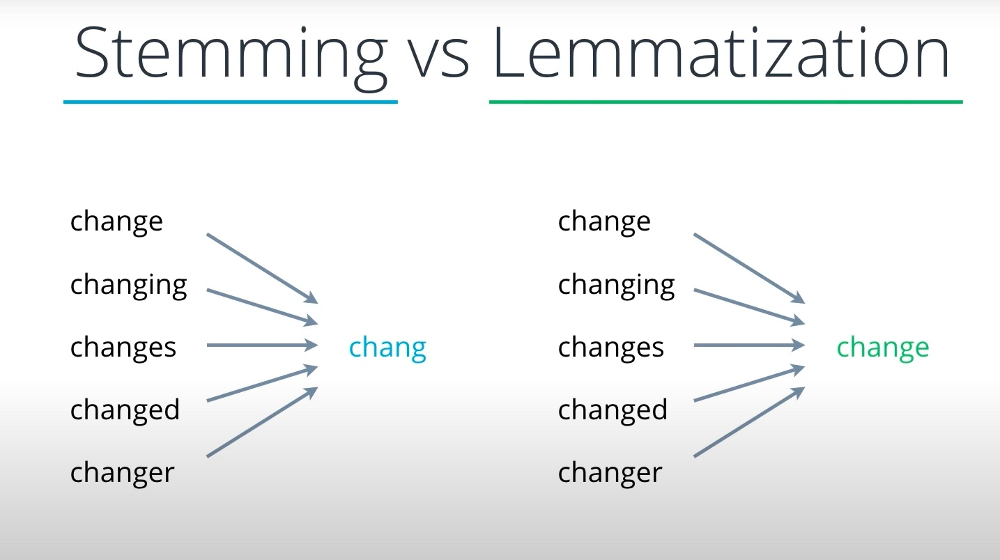
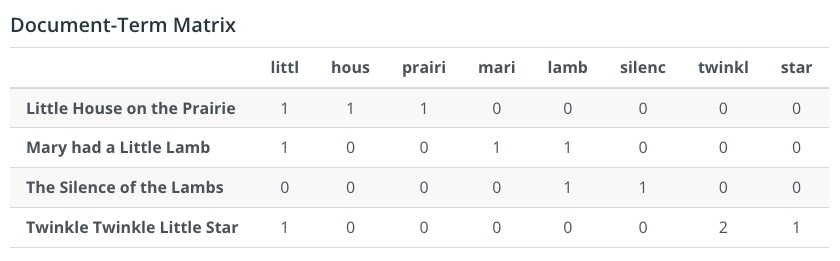
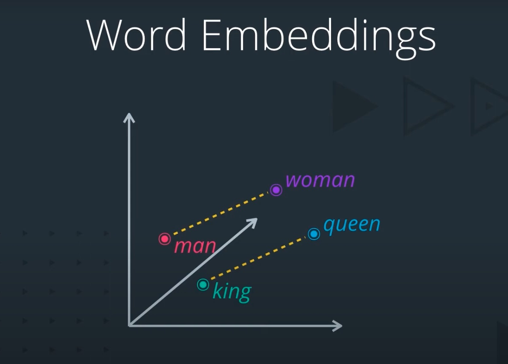
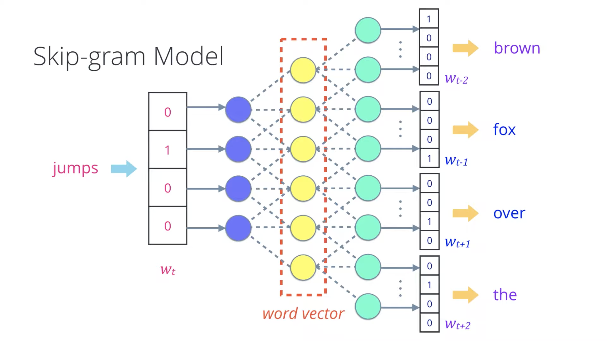
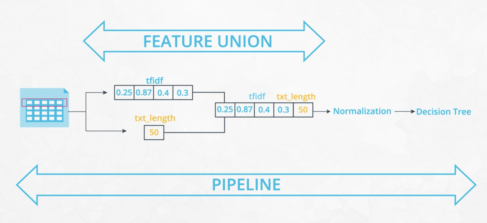

# Udacity Data Science Nanodegree: Data Engineering

These are my personal notes taken while following the [Udacity Data Science Nanodegree](https://www.udacity.com/course/data-scientist-nanodegree--nd025).

The Nanodegree assumes basic data analysis skills with python libraries (pandas, numpy, matplotlib, sklearn, etc.) and has 5 modules that build up on those skills:

1. Introduction to Data Science
2. Software Engineering
3. Data Engineering
4. Experimental Design & Recommendations
5. Data Scientist Capstone

This folder & guide refer to the **third module**: Data Engineering.

Mikel Sagardia, 2022.
No guarantees.

Overview of Contents:

- [Udacity Data Science Nanodegree: Data Engineering](#udacity-data-science-nanodegree-data-engineering)
  - [1. Introduction to Data Engineering](#1-introduction-to-data-engineering)
    - [Project Overview](#project-overview)
    - [Exercises and Code](#exercises-and-code)
  - [2. ETL Pipelines](#2-etl-pipelines)
    - [3.1 Lesson Outline and Dataset](#31-lesson-outline-and-dataset)
      - [Dataset: World Bank Data](#dataset-world-bank-data)
    - [3.2 Extract](#32-extract)
      - [Exercise 1: CSV](#exercise-1-csv)
      - [Exercise 2: JSON and XML](#exercise-2-json-and-xml)
      - [Exercise 3: SQL](#exercise-3-sql)
      - [Exercise 4: APIs](#exercise-4-apis)
    - [3.3 Transform](#33-transform)
      - [Exercise 5: Combining Datasets](#exercise-5-combining-datasets)
      - [Exercise 6: Cleaning Data](#exercise-6-cleaning-data)
      - [Exercise 7: Data Types](#exercise-7-data-types)
      - [Exercise 8: Parsing Dates](#exercise-8-parsing-dates)
      - [Exercise 9: Encodings](#exercise-9-encodings)
      - [Exercise 10: Missing Values](#exercise-10-missing-values)
      - [Exercise 11: Duplicates](#exercise-11-duplicates)
      - [Exercise 12: Regex and Dummy Variables](#exercise-12-regex-and-dummy-variables)
      - [Exercises 13 and 14: Outliers](#exercises-13-and-14-outliers)
      - [Exercise 15: Scaling](#exercise-15-scaling)
      - [Exercise 16: Feature Engineering](#exercise-16-feature-engineering)
    - [3.4 Load](#34-load)
      - [Final Exercise](#final-exercise)
  - [3. Natural Language Processing (NLP) Pipelines](#3-natural-language-processing-nlp-pipelines)
    - [3.1 Text Processing](#31-text-processing)
      - [Cleaning: Web Scrapping](#cleaning-web-scrapping)
      - [Normalization](#normalization)
      - [Tokenization](#tokenization)
      - [Stop Words](#stop-words)
      - [Tagging: Part-of-Speech (POS), Named Entities (NER)](#tagging-part-of-speech-pos-named-entities-ner)
      - [Canonical Forms: Stemming and Lemmatization](#canonical-forms-stemming-and-lemmatization)
    - [3.2 Feature Extraction](#32-feature-extraction)
      - [Bags-of-Words](#bags-of-words)
      - [Word Embeddings](#word-embeddings)
    - [3.3 Modeling](#33-modeling)
    - [3.4 Additional Concepts](#34-additional-concepts)
  - [4. Machine Learning Pipelines](#4-machine-learning-pipelines)
    - [4.1 Case Study Introduction](#41-case-study-introduction)
    - [4.2 Pipelines](#42-pipelines)
    - [4.3 Feature Unions](#43-feature-unions)
    - [4.4 Custom Transformers](#44-custom-transformers)
      - [Case Study: Custom Transformer](#case-study-custom-transformer)
    - [4.5 Grid Search](#45-grid-search)
    - [4.6 Final Pipeline](#46-final-pipeline)
  - [5. Project: Disaster Response Pipeline](#5-project-disaster-response-pipeline)

## 1. Introduction to Data Engineering

Data engineers gather data from different sources, clean and process it, and store it for later use. Then, anyone can use those data without much wrangling. That processing done by data engineers can be automated with data pipelines.

Roles of a data engineer:

- In large companies there are dedicated data engineers, which are closer to a software engineer role.
- In smaller companies, the role is more diffuse and distributed among data scientists and software developers.

The module focuses on both cases!

### Project Overview

We have messages sent during disasters via social media or other means; we need to create:

- An ETL pipeline which processes messages and stores them to an SQLite database.
- A Machine Learning pipeline which contains a model that classifies the message in 36 categories.

Finally, a web app is created in Flask so that we can classify a new message using the ML pipeline.

This kind of systems are crucial, since at disaster events millions and millions of messages are generated, and there is no human capacity to process them all; thus, an automated system is needed.

### Exercises and Code

All exercises are in [`lab/`](./lab/).

## 2. ETL Pipelines

**ETL = Extract, Transform, Load**:

- Extract: get data from different sources
- Transform: clean and format data to fit a predefined schema
- Load: save the data prepared to be used

In a large company, a data engineer is responsible for the ETL pipeline; then, a data scientist takes the data saved by the data engineer to create the machine learning pipeline. However, in small companies, the data scientist might be responsible for the ETL pipeline as well.

Example: Log data: we use log data to create a database with clicks and regions; we need to parse the logs to get the timestamps and IPs.

Cloud computing has popularized another pipeline: **ELT = Extract, Load, Transform**; these are the so called **data warehouses**. A regular ETL pipeline prepares the data in a predefined format so that we can query the dataset/database easily many times; thus, the transformation happens once. In contrast, ELT pipelines allow to store data without transformations; instead, transformations occur when querying. We can still use SQL or SQL-like languages for the queries.

Note that small datasets are used in the lesson, but usually big datasets appear in the industry, so big that they don't fit on one server, i.e., they are distributed across different locations &mdash; that's big data. **Free Udacity courses** on **Big Data** topics:

- [Intro to Hadoop and MapReduce](https://www.udacity.com/course/intro-to-hadoop-and-mapreduce--ud617)
- [Deploying a Hadoop Cluster](https://www.udacity.com/course/deploying-a-hadoop-cluster--ud1000)
- [Real-Time Analytics with Apache Storm](https://www.udacity.com/course/real-time-analytics-with-apache-storm--ud381)
- [Big Data Analytics in Healthcare](https://www.udacity.com/course/big-data-analytics-in-healthcare--ud758)
- [Spark](https://www.udacity.com/course/learn-spark-at-udacity--ud2002)

**Fee Udacity courses** on **databases**:

- [Data Wrangling with MongoDB](https://www.udacity.com/course/data-wrangling-with-mongodb--ud032)
- [SQL for Data Analysis](https://www.udacity.com/course/sql-for-data-analysis--ud198)

Interesting links:

- [ETL Wikipedia](https://en.wikipedia.org/wiki/Extract,_transform,_load)
- Data warehouses:
  - [Amazon Redshift](https://aws.amazon.com/redshift/)
  - [Google BigQuery](https://cloud.google.com/bigquery/)
  - [IBM Db2 Warehouse on Cloud](https://www.ibm.com/cloud/db2-warehouse-on-cloud)

### 3.1 Lesson Outline and Dataset

In this lesson, the following topics are learned:

1. Extract data from different sources such as:
   
   - csv files
   - json files
   - APIs

2. Transform data

   - combining data from different sources
   - data cleaning
   - data types
   - parsing dates
   - file encodings
   - missing data
   - duplicate data
   - dummy variables
   - remove outliers
   - scaling features
   - engineering features

3. Load: send the transformed data to a database
4. ETL Pipeline: code an ETL pipeline

#### Dataset: World Bank Data

Data from two sources is used:

- [World Bank Indicator Data](https://data.worldbank.org/indicator): GDP, population, etc.
- [World Bank Projects & Operations Data](https://datacatalog.worldbank.org/search/dataset/0037800): money spent to build a bridge in Nepal, etc.

The data can be downloaded as CSV or access via an API.

The goal is to aggregate and clean all data, and bring them together in one table.

### 3.2 Extract

Extraction: pulling and gathering data from different sources, for instance:

- CSV
- JSON
- XML
- Text files, e.g., log files (NLP is required)
- SQL databases
- Web scrapping
- APIs: JSON/XML strings obtained

#### Exercise 1: CSV

File: [`lab/01_csv/1_csv_exercise_solution.ipynb`](lab/01_csv/1_csv_exercise_solution.ipynb)

Contents:

```python
# If messy data with various types in a col, convert to string
df_projects = pd.read_csv('projects_data.csv', dtype=str)
# Nulls for each column
df_projects.isnull().sum()
# If first rows have info lines, not CSV, skip them
df_population = pd.read_csv("population_data.csv", skiprows=4)
# Nulls for each row
df_population.isnull().sum(axis=1)
# Drop columns with many NAs or dubious content
df_population = df_population.drop(columns='Unnamed: 62')
```

#### Exercise 2: JSON and XML

JSON and XML are common exchange formats in APIs.

File: [`lab/02_json_xml/2_extract_exercise.ipynb`](lab/02_json_xml/2_extract_exercise.ipynb)

Contents:

```python
## JSON

import pandas as pd
# Orient:
# https://pandas.pydata.org/docs/reference/api/pandas.read_json.html
df_json = pd.read_json('population_data.json', orient='records')

## XML

# Often more manual processing is required
# Example XML file with these "record" objects and "fields" within:
# <record>
#   <field name="Country or Area" key="ABW">Aruba</field>
#   <field name="Item" key="SP.POP.TOTL">Population, total</field>
#   <field name="Year">1960</field>
#   <field name="Value">54211</field>
# </record>
# Parse with BeautifulSoup
from bs4 import BeautifulSoup
with open("population_data.xml") as fp:
    soup = BeautifulSoup(fp, "lxml") # lxml is the Parser type
# Convert the XML into dataframe
data_dictionary = {'Country or Area':[], 'Year':[], 'Item':[], 'Value':[]}
for record in soup.find_all('record'): # look for "record" objects
    for record in record.find_all('field'): # look for "field" objects
        data_dictionary[record['name']].append(record.text)
df = pd.DataFrame.from_dict(data_dictionary)
#   Country or Area	 Year	 Item	               Value
# 0	Aruba	           1960	 Population, total	 54211
# ...
# We need to / can pivot the table for better format
df = df.pivot(index='Country or Area', columns='Year', values='Value')
df.reset_index(level=0, inplace=True)
#  	Country or Area	  1960	    1961	    1962	    1963	1964	...	2017
# 0	Afghanistan	      8996351	  9166764	  9345868	  ...
# ...
```

#### Exercise 3: SQL

File: [`lab/03_sql/3_sql_exercise.ipynb`](lab/03_sql/3_sql_exercise.ipynb)

There are many ways of getting data from SQL databases. Here two are shown using a SQLite database:

- Using `sqlite3`, the python library for SQLite
- Using SQLAlchemy with raw SQL statements; there are other ways with SQLAlchemy, too.

SQLite creates databases in a single file (non-distributed); these storage is though for single applications, when we'd like to query data.

Content:

```python
import sqlite3
import pandas as pd
from sqlalchemy import create_engine

# SQLite
# Connect to the database
conn = sqlite3.connect('population_data.db')
# Run a query: there is only one table, population_data, and we extract everything
df = pd.read_sql('SELECT * FROM population_data', conn)

# SQLAlchemy
# Create an engine
engine = create_engine('sqlite:///population_data.db')
# Run SELECT * query
df = pd.read_sql("SELECT * FROM population_data", engine)

# Write to SQLite
conn = sqlite3.connect('dataset.db')
df = pd.read_csv('dataset.csv')
# Clean
columns = [col.replace(' ', '_') for col in df.columns]
df.columns = columns
df.to_sql("dataset", conn, if_exists="replace")
```

#### Exercise 4: APIs

World Bank APIs resources:

- [Documentation included how to filter by year](https://datahelpdesk.worldbank.org/knowledgebase/articles/898581-api-basic-call-structure)
- [2-character iso country codes](https://www.nationsonline.org/oneworld/country_code_list.htm)
- [Search box for World Bank indicators](https://data.worldbank.org)

To find the indicator code:

- First search for the indicator here: [https://data.worldbank.org](https://data.worldbank.org)
- Click on the indicator name. The indicator code is in the url.
- For example, the indicator code for total population is `SP.POP.TOTL`, which you can see in the link [https://data.worldbank.org/indicator/SP.RUR.TOTL](https://data.worldbank.org/indicator/SP.RUR.TOTL).

File: [`lab/04_api/4_api_exercise.ipynb`](lab/04_api/4_api_exercise.ipynb)

Content:

```python
# Define URL: Rural population in Switzerland between 1995-2001
url = 'http://api.worldbank.org/v2/country/ch/indicator/SP.RUR.TOTL/?date=1995:2001&format=json&per_page=1000'
# Send the request
r = requests.get(url)
# Convert to JSON: first element is metadata
r_json = r.json()
df = pd.DataFrame(r_json[1])
```

### 3.3 Transform

Typical transformation operations:

- Combine different datasets in different formats: join/merge, pivot/melt
- Cleaning data
- Checking data types
- Matching encodings
- Dealing with missing data
- Dealing with duplicates
- Encoding data: dummies
- Outliers
- Scaling data
- Feature engineering

#### Exercise 5: Combining Datasets

Typical pandas methods to combine datasets:

- Concatenate: `concat`
- Join: `merge`
- Pivot/unpivot between long/wide formats: `pivot`, `melt`

File: [`lab/05_combine_data/5_combining_data.ipynb`](lab/05_combine_data/5_combining_data.ipynb)

Content:

```python
# df_rural.columns = 'Country Name', 'Country Code', 'Indicator Name', 'Indicator Code', '1960', ..., '2017'
df_rural = pd.read_csv('rural_population_percent.csv', skiprows=4)
# df_electricity.columns = 'Country Name', 'Country Code', 'Indicator Name', 'Indicator Code', '1960', ..., '2017'
df_electricity = pd.read_csv('electricity_access_percent.csv', skiprows=4)

# New format: long
# df_rural.columns = 'Country Name, 'Country Code', 'Indicator Name', 'Indicator Code', 'Year', 'Rural Value'
df_rural = pd.melt(df_rural, id_vars=['Country Name',
                                      'Country Code',
                                      'Indicator Name',
                                      'Indicator Code'],
                             var_name='Year',
                             value_name='Rural Value')
# df_electricity.columns = 'Country Name, 'Country Code', 'Indicator Name', 'Indicator Code', 'Year', 'Electricity Value'
df_electricity = pd.melt(df_electricity, id_vars=['Country Name',
                                                  'Country Code',
                                                  'Indicator Name',
                                                  'Indicator Code'],
                                         var_name='Year',
                                         value_name='Electricity Value')

# Drop any columns from the data frames that aren't needed
df_rural.drop(['Indicator Name', 'Indicator Code'], axis=1, inplace=True)
df_electricity.drop(['Indicator Name', 'Indicator Code'], axis=1, inplace=True)

# Merge the data frames together based on their common columns
# in this case, the common columns are Country Name, Country Code, and Year
df_merge = df_rural.merge(df_electricity, how='outer',
                                          on=['Country Name', 'Country Code', 'Year'])

# Sort the results by country and then by year
df_combined = df_merge.sort_values(by=['Country Name', 'Year'])
df_combined.head()
```

#### Exercise 6: Cleaning Data

Typical data errors that need to be cleaned:

- data entry mistakes
- duplicate data
- incomplete records
- inconsistencies between dataset

File: [`lab/06_cleaningdata/6_cleaning_data.ipynb`](lab/06_cleaningdata/6_cleaning_data.ipynb).

It's an interesting but very specific case of data cleaning: country names are mapped to their ISO country codes:

- The library `pycountry` is used to get the ISO code given the official name.
- Countries that are not found in the `pycountry` database are mapped manually.
- Mapping is done with `.apply(lambda x: d[x])`, where `d` is a dictionary which maps `name` to `code`.

#### Exercise 7: Data Types

File: [`lab/07_datatypes/7_datatypes_exercis.ipynb`](lab/07_datatypes/7_datatypes_exercise.ipynb).

Contents:

- Column filtering is done with `isin()`.
- Filtered column values are summed with `sum(axis=0)`.
- String columns are converted to numeric by removing `,` first using `replace()` and then `to_numeric()`.

#### Exercise 8: Parsing Dates

Parsing dates is a common activity both in pandas and in [SQL](http://www-db.deis.unibo.it/courses/TW/DOCS/w3schools/sql/sql_dates.asp.html#gsc.tab=0).

File: [`lab/08_parsingdates/8_parsingdates_exercise.ipynb`](lab/08_parsingdates/8_parsingdates_exercise.ipynb).

Content:

```python
# Example closing date: 2023-06-28
# Format: https://strftime.org
df_projects['closingdate'] = pd.to_datetime(df_projects['closingdate'], format='%Y-%m-%dT%H:%M:%SZ')
# Get year, month, weekday
df_projects['closingdate'].dt.year
df_projects['closingdate'].dt.month
df_projects['closingdate'].dt.weekday
```

#### Exercise 9: Encodings

Text or file encodings are mappings between bytes and string symbols; the default encoding, which is also valid for all languages, is `utf-8`. But python also comes with other encodings, too: [Standard Encodings](https://docs.python.org/3/library/codecs.html#standard-encodings).

File: [`lab/09_encodings/9_encodings_exercise.ipynb`](lab/09_encodings/9_encodings_exercise.ipynb).

```python
from encodings.aliases import aliases

# When an encoding is not UFT-8, how to detect which encoding we should use?
# Python has a file containing a dictionary of encoding names and associated aliases
alias_values = set(aliases.values())
for alias in alias_values:
    try:
        df = pd.read_csv('mystery.csv', encoding=alias)
        print(alias) # valid encodings are printed
    except:
         pass 

# Another option: chardet
# !pip install chardet
import chardet

with open("mystery.csv", 'rb') as file:
    print(chardet.detect(file.read()))
```

#### Exercise 10: Missing Values

Most machine learning algorithms cannot handle missing values; exception: [Gradient Boosting: XGBoost](https://xgboost.readthedocs.io/en/latest/).

There are two ways to handle missing values:

- Delete data
  - If a column is almost all `NA`, we could consider deleting it
  - If a row is almost all `NA`, we could consider deleting it
- Fill missing values = **imputation**
  - **Mean / median / mode imputation** is an option if the missing cells are not that many; note that instead of imputing the column aggregate, we could group by other categorical features and impute the aggregate of that group!
  - Time series: **Forward fill, Backward fill**: if the data is ordered in time, we apply *hold last sample* in one direction or the other.

File: [`lab/10_imputation/10_imputations_exercise.ipynb`](lab/10_imputation/10_imputations_exercise.ipynb).

```python
# Imputation of regular features (not time series): fill with mean / median / mode
# WARNING: instead of imputing the column aggregate,
# we should group by other categorical features and impute the aggregate of that group!
df["var_fill"] = df.groupby("var_group")["var_fill"].transform(lambda x: x.fillna(x.mean())

# Imputation in time series: Forward Fill and Backward Fill
# i.e., if the data is ordered in time, we apply *hold last sample* 
# in one direction or the other. BUT: we need to sort the data!
df['GDP_ffill'] = df.sort_values(by='year').groupby("country")['GDP'].fillna(method='ffill')
df['GDP_bfill'] = df.sort_values(by='year').groupby("country")['GDP'].fillna(method='bfill')
# If only a country
df['GDP_ffill'] = df.sort_values(by='year')['GDP'].fillna(method='ffill')
# If the first/last value is NA, we need to run both: ffill and bfill
df['GDP_ff_bf'] = df.sort_values(by='year')['GDP'].fillna(method='ffill').fillna(method='bfill')

```

#### Exercise 11: Duplicates

This exercise goes beyond the typical `.duplicated()` and `.drop_duplicates().reset_index(drop=True)`. It analyzes the case of projects in Yogoslavia and the countries in which Yogoslavia was segregated. The idea is that some projects might be (and, in fact, are) duplicated. These are found by checking the country names and the project approval dates.

File: [`lab/11_duplicatedata/11_duplicatedata_exercise.ipynb`](lab/11_duplicatedata/11_duplicatedata_exercise.ipynb).

#### Exercise 12: Regex and Dummy Variables

Categorical variables need to be converted into numbers; one approach is using dummy variables. However, categories often need to be cleaned and reduced (i.e., aggregated), otherwise the number of dummy columns explode. A common way of cleaning consists in using `.replace()` together with `re`, the regex module. More information on regex:

- [Regex tutorial — A quick cheatsheet by examples](https://medium.com/factory-mind/regex-tutorial-a-simple-cheatsheet-by-examples-649dc1c3f285)
- [Regex cookbook — Top 15 Most common regex](https://medium.com/@fox.jonny/regex-cookbook-most-wanted-regex-aa721558c3c1)

File: [`lab/12_dummy_variables/12_dummyvariables_exercise.ipynb`](lab/12_dummy_variables/12_dummyvariables_exercise.ipynb).

```python
## Cleaning categories

# Fields with value '!$10' -> NaN
df['sector'] = df['sector'].replace('!$10', np.nan)
# Replace with Regex
# This looks for string with an exclamation point followed by one or more characters
df['sector'] = df['sector'].replace('!.+', '', regex=True)
# Replace with Regex
# Remove the string '(Historic)' from the sector1 variable
df['sector'] = df['sector'].replace('^(\(Historic\))', '', regex=True)
# More on regex:
# - Tutorial: https://medium.com/factory-mind/regex-tutorial-a-simple-cheatsheet-by-examples-649dc1c3f285
# - Cookbook: https://medium.com/@fox.jonny/regex-cookbook-most-wanted-regex-aa721558c3c1

## Aggregating categories

import re

# Create an aggregate sector variable which covers general topics
# For instance: "Transportation: Highways", "Transportation: Airports" -> "Transportation"
df.loc[:,'sector_aggregates'] = sector['sector']
topics = ['Energy', 'Transportation']
for topic in topics:
    # Find all that contain the topic (ignore case), replace NaN with False (i.e., not found)
    # All found have same general topic
    df.loc[sector['sector_aggregates'].str.contains(topic, re.IGNORECASE).replace(np.nan, False),'sector_aggregates'] = topic

## Dummy Variables

# One-hot encoding of features: Dummy variables with pandas
# Use drop_first=True to remove the first category and avoid multi-colinearity
# Note: if a field has NaN, all dummy variables will have a value of 0
col_dummies = ['var1', 'var2']
try:
    for col in col_dummies:
        df = pd.concat([df.drop(col, axis=1),
        				pd.get_dummies(df[col], prefix=col, prefix_sep='_',
        					drop_first=True, dummy_na=False)],
                        axis=1)
except KeyError as err:
    print("Columns already dummified!")

```

#### Exercises 13 and 14: Outliers

Outliers are data points that have unexpected values; they can be due to:

- Errors in the recordings, i.e., we should remove them
- Due to chance, i.e., we should keep them

There are many ways to detect them:

- Data visualization: in 1D or 2D, plot as visually inspect; in higher dimensions, apply PCA to 2D and inspect.
- Clustering (in any dimension): cluster the data and compute distances to centroids; values with large distances are suspicious of being outliers.
- Statistical methods:
  - Z-score (assuming normal distribution): any data point outside from the the 2-sigma range is an outlier (i.e., `< mean-2*sigma` or `> mean+2*sigma`); 2-sigma is related to the 95% Ci or `alpha = 0.05`. 
  - Tukey method (no distribution assumption): any data point outside from the 1.5*IQR is an outlier (i.e., `< Q1-1.5*IQR` or `> Q3+1.5*IQR`)

Outliers might affect the model considerably; for instance, in a linear regression model, the line/hyperplane is pulled to the outliers. However, sometimes the outliers are aligned with the model, and they are not really outliers; when should we remove them?

- Compute candidate outliers in all dimensions, e.g., using Tukey.
- Candidate data points that are outliers in all dimensions are maybe not outliers.
- Create models with and without candidate outliers and then predict control points; do they change considerably?

Outlier detection in Scikit-Learn: [Novelty and Outlier Detection](https://scikit-learn.org/stable/modules/outlier_detection.html).

Files: 

- [`lab/13_outliers_part1/13_outliers_exercise.ipynb`](lab/13_outliers_part1/13_outliers_exercise.ipynb).
- [`lab/14_outliers_part2/14_outliers_exercise.ipynb`](lab/14_outliers_part2/14_outliers_exercise.ipynb).

```python
def tukey_filter(df, col_name):
    Q1 = df[col_name].quantile(0.25)
    Q3 = df[col_name].quantile(0.75)
    IQR = Q3 - Q1
    max_value = Q3 + 1.5 * IQR
    min_value = Q1 - 1.5 * IQR
    return df[(df[col_name] < max_value) & (df[col_name] > min_value)]
```

#### Exercise 15: Scaling

Algorithms that use Euclidean distance computations work with data in similar ranges; thus, scaling is necessary; typical scaling methods:

- Rescaling: scale values to `[0,1]`, aka. `MinMaxScaling`.
- Standardization: scale to get a mean of 0 and a standard deviation of 1, aka. `StandardScaling`.

File: [`lab/15_scaling/15_scaling_exercise.ipynb`](lab/15_scaling/15_scaling_exercise.ipynb).

#### Exercise 16: Feature Engineering

Typical feature engineering approaches:

- Encode/map values
- Ratios
- Sums
- Polynomial features: `PolynomialFeatures`
- Transform data into a new feature

File: [`lab/16_featureengineering/16_featureengineering_exercise.ipynb`](lab/16_featureengineering/16_featureengineering_exercise.ipynb).

### 3.4 Load

The last step in an ETL pipeline is loading the dataset we have prepared.

Commonly, relational databases, i.e., SQL databases, are used; I have a guide on the topic: [sql_guide](https://github.com/mxagar/sql_guide).

In addition to SQLAlchemy, we can use the SQLite package `sqlite3` in python (included in the standard library). In the following, some example lines are provided, which come from the file [`lab/17_load/17_load_exercise.ipynb`](lab/17_load/17_load_exercise.ipynb).

```python
# Write to SQLite using sqlite3
# Alternative: SQLAlchemy
import sqlite3
# Connect to database; file created if not present
conn = sqlite3.connect('dataset.db')
# Load Table A - or create one
df_A = pd.read_csv('dataset_A.csv')
# Load Table B - or create one
df_B = pd.read_csv('dataset_B.csv')
# Clean, if necessary
columns = [col.replace(' ', '_') for col in df_A.columns]
df_A.columns = columns
# ...
# Write tables to database
df_A.to_sql("table_A", conn, if_exists="replace", index=False)
df_B.to_sql("table_B", conn, if_exists="replace", index=False)
# Check (i.e., read)
df_A_ = pd.read_sql('SELECT * FROM table_A', conn)
df_B_ = pd.read_sql('SELECT * FROM table_B', conn)
# Commit changes and close connection
conn.commit()
conn.close()
```

The standard `sqlite3` package and SQLite itself are limited in terms of capabilities; for instance, once we create a table with its primary key, we cannot change the key, i.e., we need to drop the table and recreate it. In the following, an example of how a table can be created using SQL and values added.

```python
# Insert rows to SQLite
# WARNING: use better to_sql() and pass entire tables
# i.e., don't insert row-by-row in a for loop...
# Connect to the data base, create if file not there
conn = sqlite3.connect('database.db')
# Get a cursor
cur = conn.cursor()
# Drop the test table in case it already exists
cur.execute("DROP TABLE IF EXISTS test")
# Create the test table including project_id as a primary key
cur.execute("CREATE TABLE test (project_id TEXT PRIMARY KEY, countryname TEXT, countrycode TEXT, totalamt REAL, year INTEGER);")
# Insert a single row of value into the test table
project_id = 'a'
countryname = 'Brazil'
countrycode = 'BRA'
totalamt = '100,000'
year = 1970
sql_statement = f"INSERT INTO test (project_id, countryname, countrycode, totalamt, year) VALUES ('{project_id}', '{countryname}', '{countrycode}', '{totalamt}', {year});"
cur.execute(sql_statement)
# Commit changes made to the database
conn.commit()
# Select all from the test table
cur.execute("SELECT * FROM test")
cur.fetchall()
# [('a', 'Brazil', 'BRA', '100,000', 1970)]
# Insert several rows:
for index, values in df.iterrows():
    project_id, countryname, countrycode, totalamt, year = values
    sql_statement = f"INSERT INTO test (project_id, countryname, countrycode, totalamt, year) VALUES ('{project_id}', '{countryname}', '{countrycode}', '{totalamt}', {year});"
    cur.execute(sql_string)
# Commit changes to the dataset after any changes are made
conn.commit()
# ...
# Commit changes and close connection
conn.commit()
conn.close()
```

#### Final Exercise

Very interesting exercise in which the complete ETL pipeline is carried out to extract content line-by-line from a CSV, clean and transform it and load it to an SQLite database.

I have moved the code from the notebook to a script:

[`lab/18_final_exercise/etl_gdp.py`](lab/18_final_exercise/etl_gdp.py).

```python
"""This module contains an ETL pipeline
which processes the GDP data obtained from the
World Bank website.

ETL pipelines (i.e., Extract, Transform, Load)
are common before applying any data analysis or
modeling. In the present case, these steps are
carried out, mainly executed by the function run_etl():

- A source file stream is opened (DATA_SOURCE_FILENAME)
- It is read it line by line
- Each line is cleaned and transformed by transform_indicator_data()
- Each transformed line is inserted the output to the goal database
    with load_indicator_data()

To use this file, check that DATA_SOURCE_FILENAME points
to the correct file path and run the script:

    $ python etl_gdp.py

Then, you should get evidence/output in the terminal
and the SQLite database DB_FILENAME should be there.

Source: Udacity Data Science Nanodegree exercise,
link to original file:

    https://github.com/mxagar/data_science_udacity/blob/main/03_DataEngineering/lab/18_final_exercise/etl_gdp.py

Author: Mikel Sagardia
Date: 2023-03-06
"""
import sqlite3
import numpy as np
import pandas as pd

DATA_SOURCE_FILENAME = "../10_imputation/gdp_data.csv"
DB_FILENAME = "world_bank.db"
DB_TABLE_NAME = "gdp"

def create_database_table():
    """Create the database file with the gdp table.
    
    Args: None
    Returns: None
    """
    # Connect to the database
    # sqlite3 will create this database file if it does not exist already
    conn = sqlite3.connect(DB_FILENAME)

    # Get a cursor
    cur = conn.cursor()

    # Drop the gdp table in case it already exists
    cur.execute(f"DROP TABLE IF EXISTS {DB_TABLE_NAME}")

    # Create the gdp table: long format, with these rows:
    # countryname, countrycode, year, gdp
    sql_string = f"""CREATE TABLE {DB_TABLE_NAME} (countryname TEXT,
                                                   countrycode TEXT,
                                                   year INTEGER,
                                                   gdp REAL,
                                                   PRIMARY KEY (countrycode, year));"""
    cur.execute(sql_string)

    # Commit and close
    conn.commit()
    conn.close()

def extract_lines(file):
    """Generator for reading one line at a time.
    Generators are useful for data sets that are too large
    to fit in RAM.
    
    Usage:
    
        with open('dataset.csv') as f:
            for line in extract_lines(f):
                data = line.split(',')
                # process row/line...

    Args:
        file (object): file opened with open()

    Returns:
        line (str): yield one line string
    """
    while True:
        line = file.readline()
        if not line:
            break
        yield line

def transform_indicator_data(data, col_names):
    """A single line of a data source is cleaned and transformed
    into a usable format.

    The argument data is a list which represents a row
    from a dataframe with the following 63 col_names (in order):
    
    - 'Country Name': not only countries, also continents, etc.
    - 'Country Code'
    - 'Indicator Name': 'GDP (current US$)' for all
    - 'Indicator Code': 'NY.GDP.MKTP.CD' for all
    - 1960
    - 1961
    - ...
    - 2016
    - 2017
    - 'Unnamed: 62': NaN for all

    That list is converted to long format, which results in a
    dataframe with the following columns:
    
    - countryname
    - countrycode
    - year
    - gdp

    In the process:
    - Unnecessary columns are dropped
    - Only real countries are taken (i.e., not continents)
    - Only GDP values which are not NaN are taken
    
    The return is a list of lists of the following form:
    
        [[countryname, countrycode, year, gdp]]

    Args:
        data (list): data point of a country, as described above.
        col_names (list): column names of the data point

    Returns:
        results (list): GDP values per year & country, as described above.
    """
    # Get rid of quote marks
    for i, datum in enumerate(data):
        data[i] = datum.replace('"','')
    
    # Extract country name
    country = data[0]
    
    # These are "countryname" values that are not actually countries
    # List generated from visual inspection
    non_countries = ['World',
     'High income',
     'OECD members',
     'Post-demographic dividend',
     'IDA & IBRD total',
     'Low & middle income',
     'Middle income',
     'IBRD only',
     'East Asia & Pacific',
     'Europe & Central Asia',
     'North America',
     'Upper middle income',
     'Late-demographic dividend',
     'European Union',
     'East Asia & Pacific (excluding high income)',
     'East Asia & Pacific (IDA & IBRD countries)',
     'Euro area',
     'Early-demographic dividend',
     'Lower middle income',
     'Latin America & Caribbean',
     'Latin America & the Caribbean (IDA & IBRD countries)',
     'Latin America & Caribbean (excluding high income)',
     'Europe & Central Asia (IDA & IBRD countries)',
     'Middle East & North Africa',
     'Europe & Central Asia (excluding high income)',
     'South Asia (IDA & IBRD)',
     'South Asia',
     'Arab World',
     'IDA total',
     'Sub-Saharan Africa',
     'Sub-Saharan Africa (IDA & IBRD countries)',
     'Sub-Saharan Africa (excluding high income)',
     'Middle East & North Africa (excluding high income)',
     'Middle East & North Africa (IDA & IBRD countries)',
     'Central Europe and the Baltics',
     'Pre-demographic dividend',
     'IDA only',
     'Least developed countries: UN classification',
     'IDA blend',
     'Fragile and conflict affected situations',
     'Heavily indebted poor countries (HIPC)',
     'Low income',
     'Small states',
     'Other small states',
     'Not classified',
     'Caribbean small states',
     'Pacific island small states']
    
    # Filter out country name values that are in the above list
    if country not in non_countries:        
        # Convert the data variable into a numpy array
        data_array = np.array(data, ndmin=2)
        
        # Reshape the data_array so that it is one row and 63 columns
        data_array.reshape(1,63)
        
        # Convert the data_array variable into a pandas dataframe
        # Specify the column names as well using the col_names variable/arg
        # Replace all empty strings in the dataframe with np.nan
        df = pd.DataFrame(data_array, columns=col_names).replace('', np.nan)
        
        # Drop the unnecessary columns
        #df.drop(['\n', 'Indicator Name', 'Indicator Code', 'Unnamed: 62'], inplace=True, axis=1)
        df.drop(['\n', 'Indicator Name', 'Indicator Code'], inplace=True, axis=1)
        # Reshape the data sets so that they are in long format
        #   Country Name, Country Code year, gdp
        df_melt = df.melt(id_vars=['Country Name', 'Country Code'], 
                            var_name='year', 
                            value_name='gdp')
        
        # For each row in df_melt, extract the following values into a list:
        #   [country, countrycode, year, gdp]
        results = []
        for index, row in df_melt.iterrows():
            country, countrycode, year, gdp = row
            # Check if gpd is NaN: convert it to str
            if str(gdp) != 'nan':
                results.append([country, countrycode, year, gdp])
                
        return results

def load_indicator_data(results):
    """Insert the GDP data per country and year transformed
    by transform_indicator_data() into the goal database.

    The input results should have the following form:
    
        [[countryname, countrycode, year, gdp], [...], ...]

    Args:
        results (list): list of lists returned by transform_indicator_data()
            which contains GDP data per country and year

    Returns: None
    """
    # Connect to the goal database using the sqlite3 library
    conn = sqlite3.connect(DB_FILENAME)
    
    # Create a cursor object
    cur = conn.cursor()
    
    if results: 
        for result in results:
            # Extract the values from each list in the big results list
            countryname, countrycode, year, gdp = result

            # Prepare a query to insert a countryname, countrycode, year, gdp value
            sql_string = f"""INSERT INTO {DB_TABLE_NAME} 
                             (countryname, countrycode, year, gdp)
                             VALUES ("{countryname}", "{countrycode}", {year}, {gdp});"""

            # Connect to database and execute query
            try:
                cur.execute(sql_string)
            except Exception as e:
                print('error occurred:', e, result)
    
    # Commit changes and close the connection
    conn.commit()
    conn.close()

def run_etl():
    """Run the ETL pipeline: Extract, Transform, Load.
    This function
    
    - opens a file stream
    - read it line by line
    - transforms each line with transform_indicator_data()
    - inserts the output to the goal database with load_indicator_data()
    
    Args: None
    Returns: None
    """
    # Create database table
    create_database_table()
    
    # ETL
    with open(DATA_SOURCE_FILENAME) as f:
        # Execute the generator to read in the file line by line
        for line in extract_lines(f):
            # Split the comma separated values
            data = line.split(',')
            # Check the length of the line because the first lines
            # of the csv file are not data
            if len(data) == 63:
                # Check if the line represents column names (i.e., header)
                # If so, extract column names
                if data[0] == '"Country Name"':
                    col_names = []
                    # Get rid of quote marks in the results
                    # to make the data easier to work with
                    for i, datum in enumerate(data):
                        col_names.append(datum.replace('"',''))
                else:
                    # Transform and load the line of indicator data
                    results = transform_indicator_data(data, col_names)
                    load_indicator_data(results)

if __name__ == "__main__":

    # Run the complete ETL pipeline
    run_etl()
    print("ETL executed!")
    
    # Connect to the database
    conn = sqlite3.connect(DB_FILENAME)

    # Read the table to a dataframe
    df = pd.read_sql(f"SELECT * FROM {DB_TABLE_NAME}", con=conn)

    # Check: print some values
    print("Checking the contents of the database...")
    print(f"\nShape: \n{df.shape}")
    print(f"\nColumns: \n{df.columns}")
    print(f"\nHead (2 rows): \n{df.head(2)}")

    # Commit and close
    conn.commit()
    conn.close()

```

## 3. Natural Language Processing (NLP) Pipelines

Natural Language Processing (NLP) pipelines have specific characteristics; this lesson/section deals with them. Steps in an NLP pipeline:

1. Text Processing: raw text is transformed to a normalized form
   - Cleaning
   - Normalization
   - Tokenization
   - Stop Word Removal
   - Part of Speech Tagging
   - Named Entity Recognition
   - Stemming and Lemmatization
2. Feature Extraction: useful features for the model are created
   - Bag of Words
   - TF-IDF
   - Word Embeddings
3. Modeling: a model is fit to the dataset of features

When be fit and evaluate the model, it might not perform as desired; in that case, we need to go back some steps and rethink the implementation of the pipeline.

I have an NLP guide which collects NLP techniques with NLTK and spaCy: [https://github.com/mxagar/nlp_guide](https://github.com/mxagar/nlp_guide).

Additionally, my repository [text_sentiment](https://github.com/mxagar/text_sentiment) introduces the general NLP pipeline.

### 3.1 Text Processing

The text obtained from any source (OCR, speech-to-text, web, etc.) is usually processed to a standard form; in this section we will carry out these steps:

- **Cleaning** to remove irrelevant items, such as HTML tags
- **Normalizing** by converting to all lowercase and removing punctuation
- **Tokenizing**: Splitting text into words or tokens
- **Removing common words**, also known as stop words (e.g., *the*, *of*, etc.)
- **Parts of speech and named entities'** identification
- **Stemming and lemmatization**: Converting words into their dictionary or canonical forms

#### Cleaning: Web Scrapping

This section is not up to date, because the originally webpage used (Udacity course catalogue) applies Javascript to generated the course list now. Unfortunately, `BeautifulSoup` cannot deal with web pages that use Javascript to generate HTML content once the basic HTML content is captured. More on that: 

[Web-scraping JavaScript page with Python](https://stackoverflow.com/questions/8049520/web-scraping-javascript-page-with-python).

Instead of using the Udacity catalogue, I used this one:

[https://learndataengineering.com/p/all-courses](https://learndataengineering.com/p/all-courses)

Summary of the code in [`lab/NLP_Pipelines/cleaning_practice.ipynb`](./lab/NLP_Pipelines/cleaning_practice.ipynb):

```python
import requests 
from bs4 import BeautifulSoup

# Fetch web content
r = requests.get('https://learndataengineering.com/p/all-courses')
# Display the raw text: useless
print(r.text)

# Parse content
#soup = BeautifulSoup(r.text, "lxml")
soup = BeautifulSoup(r.content, 'html.parser')
# Display the parsed content: useless
print(soup.get_text())

# Optional: Get all tags: a, div, p, h3, ...
tags = {tag.name for tag in soup.find_all()}
# Optional: Get all classes
class_list = set()
for tag in tags:
    for i in soup.find_all(tag):
        if i.has_attr("class"):
            if len(i['class']) != 0:
                class_list.add(" ".join( i['class']))
print(class_list)

# Get all courses: title, description
# We need to right click + inspect to see the name of the CSS object
# of each course card; then, we need to see the hierarchical components
# of that object which contain the title and the description
course_objects = soup.find_all("div", {"class": "featured-product-card__content"})
courses = []
for course in course_objects:
    title = course.select_one("h3").get_text().strip()
    description = course.select_one("h4").get_text().strip()
    courses.append((title, description))

print(courses)
```

Interesting links:

- [Requests](https://docs.python-requests.org/en/latest/user/quickstart/#make-a-request)
- [Regular expressions](https://docs.python.org/3/library/re.html)
- [Beautiful Soup Documentation](https://www.crummy.com/software/BeautifulSoup/bs4/doc/)

#### Normalization

Typical normalization tasks:

- Convert to lower case.
- Remove punctuation and similar symbols.

```python
import re

# Conver to lowercase
text = text.lower()

# Remove punctuation characters:
# Anything that isn't A through Z or 0 through 9 will be replaced with a space
text = re.sub(r"[^a-zA-Z0-9", " ", text)
```

#### Tokenization

Tokenization consists in separating the text in symbols that have a meaning, i.e., often words and additional symbols. We can do it with `split()` or using NLTK. In any case, we get a list of tokens.

More information: [nltk.tokenize](https://www.nltk.org/api/nltk.tokenize.html)

```python
# Built-in string split: it separates in white spaces by default
text = "Dr. Smith arrived late."
word = text.split() # ['Dr.', 'Smith', 'arrived', 'late.']

# NLTK: More meaningful word tokenization
from nlt.tokenize import word_tokenize
words = word_tokenize(text) # ['Dr.', 'Smith', 'arrived', 'late', '.']

# NLTK: Sentence splits or tokenization
from nlt.tokenize import sent_tokenize
text = "Dr. Smith arrived late. However, the conference hadn't started yet."
words = sent_tokenize(text)
# ['Dr. Smith arrived late.',
#  'However, the conference hadn't started yet.']
```

#### Stop Words

Stop words are commonly occurring words that do not change much the meaning. It is common practice removing them to decrease the diensionality.

```python
# List stop words from NLTK
from nltk.corpus import stopwords
print(stopwords.words("english"))

# Tokenized sentence
words = ['the', 'first', 'time', 'you', 'see', 'the', 'second', 'renaissance', 'it', 'may', 'look', 'boring', 'look', 'at', 'it', 'at', 'least', 'twice', 'and', 'definetly', 'watch', 'part', '2', 'it', 'will', 'change', 'your', 'view', 'of', 'the', 'matrix', 'are', 'the', 'human people', 'the', 'ones', 'who', 'started', 'the', 'war', 'is', 'ai', 'a', 'bad', 'thing']

# Remove stop words
words = [w for w in words if w not in stopwords.words("english")]
print(words)
```

#### Tagging: Part-of-Speech (POS), Named Entities (NER)

Parts-of-Speech (POS) refer to token morphology: nouns, verbs, etc. NLTK has a tagger which uses a predefined grammar; usually, more sophisticated models (Hidden Markov Models or RNNs) should be used to deal with large texts.

```python
from nltk import pos_tag
# Tag parts of speach (PoS)
sentence = word_tokenize("I always lie down to tell a lie.")
pos_tag(sentence)
# [('I', 'PRP'),
# ('always', 'RB'),
# ('lie', 'VBP'),
# ('down', 'RP'),
# ('to', 'TO'),
# ('tell', 'VB'),
# ('a', 'DT'),
# ('lie', 'NN'),
# ('.', '.')]
```

Named Entities (NE) are nouns or noun phrases that refer to specific object, person, or place. It can be used, for instance, to index news articles on topics of interest (NEs).

```python
import nltk
from nltk.tokenize import word_tokenize

nltk.download('words')
nltk.download('punkt')
nltk.download('averaged_perceptron_tagger')
nltk.download('maxent_ne_chunker')

from nltk import pos_tag, ne_chunk
from nltk.tokenize import word_tokenize

# Recognize named entities in a tagged sentence
# We need to first tokenize and POS-tag
text = "Antonio joined Udacity Inc. in California."
tree = ne_chunk(pos_tag(word_tokenize(text)))

# Display functions
print(tree)
tree.pretty_print()
tree.leaves()
tree.pprint()
for ne in tree:
    print(ne)
```

Interesting links:

- [POS-Tagging](https://www.nltk.org/book/ch05.html)
- [All possible tags in NLTK](https://stackoverflow.com/questions/15388831/what-are-all-possible-pos-tags-of-nltk)

#### Canonical Forms: Stemming and Lemmatization

**Stemming** consists in obtaining the root form of the word, often times removing parts of the ending/suffix using some rules (it doesn't matter if the produced word doesn't exist):

    catching, catched , catches -> catch

**Lemmatization** is a more sophisticated process in which the original word form is obtained, using dictionaries (it needs to know the PoS for finding the correct base form, and the produced *lemma* is a real word):

    caught -> catch
    was, were, am, is -> be

So, we can decide:

- To apply none.
- To apply only one: stemming & lemmatization.
- To apply both: in that case, we need to first apply lemmatization and then stemming.



```python
import nltk
nltk.download('wordnet') # download for lemmatization
nltk.download('omw-1.4')

# Stemming: modify endings
from nltk.stem.porter import PorterStemmer
stemmed = [PorterStemmer().stem(w) for w in words]
print(stemmed)

# Lemmatization: use dictionary + POS to find base form
from nltk.stem.wordnet import WordNetLemmatizer
# By default, in doubt, the lemma is a noun
lemmed = [WordNetLemmatizer().lemmatize(w) for w in words]
print(lemmed)
# Lemmatize verbs by specifying pos: when possible, lemma is a verb
lemmed = [WordNetLemmatizer().lemmatize(w, pos='v') for w in lemmed]
print(lemmed)
```

### 3.2 Feature Extraction

Depending on the application and the model it requires, we can represent texts as

- Graphs of symbols, i.e., each word/token is a node connected to others.
- Vectors.

Most applications use vector representations, which are used to build statistical models; vectorization can be done at two levels:

- Document level, `doc2vec`: bags of words; these can be used with models that predict properties of a document, e.g., whether it's spam, sentiment, etc.
- Word level, `word2vec`: word embeddings; these should be used in models where we're trying to predict words, i.e., for text generation.

#### Bags-of-Words

Each document becomes an unordered collection of words. We build the dictionary of all possible words after sweeping all documents and each document is a vector of the length of the vocabulary. If we stack all document vectors, we have the Document-Term Matrix.

To check how similar are two documents, we can use the cosine similarity: the cosine part of the dot product between the two document vectors.



Each cell in the Document-Term Matrix is a frequency value of a word in the document. It is possible to further process/normalize the matrix by using the **term frequency inverse document frequency (TF-IDF)**. That consists in multiplying the count of that term in the document by the how rare that term is throughout all the documents we are looking at. That way, common but meaningless words (e.g., 'the', 'of', etc.) have a lower value and it highlights the words in a document which are characteristic to it.

The TF-IDF matrix contains the following values for each document `d` and term `t` cell:

`idf(d,t) = ln((N/|d in D in which t in d|) + 1)`
`tfidf(d,t) = C(d,t) * idf(d,t)`

With:

- `N`: total number of documents in the corpus, `|D|`
- `|d in D in which t in d|`: number of documents in which the term `t` appears
- `C(d,t)`: how many times the term `t` appears in document `d`

In Scikit-Learn:

- `CountVectorizer()` computes the document-term matrix.
- `TfidfVectorizer()` computes the TF-IDF matrix.

Example: Two documents: 

- *"We like dogs and cats"*
- *"We like cars and planes"*

`CountVectorizer()` yields:

| doc | We | like | and | dogs | cats | cars | planes |
| --- | -- | ---- | --- | ---- | ---- | ---- | ------ |
| 0   | 1  | 1    | 1   | 1    | 1    | 0    | 0      |
| 1   | 1  | 1    | 1   | 0    | 0    | 1    | 1      |

`TfidfVectorizer()` would yield:

| doc | We | like | and | dogs   | cats   | cars   | planes |
| --- | -- | ---- | --- | ------ | ------ | ------ | ------ |
| 0   | 1  | 1    | 1   | 1.6931 | 1.6931 | 0      | 0      |
| 1   | 1  | 1    | 1   | 0      | 0      | 1.6931 | 1.6931 |

However, note that `TfidfVectorizer()` additionally normalizes each row to have length 1.

Examples are provided in [`lab/NLP_Pipelines/bow_tfidf_practice.ipynb`](./lab/NLP_Pipelines/bow_tfidf_practice.ipynb):

```python
import re
import nltk
from nltk.corpus import stopwords
from nltk.stem.wordnet import WordNetLemmatizer
from nltk.tokenize import word_tokenize

from sklearn.feature_extraction.text import CountVectorizer
from sklearn.feature_extraction.text import TfidfTransformer
from sklearn.feature_extraction.text import TfidfVectorizer

nltk.download('punkt')
nltk.download('stopwords')
nltk.download('wordnet')

corpus = ["The first time you see The Second Renaissance it may look boring.",
        "Look at it at least twice and definitely watch part 2.",
        "It will change your view of the matrix.",
        "Are the human people the ones who started the war?",
        "Is AI a bad thing ?"]

stop_words = stopwords.words("english")
lemmatizer = WordNetLemmatizer()

def tokenize(text):
    # normalize case and remove punctuation
    text = re.sub(r"[^a-zA-Z0-9]", " ", text.lower())
    # tokenize text
    tokens = word_tokenize(text)
    # lemmatize andremove stop words
    tokens = [lemmatizer.lemmatize(word) for word in tokens if word not in stop_words]

    return tokens

# initialize count vectorizer object: we pass the tokenizer function if we want!
vect = CountVectorizer(tokenizer=tokenize)
# get counts of each token (word) in text data
X = vect.fit_transform(corpus)
# convert sparse matrix to numpy array to view
X.toarray()
# view token vocabulary and counts
vect.vocabulary_

# initialize tf-idf transformer object
transformer = TfidfTransformer(smooth_idf=False)
# use counts from count vectorizer results to compute tf-idf values
tfidf = transformer.fit_transform(X)
# convert sparse matrix to numpy array to view
tfidf.toarray()

# NOTE: `TfidfVectorizer` = `CountVectorizer` + `TfidfTransformer`,
# i.e., TfidfTransformer takes the ouput from CountVectorizer as input,
# whereas the TfidfVectorizer takes the same input as CountVectorizer
# initialize tf-idf vectorizer object
vectorizer = TfidfVectorizer()
# compute bag of word counts and tf-idf values
X = vectorizer.fit_transform(corpus)
# convert sparse matrix to numpy array to view
X.toarray()
```

#### Word Embeddings

Bags of words or one-hot encoded vectors are very sparse and large representations; we can define embedding spaces in which those large vectors are compressed to lower dimensionalities. Those embedding vectors have continuous values in the vector elements and can be created in such a way that similar or related word vectors are in the neighborhood in the embedding space; that enables semantic operations between vectors.



### 3.3 Modeling

Once we have the numerical features, we can try any model with inputs that match the features. Each application has usually its set of better suited models.

### 3.4 Additional Concepts

Some additional (and optional) concepts are introduced, which can be found in my notes of the Udacity Deep Learning and Computer Vision Nanodegrees:

- [computer_vision_udacity](https://github.com/mxagar/computer_vision_udacity)
- [deep_learning_udacity](https://github.com/mxagar/deep_learning_udacity) : [Embeddings and Word2Vec](https://github.com/mxagar/deep_learning_udacity/blob/main/04_RNN/DLND_RNNs.md#6-embeddings-and-word2vec)

Concepts and links too unlisted videos:

- [Word2Vec](https://www.youtube.com/watch?v=7jjappzGRe0&t=31s)
- [GloVe](https://www.youtube.com/watch?v=KK3PMIiIn8o&t=54s); see the [literature](../literature/) folder for the paper.
- [Embeddings For Deep Learning](https://www.youtube.com/watch?v=gj8u1KG0H2w&t=7s)
- [t-SNE](https://www.youtube.com/watch?v=xxcK8oZ6_WE&t=1s)



## 4. Machine Learning Pipelines

Topics covered in this section:

- Case Study
- Advantages of Machine Learning Pipelines
- Scikit-learn Pipeline
- Scikit-learn Feature Union
- Pipelines and Grid Search

A case study is used in the section, explained in the next section.

### 4.1 Case Study Introduction

The dataset used as case study is not available anymore at the provided link; it is in origin a dataset from [Appen](https://appen.com/pre-labeled-datasets/) in which corporate messages are collected along with other features, such as message category, confidence, timestamp, etc.

However, I found it in [data.world](https://data.world), and even though the encoding is broken, I can still use it somehow. The dataframe has a shape of `(3118, 11)`, but only 3 columns are used:

- `text`: message to be classfied.
- `category`: target message category: `Information`, `Action`, `Dialogue` and `Exclude` (the last is not taken).
- `category:confidence`: the confidence of the category; only rows with confidence 1 are taken.

A first approach to the ML workflow is summarized in the following code, which is a summary from [`lab/ML_Pipelines/ml_workflow.ipynb`](./lab/ML_Pipelines/ml_workflow.ipynb):

```python
import nltk
nltk.download(['punkt', 'wordnet'])

import re
import numpy as np
import pandas as pd
from nltk.tokenize import word_tokenize
from nltk.stem import WordNetLemmatizer
from sklearn.metrics import confusion_matrix
from sklearn.model_selection import train_test_split
from sklearn.ensemble import RandomForestClassifier
from sklearn.feature_extraction.text import CountVectorizer, TfidfTransformer

import chardet
from encodings.aliases import aliases

# URL regex, which appears in several messages
url_regex = 'http[s]?://(?:[a-zA-Z]|[0-9]|[$-_@.&+]|[!*\(\),]|(?:%[0-9a-fA-F][0-9a-fA-F]))+'

def load_data():
    df = pd.read_csv('corporate_messaging.csv', encoding='mac_roman')
    df = df[(df['category:confidence']==1) & (df['category']!='Exclude')]
    X = df.text.values
    y = df.category.values
    return X, y

def tokenize(text):
  # Remove URLs
    detected_urls = re.findall(url_regex, text)
    for url in detected_urls:
        text = text.replace(url, "urlplaceholder")
    # Tokenize
    tokens = word_tokenize(text)
    # Lemmatize
    lemmatizer = WordNetLemmatizer()
    clean_tokens = []
    for tok in tokens:
        clean_tok = lemmatizer.lemmatize(tok).lower().strip()
        clean_tokens.append(clean_tok)

    return clean_tokens

def display_results(y_test, y_pred):
    labels = np.unique(y_pred)
    confusion_mat = confusion_matrix(y_test, y_pred, labels=labels)
    accuracy = (y_pred == y_test).mean()

    print("Labels:", labels)
    print("Confusion Matrix:\n", confusion_mat)
    print("Accuracy:", accuracy)

def main():
    """This is the main function in which
    the following steps are carried out:

    - The data is loaded
    - The data is processed
    - Bags of Words are created
    - A Random Forest classifier is trained
    - The trained model is evaluated
    - The results are shown
    """
    # Load data and perform train text split
    X, y = load_data()
    X_train, X_test, y_train, y_test = train_test_split(X, y)

    # Instantiate transformers and classifiers
    # Note: TfidfTransformer takes as input the output from CountVectorizer
    # Alternative: TfidfVectorizer
    # Note that we pass the tokenizer to CountVectorizer!
    vect = CountVectorizer(tokenizer=tokenize)
    tfidf = TfidfTransformer()
    clf = RandomForestClassifier()

    # Fit and transform the training data
    X_train_counts = vect.fit_transform(X_train)
    X_train_tfidf = tfidf.fit_transform(X_train_counts)

    # Train classifier
    clf.fit(X_train_tfidf, y_train)

    # Transform (no fitting) the test data
    X_test_counts = vect.transform(X_test)
    X_test_tfidf = tfidf.transform(X_test_counts)

    # Predict on test data
    y_pred = clf.predict(X_test_tfidf)

    # Display results
    display_results(y_test, y_pred)

if __name__ == "__main__":

    ### -- Exploration: This exploration part is not necessary

    # Read the data
    # The dataset contains text messages + message categories
    # among other columns.
    # The goal is to map the mentioned values
    df = pd.read_csv('corporate_messaging.csv', encoding='mac_roman')
    df.head()

    # Count the values in category
    df.category.value_counts()
    # Information
    # Action
    # Dialogue
    # Exclude

    # Narrow down to rows with a confidence of 1 and catogory that is not Exclude
    df = df[(df['category:confidence']==1) & (df['category']!='Exclude')]
    df.category.valur_counts()
    # Information 1823
    # Action 456
    # Dialogue 124

    # load and view text and category data
    X = df.text.values
    y = df.category.values
    X[0] # Message: 'Barclays ...'
    y[0] # Category: 'Information'

    # Load the data with the function
    # and tokenize the texts
    X, y = load_data()
    X.shape, y.shape
    # ((2403,), (2403,))
    for message in X[:5]:
        tokens = tokenize(message)
        print(message)
        print(tokens, '\n')

    ### -- Processing and Training: This is where everything is run wth main()

    # This function runs everything
    main()
    # Labels: ['Action' 'Dialogue' 'Information']
    # Confusion Matrix:
    # [[ 87   0  27]
    # [  1  34   5]
    # [  7   1 439]]
    # Accuracy: 0.931780366057

```

### 4.2 Pipelines

Pipelines make thee code in the previous section more compact and they pack all transformation objects in a single `Pipeline` object. A `Pipeline` is a sequence of transformers with the `fit()` and `transform()` methods and a last estimator with the `fit()` and `predict()` method.

The sequence in the `Pipeline` is a collection of key-value pairs: the name of the object and the instance of the object; the order is relevant, since the data is passed from one object to the next following it.

Advantages of `Pipelines`:

- More compact code.
- Repetitive steps automated.
- Code easier to understand and modify.
- We can apply `GridSearchCV` to the complete `Pipeline`.
- We prevent data leakage.

Example: If we use `Pipeline` in the case study code from previous section, we get this new `main()` function:

```python
from sklearn.model_selection import train_test_split
from sklearn.pipeline import Pipeline

def main():
    X, y = load_data()
    X_train, X_test, y_train, y_test = train_test_split(X, y)

    pipeline = Pipeline([
        ('vect', CountVectorizer(tokenizer=tokenize)),
        ('tfidf', TfidfTransformer()),
        ('clf', RandomForestClassifier())
    ])

    # train classifier
    pipeline.fit(X_train, y_train)

    # predict on test data
    y_pred = pipeline.predict(X_test)

    # display results
    display_results(y_test, y_pred)
```

### 4.3 Feature Unions

[Feature Union](https://scikit-learn.org/stable/modules/generated/sklearn.pipeline.FeatureUnion.html) is a transformer/estimator which allows us to perform steps in parallel and take the union/concatenation of their results for the next step. We can use multiple feature unions with pipelines or pipelines within feature unions.



It is related to the [Column Transfomer](https://scikit-learn.org/stable/modules/generated/sklearn.compose.ColumnTransformer.html), however, the `ColumnTransformer` applies transformations independently to columns, as if they were separate dataset slices. In contrast, the `FeatureUnion` applies several transformations to the complete dataset and concatenates the results.

```python
X = df['text'].values
y = df['label'].values
X_train, X_test, y_train, y_test = train_test_split(X, y)

# Feature union applies nlp_pipeline and txt_len
# in parallel and then it concatenates the output
# as with np.hstack
pipeline = Pipeline([
    ('features', FeatureUnion([
        ('nlp_pipeline', Pipeline([
            ('vect', CountVectorizer()
            ('tfidf', TfidfTransformer())
        ])),
        # Custom transformer which computes text length
        ('txt_len', TextLengthExtractor())
    ])),
    ('clf', RandomForestClassifier())
])

pipeline.fit(Xtrain)

predicted = pipeline.predict(Xtest)
```

### 4.4 Custom Transformers

With custom transformers we can define any transformations we'd like; we need to define a class which

- Inherits from `BaseEstimator` and `TransformerMixin`.
- Define `fit()` and `transform()` functions; if there's nothing to fit, return `self`.
- If the class has any state or attributes to be stored, define `__init__()`.

Example:

```python
import numpy as np
import pandas as pd
from sklearn.base import BaseEstimator, TransformerMixin

class CaseNormalizer(BaseEstimator, TransformerMixin):
    def fit(self, X, y=None):
        return self

    def transform(self, X):
        # Usually X will be 2D, but here it's 1D
        return pd.Series(X).apply(lambda x: x.lower()).values

case_normalizer = CaseNormalizer()

X = np.array(['Implementing', 'a', 'Custom', 'Transformer', 'from', 'SCIKIT-LEARN'])
case_normalizer.transform(X)
# array(['implementing', 'a', 'custom', 'transformer', 'from', 'scikit-learn'], dtype=object)
```

Another way to create a custom transformer is [FunctionTransformer](https://scikit-learn.org/stable/modules/generated/sklearn.preprocessing.FunctionTransformer.html#sklearn.preprocessing.FunctionTransformer), which converts any function we have into a transformer! It provides less flexibility but it's very simple.

```python
import numpy as np
from sklearn.preprocessing import FunctionTransformer
transformer = FunctionTransformer(np.log1p)
X = np.array([[0, 1], [2, 3]])
transformer.transform(X)
# array([[0.       , 0.6931...],
#       [1.0986..., 1.3862...]])
```

#### Case Study: Custom Transformer

```python
import nltk
nltk.download(['punkt', 'wordnet', 'averaged_perceptron_tagger'])

import re
import numpy as np
import pandas as pd
from nltk.tokenize import word_tokenize
from nltk.stem import WordNetLemmatizer

from sklearn.metrics import confusion_matrix
from sklearn.ensemble import RandomForestClassifier
from sklearn.model_selection import train_test_split
from sklearn.pipeline import Pipeline, FeatureUnion
from sklearn.base import BaseEstimator, TransformerMixin
from sklearn.feature_extraction.text import CountVectorizer, TfidfTransformer

class StartingVerbExtractor(BaseEstimator, TransformerMixin):

    def starting_verb(self, text):
        sentence_list = nltk.sent_tokenize(text)
        for sentence in sentence_list:
            pos_tags = nltk.pos_tag(tokenize(sentence))
            first_word, first_tag = pos_tags[0]
            if first_tag in ['VB', 'VBP'] or first_word == 'RT':
                return True
        return False

    def fit(self, X, y=None):
        return self

    def transform(self, X):
        X_tagged = pd.Series(X).apply(self.starting_verb)
        return pd.DataFrame(X_tagged)

def tokenize(text):
    detected_urls = re.findall(url_regex, text)
    for url in detected_urls:
        text = text.replace(url, "urlplaceholder")

    tokens = word_tokenize(text)
    lemmatizer = WordNetLemmatizer()

    clean_tokens = []
    for tok in tokens:
        clean_tok = lemmatizer.lemmatize(tok).lower().strip()
        clean_tokens.append(clean_tok)

    return clean_tokens

def model_pipeline():
    pipeline = Pipeline([
        ('features', FeatureUnion([

            ('text_pipeline', Pipeline([
                ('vect', CountVectorizer(tokenizer=tokenize)),
                ('tfidf', TfidfTransformer())
            ])),

            ('starting_verb', StartingVerbExtractor())
        ])),

        ('clf', RandomForestClassifier())
    ])

    return pipeline

```

### 4.5 Grid Search

With `GridSearchCV` we can try different sets of hyperparameters using cross validation; the search does not apply to the final estimator only, but to the entire `Pipeline`, i.e., we can find the best hyperparameters of the transformers, too, if they allow for tuning.

To use it:

- We create a dictionary with keys as parameter names a values as lists of values.
- We create a `GridSearchCV` object and pass to it the pipeline and the dictionary with the parameters.


```python
# Build a Pipeline
pipeline = Pipeline([
    ('scaler', StandardScaler()),
    ('clf', SVC())
])

# Define dictionary with key=pipeline element (transformer, estimator) parameter 
# and value=list of parameter values
# In case of Pipelines, use two _ to denote transformer__parameter
parameters = {
    'scaler__with_mean': [True, False]
    'clf__kernel': ['linear', 'rbf'],
    'clf__C':[1, 10]
}

# Grid Search with K=3 folds
# We pass the Pipeline and the dictionary with the search parameters
cv = GridSearchCV(pipeline, param_grid=parameters, cv = 3)

cv.fit(X_train, y_train)
y_pred = cv.predict(X_test)
```

It is better to use a `Pipeline` with `GridSearchCV`, because that way we can avoid **data leakage**: for instance, in `GridSearchCV`, we perform cross validation with K folds, and for each fold the `StandardScaler` is fit with different means and standard deviations; if we used `GridSearchCV` only with the final estimator, the `StandardScaler` would be parametrized identically for all folds, so training data is leaking into the validation.

Note that since `GridSearchCV` performs several cross validation folds and tests all possible parameter value combinations (specified in the dictionary), it usually takes some time.

### 4.6 Final Pipeline

The final code uses the following technologies:

- Encoding detection
- Custom Scikit-Learn transformers
- NLP pipeline: cleaning, normalization, tokenization, lemmatization
- Scikit-Learn Pipeline
- FetureUnion
- GridSearchCV

File: [`lab/ML_Pipelines/ml_nlp_pipeline.py`](./lab/ML_Pipelines/ml_nlp_pipeline.py)

```python
"""This module shows an exemplary Machine Learning pipeline
in which NLP processing is done to classify corporate messages
according to their content.

The following methods/techniques are used:

- Encoding detection
- Custom Scikit-Learn transformers
- NLP pipeline: cleaning, normalization, tokenization, lemmatization
- Scikit-Learn Pipeline
- FetureUnion
- GridSearchCV

Using Pipeline along with GridSearchCV has several advantages:

- More compact code.
- Repetitive steps automated.
- Code easier to understand and modify.
- We can apply `GridSearchCV` to the complete `Pipeline`,
    so we optimize transformer parameters, if necessary.
- We prevent data leakage, because the transformers in
    GridSearchCV are fit in each fold with a different
    subset, so the complete training data is not leaked.

To use this file, check that DATA_FILENAME points
to the correct file path and run the script:

    $ python ml_nlp_pipeline.py

Note that you need to run the script in an environment
where all necessary packages have been installed:

    numpy, pandas, nltk, sklearn, chardet

Source: Udacity Data Science Nanodegree case study,
link to original file:

    https://github.com/mxagar/data_science_udacity/blob/main/03_DataEngineering/lab/ML_Pipelines/ml_nlp_pipeline.py

Author: Mikel Sagardia
Date: 2023-03-08
"""
import re
import numpy as np
import pandas as pd
import chardet

import nltk
nltk.download(['punkt', 'wordnet', 'averaged_perceptron_tagger'])

from nltk.tokenize import word_tokenize
from nltk.stem import WordNetLemmatizer

from sklearn.metrics import confusion_matrix
from sklearn.model_selection import GridSearchCV
from sklearn.ensemble import RandomForestClassifier
from sklearn.model_selection import train_test_split
from sklearn.pipeline import Pipeline, FeatureUnion
from sklearn.base import BaseEstimator, TransformerMixin
from sklearn.feature_extraction.text import CountVectorizer, TfidfTransformer

# Constants
DATA_FILENAME = "corporate_messaging.csv"
URL_REGEX = 'http[s]?://(?:[a-zA-Z]|[0-9]|[$-_@.&+]|[!*\(\),]|(?:%[0-9a-fA-F][0-9a-fA-F]))+'

class StartingVerbExtractor(BaseEstimator, TransformerMixin):
    """Custom transformer. Guidelines:

    - Always define fit() and transform()
    and return self if there is nothing to return. 
    - Define __init__() if attributes need to be stored.
    
    This custom transformer returns True if any of the sentences
    in the text/message starts with a verb; otherwise, False."""
    def starting_verb(self, text):
        sentence_list = nltk.sent_tokenize(text)
        for sentence in sentence_list:
            pos_tags = nltk.pos_tag(tokenize(sentence))
            first_word, first_tag = pos_tags[0]
            if first_tag in ['VB', 'VBP'] or first_word == 'RT':
                return True
        return False

    def fit(self, x, y=None):
        return self

    def transform(self, X):
        X_tagged = pd.Series(X).apply(self.starting_verb)
        return pd.DataFrame(X_tagged)


def detect_encoding():
    """Detect encoding of the dataset (default: 'utf_8').
    
    Args: None
    
    Returns:
        encoding (str): encoding as string
    """
    # !pip install chardet
    encoding = 'utf_8'
    with open(DATA_FILENAME, 'rb') as file:
        encoding = chardet.detect(file.read())['encoding']

    return encoding


def load_data():
    """Load dataset.
    
   The dataframe has 11, but only 3 columns are used:
   
   - `text`: message to be classfied.
   - `category`: target message category:
        `Information`, `Action`, `Dialogue` and `Exclude`;
        (the last is not taken).
   - `category:confidence`: the confidence of the category;
        only rows with confidence 1 are taken.  
    
    Args: None
    
    Returns:
        X, y (tuple): X is a 1D array of messages,
            y is a 1D array of text categories."""
    encoding = detect_encoding()
    df = pd.read_csv(DATA_FILENAME, encoding=encoding) # 'mac_roman'
    df = df[(df["category:confidence"] == 1) & (df['category'] != 'Exclude')]
    X = df.text.values
    y = df.category.values

    return X, y


def tokenize(text):
    """Perform the NLP:
    
    - Clean
    - Normalize
    - Tokenize
    - Lemmatize
    
    Args:
        text (string): message
    
    Returns:
        clean_tokens (list): list of processed lemmas
    """
    detected_urls = re.findall(URL_REGEX, text)
    for url in detected_urls:
        text = text.replace(url, "urlplaceholder")

    tokens = word_tokenize(text)
    lemmatizer = WordNetLemmatizer()

    clean_tokens = []
    for tok in tokens:
        clean_tok = lemmatizer.lemmatize(tok).lower().strip()
        clean_tokens.append(clean_tok)

    return clean_tokens


def build_model():
    """The Pipeline is defined, as well as
    the GridSearCV object.
    
    Args: None
    
    Returns:
        grid (object): GridSearchCV object
    """
    pipeline = Pipeline([
        ('features', FeatureUnion([
            ('text_pipeline', Pipeline([
                ('vect', CountVectorizer(tokenizer=tokenize)),
                ('tfidf', TfidfTransformer())
            ])),
            ('starting_verb', StartingVerbExtractor())
        ])),
        ('clf', RandomForestClassifier())
    ])

    parameters = {
        'features__text_pipeline__vect__ngram_range': ((1, 1), (1, 2)),
        'clf__n_estimators': [50, 100, 200],
        'clf__min_samples_split': [2, 3, 4]
    }

    grid = GridSearchCV(pipeline, param_grid=parameters)

    return grid


def display_results(grid, y_test, y_pred):
    """Display evaluation results.
    
    Args:
        grid (object): trained Pipeline embedded in a GridSearchCV
        y_test (np.array): real target values
        y_pred (np.array): predicted target values
    
    Returns: None
    """
    labels = np.unique(y_pred)
    confusion_mat = confusion_matrix(y_test, y_pred, labels=labels)
    accuracy = (y_pred == y_test).mean()

    print("Labels:", labels)
    print("Confusion Matrix:\n", confusion_mat)
    print("Accuracy:", accuracy)
    print("\nBest Parameters:", grid.best_params_)


def train_pipeline():
    """Entire training pipeline is executed:
    
    - load_dataset()
    - build_model() 
    - Train (fit) pipeline/model
    - Evaluate and display_results()
    
    Args: None
    
    Returns:
        model (object): trained Pipeline embedded in a GridSearchCV
    """
    print("\nLoading data...")
    X, y = load_data()
    X_train, X_test, y_train, y_test = train_test_split(X, y)

    print("\nTraining model...")
    model = build_model()
    model.fit(X_train, y_train)
    
    print("\nEvaluating model...")
    y_pred = model.predict(X_test)
    display_results(model, y_test, y_pred)

    return model

if __name__ == "__main__":
    """Entire training pipeline is executed
    by calling to train_pipeline()."""
    _ = train_pipeline()

```

## 5. Project: Disaster Response Pipeline

Project repository: [disaster_response_pipeline](https://github.com/mxagar/disaster_response_pipeline).
