# Udacity Data Science Nanodegree: Data Engineering

These are my personal notes taken while following the [Udacity Data Science Nanodegree](https://www.udacity.com/course/data-scientist-nanodegree--nd025).

The Nanodegree assumes basic data analysis skills with python libraries (pandas, numpy, matplotlib, sklearn, etc.) and has 5 modules that build up on those skills:

1. Introduction to Data Science
2. Software Engineering
3. Data Engineering
4. Experimental Design & Recommendations
5. Data Scientist Capstone

This folder & guide refer to the **fourth module**: Experimental Design & Recommendations.

Mikel Sagardia, 2022.
No guarantees.

Overview of Contents:

- [Udacity Data Science Nanodegree: Data Engineering](#udacity-data-science-nanodegree-data-engineering)
  - [1. Introduction to Experiment Design and Recommendation Engines](#1-introduction-to-experiment-design-and-recommendation-engines)
  - [2. Concepts in Experiment Design](#2-concepts-in-experiment-design)
    - [2.1 What Is an Experiment?](#21-what-is-an-experiment)
    - [2.2 Types of Experiment](#22-types-of-experiment)
    - [2.3 SMART Experiments](#23-smart-experiments)
    - [2.4 Types of Sampling](#24-types-of-sampling)
    - [2.5 Measuring Outcomes](#25-measuring-outcomes)
    - [2.6 Creating Metrics](#26-creating-metrics)
    - [2.7 Controlling Variables](#27-controlling-variables)
    - [2.8 Checking Validity](#28-checking-validity)
    - [2.9 Checking Bias](#29-checking-bias)
    - [2.10 Ethics in Experimentation](#210-ethics-in-experimentation)
  - [3. Statistical Considerations in Testing](#3-statistical-considerations-in-testing)
  - [4. A/B Testing Case Study](#4-ab-testing-case-study)


## 1. Introduction to Experiment Design and Recommendation Engines

In a nutshell:

- Experiments: A/B tests = hypothesis tests, ANOVAs, etc.
- Recommendation engines: suggesting items a user might like.

Experiments can be used to evaluate the quality of the recommendations.

Experiments are broken into 2 groups:

- Treatment
- Control

How can we determine when an experiment has completed?

- Define metrics beforehand.
- Choose 1-2 metrics and their threshold values, which are the flags.
- Make sure we collect enough data to make a recommendation.

How to decided what to test?

- Often marketing decides according to their priorities.
- We need to consider the impact of the test in the operations.

In every new experiment, you need to consider

- All data sources and all data that is incoming: shops, inventories, etc.
- How can be measured whether an experiment worked or not.

Most experiments fail: the outcome is there is no significant difference between the treatment and the control group. That is normal, because we're trying to discover things that are not so obvious; if they were easy, why aren't we using them?

When creating the control/treatment groups:

- Be mindful of the time of year if the business has seasonal patterns.
- Consider the users' past behavior: maybe they have significant patterns that affect the group result.

### Lab Exercises

The folder [`lab`](./lab/) contains 2 sub-folders:

- [`lab/Experiments`](./lab/Experiments/): exercises of sections 3-5
- [`lab/Recommendations`](./lab/Recommendations/): exercises of sections 6 and 7

## 2. Concepts in Experiment Design

### 2.1 What Is an Experiment?

Experiments are run to check hypotheses; however, we need to take into account that **correlation does not imply causation**.

Example: we have an online store and we want to check which UX leads to more purchases: (i) clicking on a product opens a new product tab or (ii) clicking on a product opens an overlay. To perform the experiment which answers the question:

1. We need to compare two groups: one with treatment (i) or control, one for treatment (ii) or overlay.
2. We need to make sure that the only difference between the groups is the feature in question, i.e., we need to control that there are no other differences. One way to achieve that is to do it randomly.

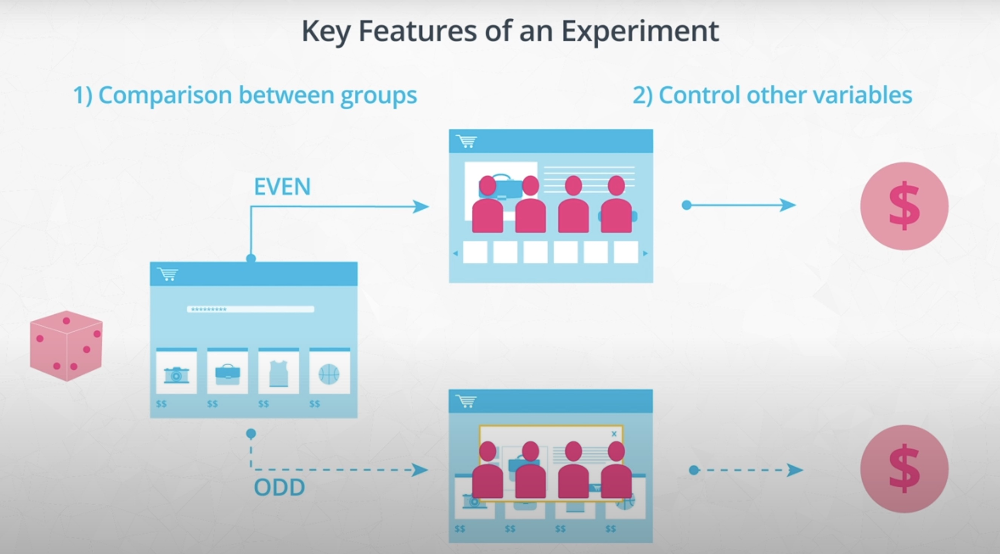

However, often it's not possible to run a true experiment, which requires at least two groups of users randomly selected, one of the groups being the control group. We can say there's a spectrum of experiments:

- **Experiments** (one extreme): two groups, randomly generated, one of them control; we have full control over the features. This is typical in medical sciences.
- **Observational studies** (the other extreme): not possible to have two random groups, so we don't have control over the features. Sometimes, the reason for having an observational study are ethical issues. We cannot infer any causation, but we can use them to understand dynamics and formulate hypotheses to be tested.
- **Quasi-experiments** (between the extremes): we have some control over the features; e.g., we implement a new feature and test it without control group, or the group with the new feature is not random. Depending on the product, this can be quite common: for instance, if we launch a feature in *beta* and customers try it, the group is not random anymore!

Lecture videos:

- [What Is An Experiment](https://www.youtube.com/watch?v=fH_xF5_SDCE&t=106s)
- [What Is An Experiment Pt 2](https://www.youtube.com/watch?v=PYzN1usi7QY&t=185s)

### 2.2 Types of Experiment

The two most important typed of experiments are:

- **Between**: each group A/B tries one treatment control/experiment.
- **Within**: each group A/B tries both treatments; the advantage of this type of experiment is that we can account for the variance introduced by the subjects. However, not always is possible to design a *within* study.

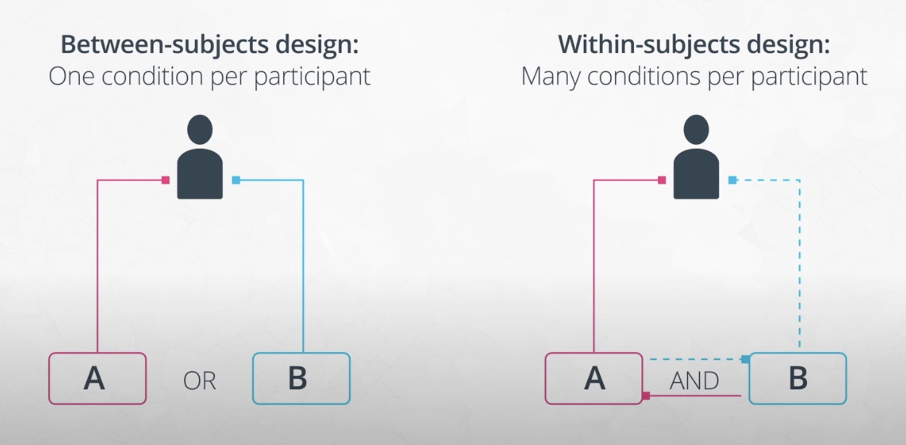

Another type of experiments are **factorial**: we test several factors, not only one; these lead to ANOVA analyses and require a stricter control.

Lecture video: [Types Of Experiments](https://www.youtube.com/watch?v=7ihDj4M7EiU&t=190s)

### 2.3 SMART Experiments

Experiments should be designed in a SMART way:

> - Specific: Make sure the goals of your experiment are specific.
> - Measurable: Outcomes must be measurable using objective metrics
> - Achievable: The steps taken for the experiment and the goals must be realistic.
> - Relevant: The experiment needs to have a purpose behind it.
> - Timely: Results must be obtainable in a reasonable time frame.

### 2.4 Types of Sampling

The most common way of random sampling is **Simple Random Sampling**: we have a population and give each individual an equal chance of being selected. However, sometimes (often) that is not completely possible. For instance, we might have a population divided in different living regions (urban 50%, suburban 30%, rural 20%), so some regions are unrepresented. In those cases, instead of choosing randomly from the total population, we allocate a given amount of people to each region relative to the percentage of people living there; that way, we assure a representative amount in each region instead of leaving the selection completely to chance. That is called **Stratified Random Sampling**.

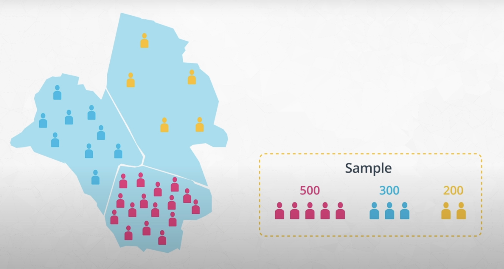

Both Simple Random Sampling and Stratified Random Sampling are **probabilistic sampling methods**; however, there exist also **non-probabilistic sampling methods**, such as **Convenience Sampling**: record information from available units, e.g., college students in a university study. These sometimes are the only way of of conducting the experiment, but they might lead to false results, because they use non-representative samplings.

Lecture video: [Types of Sampling](https://www.youtube.com/watch?v=GF_eQqNoarI&t=1s).

### 2.5 Measuring Outcomes

How can we measure the effectiveness of a video recommendation engine? We need to define measurable **evaluation metrics** beforehand, e.g.:

- Video watch time: the longer, the better.
- Video ranking: the higher, the better.
- Number of search queries after watching the video: the more the better, because the video might have arisen curiosity.

However, **those metrics might be misleading**:

- The engine suggests only longer videos, not better ones.
- The engine suggests videos which have a high ranking, ignoring the ones with few rankings.
- The engine suggests videos which originate many queries, but because they are confusing or not good enough.

So what should we do? Consider goals of the study separate from the metrics: the metric might be a proxy to what is being measured. Additionally, consider all implications of a metric value.

Lecture videos:

- [Measuring Outcomes Pt 1](https://www.youtube.com/watch?v=HPmMEkbT2uE&t=5s)
- [Measuring Outcomes Pt 2](https://www.youtube.com/watch?v=yLdXcRXcfPw&t=2s)

### 2.6 Creating Metrics

Going back to the online store example, we need to find a way to divide the two groups; notes:

- The flow of steps the user follows from start to end are called **user funnel**, because we loose users from step to step.
- Two groups mean two different funnels.
- In the case of an online store, we can implement the separation with a cookie in the beginning: when the user opens the page/starts a session, a cookie which randomly assigns the user to groups A/B is created, which is permanently stored for that user. The cookie is **unit of diversion** and it should be unnoticeable for the user; depending on the experiment, we might have different types of diversions:
  - Event-based: when opening page.
  - Cookie-based: a user has one permanent cookie.
  - Account-based: every logged user has a group assigned.

We need to track two kinds of metrics:

1. Evaluation metrics: metrics we expect to change due to the treatment. We compare the groups with them.
2. Invariant metrics: metrics we expect to be constant; we measure them to make sure that the groups are the same, treatment aside.

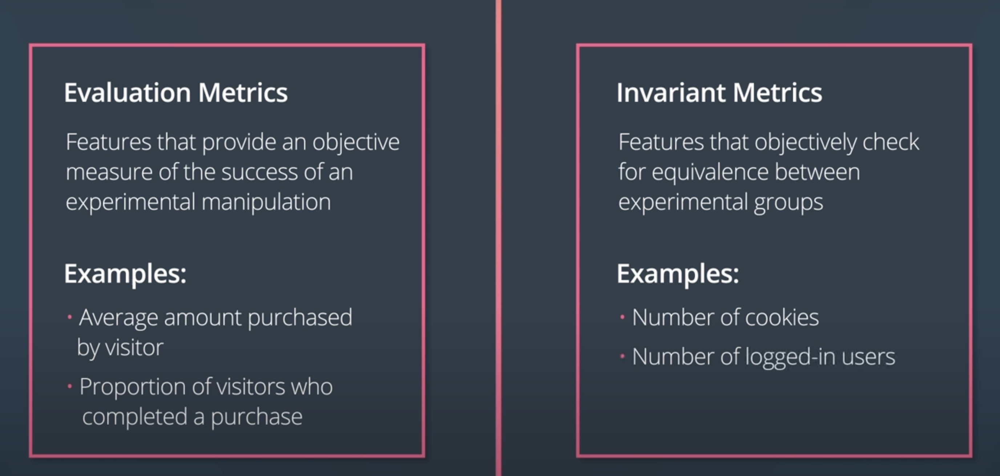

Lecture video: [Creating Metrics](https://www.youtube.com/watch?v=__7tzDUY870&t=7s)

### 2.7 Controlling Variables

As mentioned before, *correlation does not mean causation*. Sometimes variables are correlated, but that relationship can be:

- by chance
- or caused by a **confounding variable**: a confounding variable is a hidden factor which influences both correlated variables.

Example: ice cream consumption and crime rates are correlated; the confounding variable can be the temperature: the hotter it is, the more ice cream people eat and more crimes occur, without both being related more than by the temperature.

If we want to argue causality, we need to change only one factor/variable and control the experiment very thoroughly.

Lecture video: [Controlling Variables](https://www.youtube.com/watch?v=pLTneSg2MRY)

### 2.8 Checking Validity

Validity is related to how well the conclusions of the experiment can be supported.

There are 3 types of validity measures:

1. Construct validity: degree to which an experiment's metric result supports the goals of the study; a bad construct validity example is the number of search queries in the online store example.
2. Internal validity: degree to which a causality claim can be supported. If we have 2 correlated variables, but we don't account for any other variables, the causation is not well supported; we need to consider other variables to state causation.
3. External validity: how generalizable the results are. This is related to the representativeness of the sample: the more representative, the more generalizable.

Lecture video: [Checking Validity](https://www.youtube.com/watch?v=H3H1SZXqDmQ&t=2s).

### 2.9 Checking Bias

In addition to checking the validity, we need to check the biases of our experiments.

Bias, definition: systematic error that affects the interpretability of the experiment.

Examples of frequent biases:

- Sampling bias: sample is not representative of the population. For instance:
  - With questionnaires, some strata of people don't answer some questions, so if we take only the answers, we're introducing bias!
  - With the online store example, if the A/B groups are decided depending on the daytime (AM, PM), we can expect them to be two different populations!
- Novelty bias: when we introduce something new to the customers (e.g., overlay), the user behavior might deviate from the regular; then, when the novelty is gone, we get the stationary behavior, which might be different than before introducing the new feature.
- Order biases: biases that occur when the order in which administer different treatment conditions is relevant:
  - Primacy bias: condition is presented first, novelty bias
  - Recency bias: condition is presented last
  - Example: when 5 products are presented to the users sequentially and their feedback is asked.
- Experimenter bias: when the presence of the experimenter affects the participants' behavior.

Techniques to avoid bias: single/double blinding.

Interesting links:

- [Wikipedia: List of cognitive biases](https://en.wikipedia.org/wiki/List_of_cognitive_biases)
- [Blinded experiment](https://en.wikipedia.org/wiki/Blinded_experiment)

Lecture video: [Checking Bias](https://www.youtube.com/watch?v=ppjNNY4DhPw&t=1s).

### 2.10 Ethics in Experimentation

Ethical issues need to be examined before conducting an experiment:

1. Minimize participant risk; emotional stress is also a form of harm.
2. Clear the benefits for the risks taken. Are the benefits worth taking?
3. Provide an informed consent. A debriefing is necessary, and a signed agreement; users need to be able to opt-out whenever they want.
4. Handle sensitive data appropriately. Secure the information and anonymize it.

Examples in experimental ethics, interesting links:

- [Tuskegee Syphilis Study](https://en.wikipedia.org/wiki/Tuskegee_Syphilis_Study)
- [Milgram experiment](https://en.wikipedia.org/wiki/Milgram_experiment)
- [Stanford prison experiment](https://en.wikipedia.org/wiki/Stanford_prison_experiment)
- [The Morality Of A/B Testing](https://techcrunch.com/2014/06/29/ethics-in-a-data-driven-world/?guccounter=1)
- [The Belmont Report](https://www.hhs.gov/ohrp/regulations-and-policy/belmont-report/index.html)
- [APA Ethics Code](https://www.apa.org/ethics/code/)

Lecture videos:

- [Ethics In Experimentation Pt 1](https://www.youtube.com/watch?v=cWB1jQgcQ1g&t=1s)
- [Ethics In Experimentation Pt 2](https://www.youtube.com/watch?v=0qcJ_oggdKw)
- [Ethics In Experimentation Pt 3](https://www.youtube.com/watch?v=_HTolKktaC4)

## 3. Statistical Considerations in Testing

Check also my notes on statistics:

- [Statistics_Python_2_Inference.md](https://github.com/mxagar/statistics_with_python_coursera/blob/main/02_Inference/Statistics_Python_2_Inference.md).
- [Statistical_Analysis_Notes.pdf](https://github.com/mxagar/statistics_with_python_coursera/blob/main/Statistical_Analysis_Notes.pdf)

### 3.1 Statistical Significance Refresher Notebook

Notebook: [L2_Statistical_Significance_Solution.ipynb](./lab/Experiments/L2_Statistical_Significance_Solution.ipynb).

Notes on statistical testing:

- [Statistics_Python_2_Inference.md](https://github.com/mxagar/statistics_with_python_coursera/blob/main/02_Inference/Statistics_Python_2_Inference.md).
- [Statistical_Analysis_Notes.pdf](https://github.com/mxagar/statistics_with_python_coursera/blob/main/Statistical_Analysis_Notes.pdf)

Problem: we have a new layout and want to check whether it leads to more download clicks; we run an A/B test with cookies, i.e., each user gets a random layout and we collect their response.

- Experiment: Does layout change lead to more clicks on download?
- Variable `condition`: layout changed or not
- Variable `click`: whether download clicked or not

A Z-test is performed with 2 proportions, using two approaches: 

- (1) analytical, i.e., Z-test with binomial distribution variance,
- (2) simulation, i.e., a large amount of samples are taken from the data to arrive at the same conclusion.

```python
# Experiment: Does layout change lead to more clicks on download?
# condition: layout changed or not
# click: whether download clicked or not
data = pd.read_csv('./data/statistical_significance_data.csv')
data.head(10)
# 	condition	click
# 0	1	        0
# ...

# INVARIANT metric: the condition
# The size of both groups should not be significantly different
# Get number of trials and number of 'successes'
n_obs = data.shape[0]
n_control = data.groupby('condition').size()[0]

print(n_obs) # 999
print(n_control) # 491: approx. 1/2, ok

# Compute a z-score and p-value
# H0: new layout doesn't have more/less entries 
# Ha: new layout leads to more/less entries
p = 0.5
sd = np.sqrt(p * (1-p) * n_obs)

z_score = ((n_control + 0.5) - p * n_obs) / sd
p_value = 2*stats.norm.cdf(z_score)

print("z-score: {z}".format(z=z_score))
print("p-value from z-score: {p}".format(p=p_value)) # 0.61, we cannot reject H0

# EVALUATION metric: downloads
# Get p(click) in each condition
p_click = data.groupby('condition').mean()['click']
p_click
# 0    0.079430
# 1    0.112205

# Get number of trials and overall 'success' rate under null
n_control = data.groupby('condition').size()[0]
n_exper = data.groupby('condition').size()[1]
p_null = data['click'].mean()

# Compute standard error, z-score, and p-value
# H0: new layout doesn't lead to more/less clicks
# Ha: new layout leads to more/less download clicks
se_p = np.sqrt(p_null * (1-p_null) * (1/n_control + 1/n_exper))

z_score = (p_click[1] - p_click[0]) / se_p
p_val = 1-stats.norm.cdf(z_score)

print("z-score: {z}".format(z=z_score))
print("p-value from z-score: {p}".format(p=p_val)) # p = 0.039; we can reject H0
```

### 3.2 Practical Significance

Sometimes our experiments are significant and we conclude the change we would need to be more successful; however, implementing those changes might be very costly, more than the revenue they would bring. Thus, it doesn't make sense to implement them; that's **practical significance**: when in practice it doesn't make sense to modify something even though the experiments show it would be significantly beneficial. 

Lecture video: [Practical Significance](https://www.youtube.com/watch?v=eJ3idt3AJ7E&t=1s)

One way of dealing with the practical significance is the following:

- Given the risks we want to take and the costs we want to assume to implement the change, we compute the minimum impact we expect, e.g., number of sold products.
- Then, we compute the confidence interval (CI) of the metrics from our experiment.
- Depending on the location of the expected impact wrt. the CI, we decide.

### 3.3 Experiment Size: Statistical Power

Lecture video: [Experiment Size](https://www.youtube.com/watch?v=sImRm8e01jA&t=2s).

How long should we run an experiment to draw meaningful conclusions? How many recordings do we need?

These questions are related to the statistical power.

Example: we have an online store and we want to test whether a new layout leads to more buys; the current click-through rate is 10%, and we want to see an increase to 12%, that's the practical boundary. How many data-points do we need to record in order to reliably detect that change?

We use the **statistical power**, `1 - beta`: the likelihood of a hypothesis test detecting a true effect if there is one, i.e., given the true mean (different from the H0), the probability of rejecting the null hypothesis.

To compute it, we use the distributions of the two layouts/conditions:

- We have the distributions of the click-through rates hypotheses with the current and the new layouts.
- We select `alpha = 0.05` and draw the boundary in the current layout distribution.
- The same boundary value is used to compute the power, which is the area below the curve starting at the boundary, e.g., `0.8 = 80%`.
- The more data-points we take, the narrower and more disjoint the distributions become, so the power increases!
- Thus, we can define the power we want and, from it, derivate the number of data-points we need to reach it.
- with the number of data-points, we can calculate the duration of the experiment, because we know the number of visitors/day, approx.; but:
  - Consider seasonal effects, weekends, etc. Which impact do they have on the results?
  - If the experiment needs to be run too long, maybe we need to change the power?


#### Example Notebook: Statistical Power and Experiment Size

Notebook: [L2_Experiment_Size_Solution.ipynb](./lab/Experiments/L2_Experiment_Size_Solution.ipynb).

This is a very interesting notebook in which two functions are defined and used in the context of the example above:

- `power(p_null, p_alt, n, alpha = .05)`: given all the arguments, compute the power `1 - beta` of the experiment, i.e., the probability of a hypothesis test detecting a true effect if there is one. The hypotheses distributions are plotted.
- `experiment_size(p_null, p_alt, alpha = .05, beta = .20)`: analytically compute the required sample size to reach a power (closed-form).

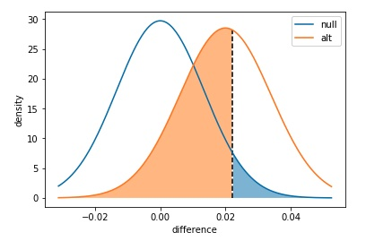

```python
def power(p_null, p_alt, n, alpha = .05, plot = True):
    """
    Compute the power of detecting the difference in two populations with 
    different proportion parameters, given a desired alpha rate.
    
    WARNING: This formula is maybe one-sided, but we could use a two-sided approach?

    Input parameters:
        p_null: base success rate under null hypothesis
        p_alt : desired success rate to be detected, must be larger than
                p_null
        n     : number of observations made in each group
        alpha : Type-I error rate
        plot  : boolean for whether or not a plot of distributions will be
                created
    
    Output value:
        power : Power to detect the desired difference, under the null.
    """
    
    # Compute the power
    se_null = np.sqrt((p_null * (1-p_null) + p_null * (1-p_null)) / n)
    null_dist = stats.norm(loc = 0, scale = se_null)
    p_crit = null_dist.ppf(1 - alpha)
    
    se_alt  = np.sqrt((p_null * (1-p_null) + p_alt  * (1-p_alt) ) / n)
    alt_dist = stats.norm(loc = p_alt - p_null, scale = se_alt)
    beta = alt_dist.cdf(p_crit)
    
    if plot:
        # Compute distribution heights
        low_bound = null_dist.ppf(.01)
        high_bound = alt_dist.ppf(.99)
        x = np.linspace(low_bound, high_bound, 201)
        y_null = null_dist.pdf(x)
        y_alt = alt_dist.pdf(x)

        # Plot the distributions
        plt.plot(x, y_null)
        plt.plot(x, y_alt)
        plt.vlines(p_crit, 0, np.amax([null_dist.pdf(p_crit), alt_dist.pdf(p_crit)]),
                   linestyles = '--')
        plt.fill_between(x, y_null, 0, where = (x >= p_crit), alpha = .5)
        plt.fill_between(x, y_alt , 0, where = (x <= p_crit), alpha = .5)
        
        plt.legend(['null','alt'])
        plt.xlabel('difference')
        plt.ylabel('density')
        plt.show()
    
    # return power
    return (1 - beta)

power(.1, .12, 1000) # 0.44122379261151545


def experiment_size(p_null, p_alt, alpha = .05, beta = .20):
    """
    Compute the minimum number of samples needed to achieve a desired power
    level for a given effect size.
    
    Input parameters:
        p_null: base success rate under null hypothesis
        p_alt : desired success rate to be detected
        alpha : Type-I error rate
        beta  : Type-II error rate
    
    Output value:
        n : Number of samples required for each group to obtain desired power
    """
    
    # Get necessary z-scores and standard deviations (@ 1 obs per group)
    z_null = stats.norm.ppf(1 - alpha)
    z_alt  = stats.norm.ppf(beta)
    sd_null = np.sqrt(p_null * (1-p_null) + p_null * (1-p_null))
    sd_alt  = np.sqrt(p_null * (1-p_null) + p_alt  * (1-p_alt) )
    
    # Compute and return minimum sample size
    p_diff = p_alt - p_null
    n = ((z_null*sd_null - z_alt*sd_alt) / p_diff) ** 2
    return np.ceil(n)

experiment_size(.1, .12) # 2863.0
```

### 3.3 Using Dummy Tests: A/A Tests

Lecture video: [Using Dummy Tests](https://www.youtube.com/watch?v=rURTLjh3Hlc&t=85s).

Comparison between equivalent groups for two main purposes:

1. Test that everything is working as expected; we should not see significant differences between the groups. However, some Type I errors might arise, so one large deviation is not necessarily reason for concern.
2. Collect distributions of variables under non changes, for reference. That way, we can more easily compute experiment size in the future.

### 3.4 Non-Parametric Tests

Non-parametric tests make no assumption of the underlying distribution.

Check also my notes on statistics:

- [Statistics_Python_2_Inference.md](https://github.com/mxagar/statistics_with_python_coursera/blob/main/02_Inference/Statistics_Python_2_Inference.md).
- [Statistical_Analysis_Notes.pdf](https://github.com/mxagar/statistics_with_python_coursera/blob/main/Statistical_Analysis_Notes.pdf)

### Notebook 1: CI and P-Value of Quantiles

Notebook: [L2_Non-Parametric_Tests_Part_1_Solution.ipynb](./lab/Experiments/L2_Non-Parametric_Tests_Part_1_Solution.ipynb).

Two non-parametric functions are presented in the notebook:

- `quantile_ci(data, q, c = .95, n_trials = 1000)`: [Bootstrapping](https://en.wikipedia.org/wiki/Bootstrapping_(statistics)): Compute a confidence interval for a quantile of a dataset using a bootstrap method. Bootstrapping is used to estimate sampling distributions by using the actually collected data to generate new samples that could have been hypothetically collected. In a standard bootstrap, a bootstrapped sample means drawing points from the original data with replacement until we get as many points as there were in the original data. With it, we can estimate the sampling distribution and obtain the CI of a quantile.
- `quantile_permtest(x, y, q, alternative = 'less', n_trials = 10_000)`: [Permutation test](https://en.wikipedia.org/wiki/Permutation_test): Compute the p-value of the difference between 2 groups given a quantile. The permutation test is a resampling-type test used to compare the values on an outcome variable between two or more groups; under the null hypothesis, the outcome distribution should be the same for all groups.

```python
def quantile_ci(data, q, c = .95, n_trials = 1000):
    """
    Compute a confidence interval for a quantile of a dataset using a bootstrap
    method.
    
    Input parameters:
        data: data in form of 1-D array-like (e.g. numpy array or Pandas series)
        q: quantile to be estimated, must be between 0 and 1
        c: confidence interval width
        n_trials: number of bootstrap samples to perform
    
    Output value:
        ci: Tuple indicating lower and upper bounds of bootstrapped
            confidence interval
    """
    
    # initialize storage of bootstrapped sample quantiles
    n_points = data.shape[0]
    sample_qs = []
    
    # For each trial...
    for _ in range(n_trials):
        # draw a random sample from the data with replacement...
        sample = np.random.choice(data, n_points, replace = True)
        
        # compute the desired quantile...
        sample_q = np.percentile(sample, 100 * q)
        
        # and add the value to the list of sampled quantiles
        sample_qs.append(sample_q)
        
    # Compute the confidence interval bounds
    lower_limit = np.percentile(sample_qs, (1 - c)/2 * 100)
    upper_limit = np.percentile(sample_qs, (1 + c)/2 * 100)
    
    return (lower_limit, upper_limit)

def quantile_permtest(x, y, q, alternative = 'less', n_trials = 10_000):
    """
    Compute the p-value of the difference between 2 groups given a quantile.
    
    Input parameters:
        x: 1-D array-like of data for independent / grouping feature as 0s and 1s
        y: 1-D array-like of data for dependent / output feature (continuous values)
        q: quantile to be estimated, must be between 0 and 1
        alternative: type of test to perform, {'less', 'greater'}
        n_trials: number of permutation trials to perform
    
    Output value:
        p: estimated p-value of test
    """
    
    
    # initialize storage of bootstrapped sample quantiles
    sample_diffs = []
    
    # For each trial...
    for _ in range(n_trials):
        # randomly permute the grouping labels
        labels = np.random.permutation(x)
        
        # compute the difference in quantiles
        cond_q = np.percentile(y[labels == 0], 100 * q)
        exp_q  = np.percentile(y[labels == 1], 100 * q)
        
        # and add the value to the list of sampled differences
        sample_diffs.append(exp_q - cond_q)
    
    # compute observed statistic
    cond_q = np.percentile(y[x == 0], 100 * q)
    exp_q  = np.percentile(y[x == 1], 100 * q)
    obs_diff = exp_q - cond_q
    
    # compute a p-value
    if alternative == 'less':
        hits = (sample_diffs <= obs_diff).sum()
    elif alternative == 'greater':
        hits = (sample_diffs >= obs_diff).sum()
    
    return (hits / n_trials)
```

#### Notebook 2: Mean Differences

Notebook: [`L2_Non-Parametric_Tests_Part_2_Solution.ipynb`](./lab/Experiments/L2_Non-Parametric_Tests_Part_2_Solution.ipynb).

- `ranked_sum(df.x, df.y, alternative = 'two-sided')`: [Rank-Sum Test (Mann-Whitney U test)](https://en.wikipedia.org/wiki/Mann–Whitney_U_test). We pass `y = {0,1}` and `x in R` and evaluate whether the groups belong to a different distribution without any assumption.
- `scipy.stats.mannwhitneyu(df.x[df.y==0], df.x[df.y==1], alternative = 'greater')`: equivalent to the previous, but `scipy` is used, and the function considers more factors.
- `sign_test(x, y, alternative = 'two-sided')`: [Sign test](https://en.wikipedia.org/wiki/Sign_test): it requires that there be paired values between two groups to compare, and tests whether one group's values tend to be higher than the other's. The test is quite weak but can be applied very broadly.

```python
import scipy.stats as stats

data = pd.read_csv('./data/permutation_data.csv')
data.head()
# 	  condition	time
#  0	0	        5940
#  1	0	        666
#  2	1	        571
#  ...

# Data visualization: two Poisson-like distributions
bin_borders = np.arange(0, data['time'].max()+400, 400)
plt.hist(data[data['condition'] == 0]['time'], alpha = 0.5, bins = bin_borders)
plt.hist(data[data['condition'] == 1]['time'], alpha = 0.5, bins = bin_borders)
plt.legend(labels = ['control', 'experiment'])

stats.mannwhitneyu(data[data['condition'] == 0]['time'],
                   data[data['condition'] == 1]['time'],
                   alternative = 'greater')
# MannwhitneyuResult(statistic=3273546.0, pvalue=0.001752280226004597)
```

### 3.5 Missing Data

Missing data is data itself: if we have a questionnaire with difficult/sensitive questions, when a participant decides not to answer some, the missing value is related to their personality. If we're excluding the fact that they didn't answer, we are inserting bias; and if we're completely dropping the user, the bias is larger.

Therefore, always consider:

- Why do we have missing data?
- Store with `Missing` variables the number or the columns/fields which are missing.
- Which bias are we introducing when dropping/imputing?

When should we prefer dropping vs. imputing?

- Mechanical failures, e.g., no GPS data in forests.
- The missing data is in the target.

Other cases in which it is good practice dropping data:

- Columns with no variability.
- Values that we know are not correct.
- If a column has a large percentage of missing values, we can remove it.

But, always: **track missing values with dummy variables, either when we remove or impute them!**

Lecture videos:

- [Missing Data](https://www.youtube.com/watch?v=zAKd2WwSHfs&t=4s)
- [Removing Data - When Is It OK?](https://www.youtube.com/watch?v=oQhIPq5AccU)
- [Removing Data - Other Considerations](https://www.youtube.com/watch?v=xrXk_Tvi0oQ)

### 3.6 Analyzing Multiple Metrics

Usually we measure several metrics; if we perform several comparisons, the `alpha` needs to be corrected, because the combined probability of the Type I error increases with the number of variables.

Example: We measure the ratio of adding to a cart and buying for web layouts A and B. The experiment is a success if either metric (cart or buy) is statistically significant. With `alpha = 5%` Type I error rate, how likely is to falsely declare a significant effect?

    p(both not significant) = (1-0.05)*(1-0.05) = 0.9025
    p(at least one significant) = 1 - 0.9025 = 0.0975
    p(false significant effect) = 9.75%

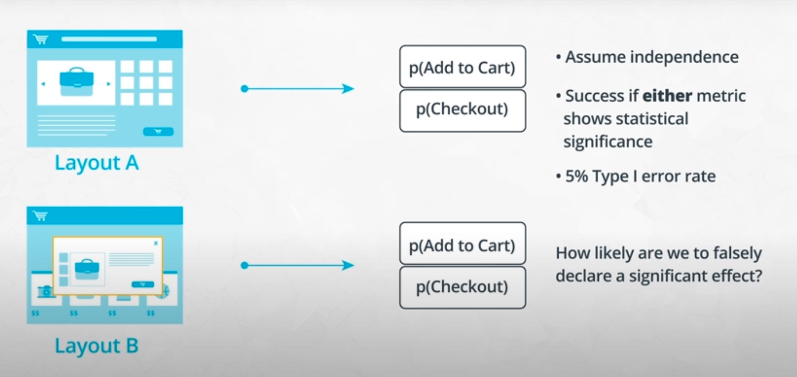

Thus, we take `alpha = 0.05`, but the combined error is larger: `alpha* = 0.0975`. Therefore, we need to correct the `alpha` value!

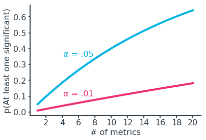

One approach to correct the `alpha` value is the [**Bonferroni correction**](https://en.wikipedia.org/wiki/Bonferroni_correction):

    alpha* = alpha / k
    k: number of comparisons = number of metrics

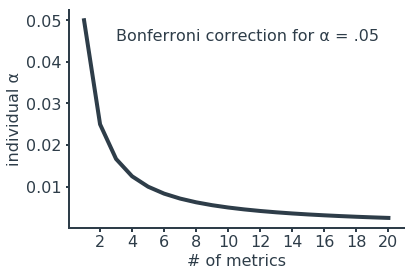

If we assume independence between metrics, we can also use the **Sidak correction**, which is less conservative:

    alpha* = 1 - (1 - alpha)^(1/k)
    k: number of comparisons = number of metrics

Note that:

- Metrics tend to be correlated in real life, so we need to take a conservative correction like Bonferroni.
- Reducing Type I error (smaller `alpha`) increases Type II error!

Lecture videos:

- [Analyzing Multiple Metrics Pt 1](https://www.youtube.com/watch?v=SNFHYbJvlZU)
- [Analyzing Multiple Metrics Pt 2](https://www.youtube.com/watch?v=x7foG7murvU)

### 3.7 Early Stopping

Stopping an A/B test early because the results are statistically significant is usually a bad idea, because those observed effects can easily become smaller when the experiment is complete. We should instead define the experiment size/length in terms of the power we want to achieve and complete the experiment without peeking and early stopping.

Notebook: [`L2_Early_Stopping_Solution.ipynb`](./lab/Experiments/L2_Early_Stopping_Solution.ipynb).

More information:

- [How Not To Run an A/B Test](https://www.evanmiller.org/how-not-to-run-an-ab-test.html)
- [Simple Sequential A/B Testing](https://www.evanmiller.org/sequential-ab-testing.html)
- [Sequential probability ratio test](https://en.wikipedia.org/wiki/Sequential_probability_ratio_test)

Lecture video: [Early Stopping](https://www.youtube.com/watch?v=taIJZMNwRsI).

### 3.8 Glossary

> - Bootstrapping: Estimate sampling distributions by using actually collected data to generate new samples that could have been hypothetically collected.
> - Non-parametric tests: Tests that don't rely on many assumptions of the underlying population, and so can be used in a wider range of circumstances compared to standard tests.
> - Permutation Tests: A resampling-type test used to compare the values on an outcome variable between two or more groups.
> - Practical significance: Refers to the level of effect that you need to observe in order for the experiment to be called a true success and implemented in truth.
> - Rank-Sum test: This test is performed only on the data present. Also known as the Mann-Whitney U test, is not a test of any particular statistic like the mean or median. Instead, it's a test of distributions.
> - Sign test: This test only requires that there be paired values between two groups to compare, and tests whether one group's values tend to be higher than the other's.

## 4. A/B Testing Case Study

A software company sells a product which has a 7-day trial period; they expect that the trial testers are likelier to buy the software. They want to experiment which web layout leads to more trial testers, i.e., the structure and the content should invite to join to the 7-day trial period.

Steps:

1. Design funnel and metrics to track
2. Estimate experiment size/duration
3. Statistical analysis of the data
4. Conclusion: which layout is necessary?

### 4.1 Funnel and Metrics

Expected, normal flow:

- Visit homepage
- Visit download page
- Sign up for an account
- Download software
- After the 7-day trial, the software takes the user to a license-purchase page
- Purchase license

Atypical events:

- Users land in the 7-day trial page from somewhere else
- Users buy the license before 7 days
- Users buy the license after 7 days

We need to choose:

- Where to split users into experimental groups: the unit of diversion
- Which metrics to track in each step, both invariant and evaluation metrics

Diversion methods:

- Event-based, i.e., page view: not good here, because if the visitor gets a different view every time he/she opens the page, that's disturbing.
- User-ID, i.e., account: not good here, because some users sign in when hitting the download button.
- Cookie-based: best choice here; however, typical issues of cookies hold: what if the user accesses via incognito browsing? We assume those issues are insignificant.

Metrics:

- Number of users at each stage of the funnel/flow.
    - Invariant metric: Total number of cookies
- Number of licenses bought?
    - Evaluation metric: download rate
    - Evaluation metric: purchase rate
- Is it possible to track software usage statistics?


### 4.2 Experiment Sizing

Historical statistics:

- Invariant metric: 3250 unique visitors/day
    - Slightly more on weekdays
- Evaluation metric 1: 520 downloads/day: 0.16
- Evaluation metric 2: 65 license purchases/day: 0.02

If any evaluation metric 1 / 2 increases significantly, the experiment is successful, i.e., we should deploy the layout that favors the increase. Even in that case we need to apply the Bonferroni correction:

`alpha = 0.05 / 2 = 0.025`

**However, if we needed to see an increase in both metrics, we wouldn't need to apply Bonferroni - WTF!?**

> Let's say that we want to detect an increase of 50 downloads per day (up to 570 per day, or a .175 rate). How many days of data would we need to collect in order to get enough visitors to detect this new rate at an overall 5% Type I error rate and at 80% power?

Using the `experiment_size()` function from the notebook [L2_Experiment_Size_Solution.ipynb](./lab/Experiments/L2_Experiment_Size_Solution.ipynb) introduced previously:

```python
experiment_size(p_null=0.16, p_alt=0.175, alpha=0.025, beta=0.2) / 3250
# 2.91 -> 3
```

> What if we wanted to detect an increase of 10 license purchases per day (up to 75 per day, or a .023 rate). How many days of data would we need to collect in order to get enough visitors to detect this new rate at an overall 5% Type I error rate and at 80% power?

```python
experiment_size(p_null=0.02, p_alt=0.023, alpha=0.025, beta=0.2) / 3250
# 10.74 -> 11
```

The solution has values that are double the ones I got; that is maybe because the formula implementation is *pone-sided*, but the solution is *two-sided*?

However, **important note**: consider there is a delay between the implementation and the downloads; maybe the first week after implementation the downloads are due to the UX before the implementation. Thus, we should consider extending slightly the experiment.

### 4.3 Validity, Bias, Ethics

- In this case, **validity** is achieved by properly implementing randomization; additionally, we don't need generalization.
- Biases:
    - Novelty is not an issue because users are expected to visit the download/purchase page once/very few times.
    - However, if the new layout is successful, the expanded user base that uses customer support is biased (I don't see clearly the effect of that).
- Ethical issues: none; after cookie consent, everything should be ok, and no sensitive data is collected.

### 4.4 Data Analysis

Dataset collected during 29 days (21 + 8 days): [`homepage-experiment-data.csv`](./lab/Experiments/data/homepage-experiment-data.csv).

The statistical analysis is in [`ABTesting_UseCase.ipynb`](./lab/Experiments/ABTesting_UseCase.ipynb):

- Both groups have non-significant differences in terms of group size.
- The new layout led to significantly more downloads.
- No significant differences were found between the two layouts in terms of license purchases.


## 5. Portfolio Exercise: Starbucks

Project presentation video: [Starbucks Lab](https://www.youtube.com/watch?v=QPKRboscAf4&t=4s).

The dataset and the mini-project were the take-home assignment for data scientist role candidates at Starbucks. It is a Starbucks experiment (using simulated and realistic data) with control and treatment groups.

Goal: identify which features are important, which create an incremental response.

Note: the column names are not as obvious as they seem.

Notebook and data: [`Starbucks_Assignment`](./lab/Experiments/Starbucks_Assignment/)

Everything is explained in the main notebook.

## 6. Introduction to Recommendation Engines

Have a look at my notes on recommender engines:

- [Machine Learning IBM: Recommender Systems](https://github.com/mxagar/machine_learning_ibm/tree/main/06_Capstone_Project)
- [Machine Learning Andrew Ng: Recommender Systems](https://github.com/mxagar/machine_learning_coursera/tree/main/07_Anomaly_Recommender)
- Project: [course_recommender_streamlit](https://github.com/mxagar/course_recommender_streamlit)

There are 3 main recommendation systems:

1. Knowledge-based
2. Content-based
3. Collaborative Filtering
    - Neighborhood Based Collaborative Filtering
    - Model-Based Collaborative Filtering

However, other approaches and hybrid systems are also possible, i.e., mixing those basic types.

To work with recommendation engines, we need to use similarity/distance metrics:

- Pearson's correlation coefficient
- Spearman's correlation coefficient
- Kendall's Tau
- Euclidean Distance
- Manhattan Distance

#### Goals of Recommender Systems

Lecture video: [Goals Of Recommendation Systems](https://www.youtube.com/watch?v=WzelOlFeDmU)

Recommender systems are very important to companies which implement them, because they're central to their revenue system. There are 4 factors which need to be taken into account when implementing recommendation engines:

- Relevance: Does the user have a connection with this recommendation?
- Novelty: The user has not been exposed to this recommendation already.
- Serendipity: A user is genuinely and pleasantly surprised by the recommendation.
- Increased Diversity: Finding the balance between what a user expects and knows and offering new and varied recommendations.

Blog post on how to evaluate those 4 factors/metrics: [Recommender Systems — It’s Not All About the Accuracy](https://gab41.lab41.org/recommender-systems-its-not-all-about-the-accuracy-562c7dceeaff)

The notebooks of this section are located in

[`lab/Recommendations/01_Intro_to_Recommendations/`](./lab/Recommendations/01_Intro_to_Recommendations/)

### 6.1 Three Types of Recommendation Engines

Lecture video: [Types Of Recommendations](https://www.youtube.com/watch?v=uoXF81AO21E&t=11s).

Let's image a user-item matrix, such as user-movies.

1. Knowledge-based RS: use knowledge about items to meet user specifications.
    - Typical for luxury items.
    - Users define characteristics, which are then filtered.
2. Collaborative Filtering RS: use item ratings of many users in a collaborative way to recommend new items to new users.
    - It's the most common
    - The key idea is that there is collaboration between users and items.
3. Content-based RS: use information about items to find similarities; then, similar items are recommended. The information is usually composed by (latent) features related to the topic/genre, year, etc.
    - They key idea is that similarities between items (or users) are taken, without considering user-item interactions.


### 6.2 MovieTweetings Dataset

The **MovieTweetings** dataset is data about movie ratings collected from Twitter by Simon Dooms:

- Dataset: [sidooms/MovieTweetings](https://github.com/sidooms/MovieTweetings).
- Presentation / slides: [MovieTweetings: a movie rating dataset collected from twitter](https://www.slideshare.net/simondooms/movie-tweetings-a-movie-rating-dataset-collected-from-twitter)

The dataset used by Udacity is reduced; however, I downloaded the dataset from the original source and the files are located in

[`lab/Recommendations/01_Intro_to_Recommendations/org_data/MovieTweetings/`](./lab/Recommendations/01_Intro_to_Recommendations/org_data/MovieTweetings/)

The dataset consists of 3 files:

```
users.dat
    user_id::twitter_id
    1::177651718

items.dat
    movie_id::movie_title (movie_year)::genre|genre|genre
    0110912::Pulp Fiction (1994)::Crime|Thriller

ratings.dat
    user_id::movie_id::rating[0,10]::rating_timestamp
    14927::0110912::9::1375657563

```

#### Notebook: Transform and Prepare Datasets

Notebook: [`1_Introduction to the Recommendation Data.ipynb`](./lab/Recommendations/01_Intro_to_Recommendations/1_Introduction%20to%20the%20Recommendation%20Data.ipynb)

In this notebook genres are extracted as well as the year and the rating timestamp.

```python
import numpy as np
import pandas as pd
import matplotlib.pyplot as plt
import datetime

# Read in the datasets
movies = pd.read_csv('original_movies.dat',
                     delimiter='::',
                     header=None,
                     names=['movie_id', 'movie', 'genre'],
                     dtype={'movie_id': object}, engine='python')

reviews = pd.read_csv('original_ratings.dat',
                      delimiter='::',
                      header=None,
                      names=['user_id', 'movie_id', 'rating', 'timestamp'],
                      dtype={'movie_id': object, 'user_id': object, 'timestamp': object},
                      engine='python')

# Reduce the size reviews dataset
reviews = reviews.loc[:100000,:]

# number of movies
print(f"Number of movies: {len(movies['movie_id'].unique())}")
# number of ratings
print(f"Number of ratings: {reviews[~reviews['rating'].isna()].shape[0]}")
# number of different genres
genres = set()
for r in movies['genre'].dropna().str.split('|'):
    for g in r:
        genres.add(g)
print(f"Number of different genres: {len(genres)}")
# number of unique users
print(f"Number of unique users: {len(reviews['user_id'].unique())}")
# number of missing ratings
print(f"Number of missing ratings: {reviews['rating'].isna().sum()}")
# the `average`, `min`, and `max` ratings given
print(f"Ratings: min = {reviews['rating'].min()}, max = {reviews['rating'].max()}, avg = {reviews['rating'].mean()}")

# Number of movies: 35479
# Number of ratings: 100001
# Number of different genres: 28
# Number of unique users: 8022
# Number of missing ratings: 0
# Ratings: min = 0, max = 10, avg = 7.397666023339767

# Pull the date from the title and create new column
movies['year'] = movies['movie'].str.extract(r'\((\d{4})\)')

# Dummy the date column with 1's and 0's for each century of a movie (1800's, 1900's, and 2000's)
movies["1800's"] = movies['year'].apply(lambda year_text: 1 if int(year_text) < 1900 else 0)
movies["1900's"] = movies['year'].apply(lambda year_text: 1 if int(year_text) > 1899 and int(year_text) < 2000 else 0)
movies["2000's"] = movies['year'].apply(lambda year_text: 1 if int(year_text) > 1900 else 0)

# Dummy column the genre with 1's and 0's for each genre
genre_dict = {g:i for i,g in enumerate(genres)}

def get_genre_vector(genre_list):
    genre_vector = [0]*len(genres)
    try:
        for g in genre_list:
            genre_vector[genre_dict[g]] = 1
    except:
        pass
    
    return genre_vector

genre_dummies_series = movies.genre.str.split('|').apply(get_genre_vector)
genre_dummies_df = pd.DataFrame(genre_dummies.apply(pd.Series))
genre_dummies_df.columns = list(genre_dict.keys())
movies = pd.concat([movies, genre_dummies_df], axis=1)

# Create a date out of time stamp
change_timestamp = lambda val: datetime.datetime.fromtimestamp(int(val)).strftime('%Y-%m-%d %H:%M:%S')
reviews['date'] = reviews['timestamp'].apply(change_timestamp)

```

### 6.3 Knowledge-Based Recommendations

Lecture video: [Knowledge Based Recommendations](https://www.youtube.com/watch?v=C_vU1tjQHZI&t=97s).

Knowledge-based recommendations require from users to choose some preferences, e.g.:

- Genre(s)
- Year range for movies
- etc.

Then, the most recommended movies that fit those properties are suggested, i.e., a ranking is done according to available rankings and the user-provided filters.

This approach is very common in luxury or expensive items, e.g., houses.

Note that we distinguish two types of recommender systems in this context:

- Knowledge-based, i.e., those that apply user filters.
- Rank-based, i.e., those that sort items according to their ranking.

Of course, both approaches are usually combined.

#### Notebook: Most Popular Recommendations

Notebook: [`2_Most_Popular_Recommendations.ipynb`](./lab/Recommendations/01_Intro_to_Recommendations/2_Most_Popular_Recommendations.ipynb).

In this notebook, (1) ranking and (2) filtering are carried out to select movies.

```python
def create_ranked_df(movies, reviews):
    '''
    INPUT
    movies - the movies dataframe
    reviews - the reviews dataframe
    
    OUTPUT
    ranked_movies - a dataframe with movies that are sorted by highest avg rating, more reviews, 
                    then time, and must have more than 4 ratings
    '''
    
    # Pull the average ratings and number of ratings for each movie
    movie_ratings = reviews.groupby('movie_id')['rating']
    avg_ratings = movie_ratings.mean()
    num_ratings = movie_ratings.count()
    last_rating = pd.DataFrame(reviews.groupby('movie_id').max()['date'])
    last_rating.columns = ['last_rating']

    # Add Dates
    rating_count_df = pd.DataFrame({'avg_rating': avg_ratings, 'num_ratings': num_ratings})
    rating_count_df = rating_count_df.join(last_rating)

    # merge with the movies dataset
    movie_recs = movies.set_index('movie_id').join(rating_count_df)

    # sort by top avg rating and number of ratings
    ranked_movies = movie_recs.sort_values(['avg_rating', 'num_ratings', 'last_rating'], ascending=False)

    # for edge cases - subset the movie list to those with only 5 or more reviews
    ranked_movies = ranked_movies[ranked_movies['num_ratings'] > 4]
    
    return ranked_movies

ranked_movies = create_ranked_df(movies, reviews)

def popular_recs_filtered(user_id, n_top, ranked_movies, years=None, genres=None):
    '''
    INPUT:
    user_id - the user_id (str) of the individual you are making recommendations for
    n_top - an integer of the number recommendations you want back
    ranked_movies - a pandas dataframe of the already ranked movies based on avg rating, count, and time
    years - a list of strings with years of movies
    genres - a list of strings with genres of movies
    
    OUTPUT:
    top_movies - a list of the n_top recommended movies by movie title in order best to worst
    '''
    
    # Implement your code here

    # Step 1: filter movies based on year and genre
    #top_movies = list(ranked_movies.movie[:n_top])
    movies_years = np.ones((ranked_movies.shape[0],))
    if years:
        years = [int(y) for y in years]
        movies_years = ranked_movies['date'].isin(years).values
    movies_genres = np.ones((ranked_movies.shape[0],))
    if genres:
        num_genre_match = ranked_movies[genres].sum(axis=1)
        movies_genres = (num_genre_match > 0).values
                
    # Step 2: create top movies list 
    top_movies = list(ranked_movies[np.logical_and(movies_years, movies_genres)].movie[:n_top])

    return top_movies

# Top 20 movies recommended for id 1 with years=['2015', '2016', '2017', '2018'], genres=['History']
recs_20_for_1_filtered = popular_recs_filtered(user_id=1, n_top=20, ranked_movies=ranked_movies, years=['2015', '2016', '2017', '2018'], genres=['History'])
```

### 6.4 Collaborative Filtering

The previous *knowledge-based* approach requires user input for filtering; we can infer the user preferences by past items he/she has selected and comparing his/her profile to other users. In other words, we use item-user interactions/collaborations to recommend new items. That is called **collaborative filtering**.

In collaborative filtering, in practice, we don't need to have explicit user preferences (e.g., genres) nor item properties (e.g., movie genres), but just suffices with the user-item interactions. Systems that require explicit information about users and items are **content-based** recommendation engines.

In collaborative filtering, we collect these data:

- Item ratings for each user
- Items liked by user or not
- Items used by user or not

In general, there are 2 major collaborative filtering methods:

1. Model-based, learned in section [7. Matrix Factorization Recommendations](#7-matrix-factorization-recommendations).
2. Neighborhood-based, learned now.

In **neighborhood-based collaborative filtering systems**, we need to work with **similarity measures** or **distance measures**:

- Similarity: correlation-related, the largest the better, usually in `[-1,1]`
    - Pearson's correlation coefficient
    - Spearman's correlation coefficient: correlation with ranking values. Unlike Pearson's correlation, Spearman's correlation can have perfect relationships (1 or -1 values) that aren't linear relationships. You will notice that neither Spearman or Pearson correlation values suggest a relation when there are quadratic relationships.
    - Kendall's Tau: similar to Spearman correlation (also ranks are used), but more it has a smaller variability when using larger sample sizes. Spearman and Kendall can give same values.
- Distance: how far as data points in feature space? the smallest the better
    - Euclidean Distance
    - Manhattan Distance

Lecture videos:

- [Intro To Collab Filtering](https://www.youtube.com/watch?v=wGq7dUgJpsc)
- [Types Of Collaborative Filtering](https://www.youtube.com/watch?v=fZhkWHHP6SM)
- [Measuring Similarity](https://www.youtube.com/watch?v=G_Y6IPmp7Xs)
- [Identifying Recommendations](https://www.youtube.com/watch?v=P60qvS_OTMg)

#### Notebook: Measuring Similarity

Notebook: [`3_Measuring Similarity.ipynb`](./lab/Recommendations/01_Intro_to_Recommendations/3_Measuring%20Similarity.ipynb).

The introduced distance metrics are implemented:

- Pearson
- Spearman
- Kendall
- Euclidean
- Manhattan

```python
def pearson_corr(x, y):
    '''
    INPUT
    x - an array of matching length to array y
    y - an array of matching length to array x
    OUTPUT
    corr - the pearson correlation coefficient for comparing x and y
    '''
    # Implement your code here
    xm = x.mean()
    ym = y.mean()
    corr = np.dot(x-xm, y-ym) / (np.sqrt(np.sum(np.dot(x-xm,x-xm))) * np.sqrt(np.sum(np.dot(y-ym,y-ym))))
    
    return corr

def corr_spearman(x, y):
    '''
    INPUT
    x - an array of matching length to array y
    y - an array of matching length to array x
    OUTPUT
    corr - the spearman correlation coefficient for comparing x and y
    '''
    # Implement your code here
    xr = x.rank()
    yr = y.rank()
    corr = pearson_corr(xr, yr)
    
    return corr


def kendalls_tau(x, y):
    '''
    INPUT
    x - an array of matching length to array y
    y - an array of matching length to array x
    OUTPUT
    tau - the kendall's tau for comparing x and y
    '''    
    # Change each vector to ranked values
    x = x.rank()
    y = y.rank()
    n = len(x)
     
    sum_vals = 0
    # Compute Mean Values
    for i, (x_i, y_i) in enumerate(zip(x, y)):
        for j, (x_j, y_j) in enumerate(zip(x, y)):
            if i < j:
                sum_vals += np.sign(x_i - x_j)*np.sign(y_i - y_j)
                        
    tau = 2*sum_vals/(n*(n-1))
    
    return tau

def eucl_dist(x, y):
    '''
    INPUT
    x - an array of matching length to array y
    y - an array of matching length to array x
    OUTPUT
    euc - the euclidean distance between x and y
    '''  
    return np.sqrt(np.sum(np.dot(x-y, x-y)))
    
def manhat_dist(x, y):
    '''
    INPUT
    x - an array of matching length to array y
    y - an array of matching length to array x
    OUTPUT
    manhat - the manhattan distance between x and y
    '''  
    return np.sum(np.abs(x-y))
```

#### Identifying Recommendations

To identify which movies to recommend, we need to:

- Find neighbor users based on their similarity/distance.
- Remove the movies that the user has already seen.
- Remove movies with bad ratings from identified neighbor users, or tae movies with high ratings.

It is possible to use of the approaches, too, e.g. weighting ratings based on the closeness of the neighbors.

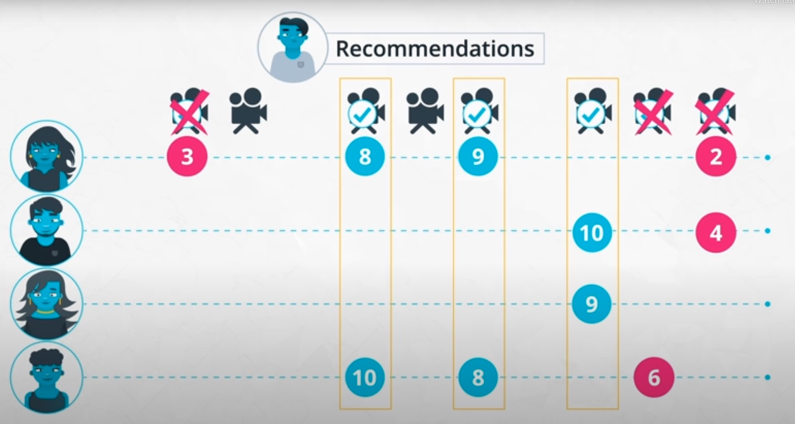

Interesting links:

- [Recommender Systems through Collaborative Filtering](https://www.dominodatalab.com/blog/recommender-systems-collaborative-filtering).
- [Item Weighting Techniques for Collaborative Filtering](https://www.semanticscholar.org/paper/Item-Weighting-Techniques-for-Collaborative-Baltrunas-Ricci/3e9ebcd9503ef7375c7bb334511804d1e45127e9?p2df).

#### Notebook: Neighborhood-Based Collaborative Filtering

Notebook: [`4_Collaborative Filtering.ipynb`](./lab/Recommendations/01_Intro_to_Recommendations/4_Collaborative%20Filtering.ipynb).

Many things are implemented in this notebook; they all essentially filter the main dataframe and compute vector similarities. Summary of steps:

- Load `movies` and `reviews` dataframes.
- Pivot `reviews` dataframe to get the `user_items` matrix/dataframe.
- Function: movies watched by a `user_id`.
- Function: create a dictionary with movies watched by each `user_id`.
- Functions: given 2 users, compute their correlation & distance taking the reviews vector.
- Load the dataframe which contains all user-user distances: `df_dist`.
- Function: Given a user, compute his/her closest user neighbors.
- Function: Given a user, compute movies above a rating.
- Function: Given an array of movie ids, get their names.
- Function: Given a user, find his/her closest neighbors, and for each neighbors, pick movies rated a above a value; limit the number of recommended movies to a threshold.
- Function: make recommendations for all users.


```python
import numpy as np
import pandas as pd

movies = pd.read_csv('movies_clean.csv')
reviews = pd.read_csv('reviews_clean.csv')

user_items = reviews[['user_id', 'movie_id', 'rating']]
user_items.head()
#   user_id	movie_id	rating
# 0	1	    114508	    8
# ...

# Create user-by-item matrix
user_by_movie = user_items.pivot(index='user_id', columns='movie_id', values='rating').reset_index().rename_axis(index=None, columns=None)
#user_by_movie = user_items.groupby(['user_id', 'movie_id'])['rating'].max().unstack()

# Create a dictionary with users and corresponding movies seen

def movies_watched(user_id):
    '''
    INPUT:
        user_id - the user_id of an individual as int
    OUTPUT:
        movies - an array of movies the user has watched
    '''
    #movies = user_by_movie[user_by_movie.user_id==user_id][user_by_movie[user_by_movie.user_id==user_id].isnull() == False].index.values
    movies = user_by_movie.loc[user_by_movie.user_id==user_id][user_by_movie.loc[user_by_movie.user_id==user_id].isnull() == False].index.values
    movies = movies[1:]
    return movies


def create_user_movie_dict():
    '''Creates the movies_seen dictionary.

    INPUT: None
    OUTPUT: movies_seen - a dictionary where each key is a user_id and the value is an array of movie_ids
    '''
    #movies_seen = {user_id:movies_watched(user_id) for user_id in user_by_movie['user_id']}
    n_users = user_by_movie.shape[0]
    movies_seen = dict()

    #for user1 in range(n_users):
    for user1 in user_by_movie['user_id'].values:   
        movies_seen[user1] = movies_watched(user1)
    
    return movies_seen

def create_movies_to_analyze(movies_seen, lower_bound=2):
    '''
    INPUT:  
        movies_seen - a dictionary where each key is a user_id and the value is an array of movie_ids
        lower_bound - (an int) a user must have more movies seen than the lower bound to be added to the movies_to_analyze dictionary
    OUTPUT: 
    movies_to_analyze - a dictionary where each key is a user_id and the value is an array of movie_ids
    '''
    movies_to_analyze = dict()

    for user, movies in movies_seen.items():
        if len(movies) > lower_bound:
            movies_to_analyze[user] = movies
    return movies_to_analyze

def compute_correlation(user1, user2):
    '''
    INPUT
    user1 - int user_id
    user2 - int user_id
    OUTPUT
    the correlation between the matching ratings between the two users
    '''
    # Pull movies for each user
    movies1 = movies_to_analyze[user1]
    movies2 = movies_to_analyze[user2]
    
    # Find Similar Movies
    sim_movs = np.intersect1d(movies1, movies2, assume_unique=True)
    
    # Calculate correlation between the users
    df = user_by_movie.loc[(user1, user2), sim_movs]
    corr = df.transpose().corr().iloc[0,1]
        
    return corr

def compute_euclidean_dist(user1, user2):
    '''
    INPUT
    user1 - int user_id
    user2 - int user_id
    OUTPUT
    the euclidean distance between user1 and user2
    '''
    # Pull movies for each user
    movies1 = movies_to_analyze[user1]
    movies2 = movies_to_analyze[user2]
    
    # Find Similar Movies
    sim_movs = np.intersect1d(movies1, movies2, assume_unique=True)
    
    # Calculate ratings
    ratings1 = user_by_movie.loc[user1, sim_movs].values
    ratings2 = user_by_movie.loc[user2, sim_movs].values    
    
    # Calculate distance
    d = ratings1-ratings2
    dist = np.sqrt(np.dot(d,d))
    
    return dist #return the euclidean distance

movies_seen = create_user_movie_dict()
movies_to_analyze = create_movies_to_analyze(movies_seen)

#######

df_dists = pd.read_csv('df_dists.csv')
del df_dists['Unnamed: 0']
df_dists.dropna(inplace=True)
df_dists.shape # (12208036, 3), very large!

df_dists.head()
#       user1	user2	eucl_dist
# 8023	2	    2	    0.0
# ...

def find_closest_neighbors(user):
    '''
    INPUT:
        user - (int) the user_id of the individual you want to find the closest users
    OUTPUT:
        closest_neighbors - an array of the id's of the users sorted from closest to farthest away
    '''
    closest_users = df_dists[df_dists['user1']==user].sort_values(by='eucl_dist').iloc[1:]['user2']
    closest_neighbors = np.array(closest_users)
    
    return closest_neighbors


def movies_liked(user_id, min_rating=7):
    '''
    INPUT:
    user_id - the user_id of an individual as int
    min_rating - the minimum rating considered while still a movie is still a "like" and not a "dislike"
    OUTPUT:
    movies_liked - an array of movies the user has watched and liked
    '''
    movies_liked = np.array(user_items.query('user_id == @user_id and rating > (@min_rating -1)')['movie_id'])
    
    return movies_liked

def movie_names(movie_ids):
    '''
    INPUT
    movie_ids - a list of movie_ids
    OUTPUT
    movies - a list of movie names associated with the movie_ids    
    '''
    movie_lst = list(movies[movies['movie_id'].isin(movie_ids)]['movie'])
   
    return movie_lst
    
    
def make_recommendations(user, num_recs=10):
    '''
    INPUT:
        user - (int) a user_id of the individual you want to make recommendations for
        num_recs - (int) number of movies to return
    OUTPUT:
        recommendations - a list of movies - if there are "num_recs" recommendations return this many
                          otherwise return the total number of recommendations available for the "user"
                          which may just be an empty list
    '''
    # I wanted to make recommendations by pulling different movies than the user has already seen
    # Go in order from closest to farthest to find movies you would recommend
    # I also only considered movies where the closest user rated the movie as a 9 or 10
    
    # movies_seen by user (we don't want to recommend these)
    movies_seen = movies_watched(user)
    closest_neighbors = find_closest_neighbors(user)
    
    # Keep the recommended movies here
    recs = np.array([])
    
    # Go through the neighbors and identify movies they like the user hasn't seen
    for neighbor in closest_neighbors:
        neighbs_likes = movies_liked(neighbor)
        
        #Obtain recommendations for each neighbor
        new_recs = np.setdiff1d(neighbs_likes, movies_seen, assume_unique=True)
        
        # Update recs with new recs
        recs = np.unique(np.concatenate([new_recs, recs], axis=0))
        
        # If we have enough recommendations exit the loop
        if len(recs) > num_recs-1:
            break
    
    # Pull movie titles using movie ids
    recommendations = movie_names(recs)
    
    return recommendations

def all_recommendations(num_recs=10):
    '''
    INPUT 
        num_recs (int) the (max) number of recommendations for each user
    OUTPUT
        all_recs - a dictionary where each key is a user_id and the value is an array of recommended movie titles
    '''
    
    # All the users we need to make recommendations for
    users = np.unique(df_dists['user1'])
    n_users = len(users)
    
    #Store all recommendations in this dictionary
    all_recs = dict()
    
    # Make the recommendations for each user
    for user in users:
        all_recs[user] = make_recommendations(user, num_recs)
    
    return all_recs

all_recs = all_recommendations(10)

```

### 6.5 Content-Based Recommender Systems

Lecture video: [Content Based Recommendations](https://www.youtube.com/watch?v=pnGHpB77Mys).

When the number of users starts to increase, it is a good practice to use a blend of methods; but until the number of users grows, **content-based** recommendations are very useful, because they enable making recommendations without needing to establish relationships between them via the user-item matrix. 

The content-based approach consists in listing the properties of the items, e.g.:

- Movies: genre.
- Clothes: appearance properties, e.g., color, type of cloth, etc.
- Products: related products, e.g. bike leads to pump, helm, etc.

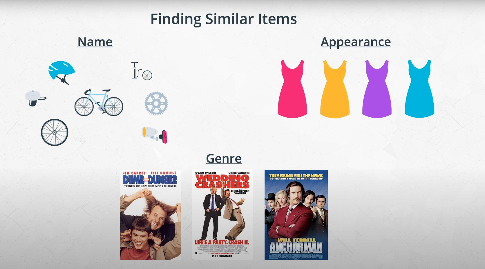

#### Notebook: Content-Based Recommender System

Notebook: [`5_Content Based Recommendations.ipynb`](./lab/Recommendations/01_Intro_to_Recommendations/5_Content%20Based%20Recommendations.ipynb).

Contents:

- Get ranked reviews by user.
- Compute movie similarity matrix by applying dot product to the genre vectors.
- Implement complementary functions:
    - Given a movie id, get its name/title.
    - Given a movie id, get the 10 most similar ones.
- Make recommendations for all users based on similarities:
    - Take the movies rated by each user, sorted.
    - Find the most similar movies to the ranked movies and add to recommendation set, if not yet seen.


```python
movies = pd.read_csv('movies_clean.csv')
reviews = pd.read_csv('reviews_clean.csv')

movies.shape # (35479, 35): century and genre columns included
reviews.head()
# 	user_id	movie_id	rating	timestamp	date
# 0	1	    114508	    8	    1381006850	2013-10-05 21:00:50
# ...

ranked_reviews = reviews.sort_values(by=["user_id", "rating"], ascending=[True, False])
users = np.unique(reviews['user_id'])

# Similarities matrix
movie_content = np.array(movies.iloc[:,4:])
dot_prod_movies = movie_content.dot(np.transpose(movie_content))

def get_movie_names(movie_ids):
    '''
    INPUT
    movie_ids - a list of movie_ids
    OUTPUT
    movies - a list of movie names associated with the movie_ids
    
    '''
    movie_lst = [movies.loc[movies.movie_id == movie_id, 'movie'].values[0] for movie_id in movie_ids]
   
    return movie_lst

def find_similar_movies(movie_id):
    '''
    INPUT
    movie_id - a movie_id 
    OUTPUT
    similar_movies - an array of the most similar movies by title
    '''
    movie_index = movies.loc[movies.movie_id == movie_id].index[0]
    movie_indices = list(df_sim.iloc[movie_index].sort_values(ascending=False)[1:11].index)
    movie_ids = [movies.iloc[movie_indx]['movie_id'] for movie_indx in movie_indices]
    similar_movies = get_movie_names(movie_ids)
    return similar_movies

def make_recs():
    '''
    INPUT
    None
    OUTPUT
    recs - a dictionary with keys of the user and values of the recommendations
    '''
    # Create dictionary to return with users and ratings
    recs = defaultdict(set)
    # How many users for progress bar
    n_users = len(users)

    
    # Create the progressbar
    # https://progressbar-2.readthedocs.io/en/latest/
    cnter = 0
    bar = progressbar.ProgressBar(maxval=n_users+1,
                                  term_width=50,
                                  widgets=[progressbar.Bar('=', '[', ']'), 
                                           '->',
                                           progressbar.Percentage()])
    bar.start()
    
    # For each user
    for user in users:
        
        # Update the progress bar
        cnter+=1 
        bar.update(cnter)

        # Pull only the reviews the user has seen
        reviews_temp = ranked_reviews[ranked_reviews['user_id'] == user]
        movies_temp = np.array(reviews_temp['movie_id'])
        movie_names = np.array(get_movie_names(movies_temp))

        # Look at each of the movies (highest ranked first), 
        # pull the movies the user hasn't seen that are most similar
        # These will be the recommendations - continue until 10 recs 
        # or you have depleted the movie list for the user
        for movie in movies_temp:
            rec_movies = find_similar_movies(movie)
            temp_recs = np.setdiff1d(rec_movies, movie_names)
            recs[user].update(temp_recs)

            # If there are more than 
            if len(recs[user]) > 9:
                break

    bar.finish()
    
    return recs

# Make recommendations for all users
# based on similarities
recs = make_recs()

```

### 6.6 Other Recommendation Techniques

- [AirBnB: Listing Embeddings in Search Ranking](https://medium.com/airbnb-engineering/listing-embeddings-for-similar-listing-recommendations-and-real-time-personalization-in-search-601172f7603e)
- [Location-Based Recommendation Systems](https://link.springer.com/referenceworkentry/10.1007/978-3-319-17885-1_1580)

### 6.7 Types of Ratings

Lecture video: [Types Of Ratings](https://www.youtube.com/watch?v=fMjqe4sxBlQ).

We can have binary ratings (like/dislike) or scale-based ratings (1-3, 1-5, 1-10); to choose, we should consider the following points:

- Do we need to account for neutrality from the user? If so, the number of values in the rating must be odd (3, 5, 7).
- Try to always pick the simplest rating possible, i.e., prefer 1-3 to 1-5 is possible.

Blog post on how to choose the best rating: [Survey Response Scales: How to Choose the Right One for your Questionnaire](https://cxl.com/blog/survey-response-scales/).

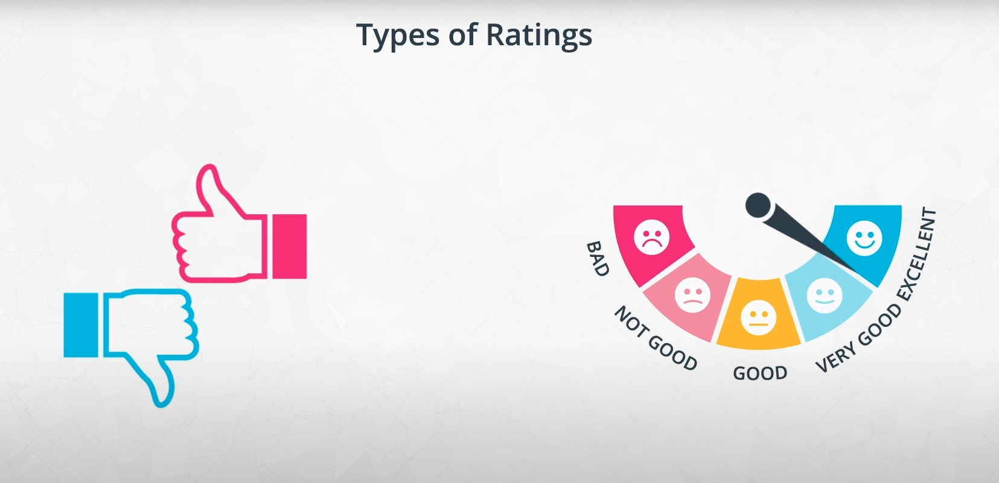

## 7. Matrix Factorization Recommendations

Goals of the section - answer these questions:

- How do you know when our recommendations are good?
- How can you use machine learning for recommendations?
- How do you make recommendations for new users (aka. **cold start problem**)? Usually, this is addressed by combining different recommendation techniques.

The machine learning method learned in this section is the **matrix factorization** method, which discovers latent features of items.

For related information, check:

- My handwritten notes after watching the lectures from Andrew Ng: [`Matrix_Factorization.pdf`](Matrix_Factorization.pdf).
- [Machine Learning IBM: Recommender Systems](https://github.com/mxagar/machine_learning_ibm/tree/main/06_Capstone_Project)
- [Machine Learning Andrew Ng: Recommender Systems](https://github.com/mxagar/machine_learning_coursera/tree/main/07_Anomaly_Recommender)
- Project: [course_recommender_streamlit](https://github.com/mxagar/course_recommender_streamlit)

### 7.1 Validating Our Recommendations

Lecture video: [How Do We Know Our Recs Are Good](https://www.youtube.com/watch?v=D0H_fjJ35CU)

There are several aspects to consider when considering how good a recommendation engine is:

- We define interesting metrics (e.g., user engagement, downloads, revenue) and check how these metrics behave before and after the implementation of the recsys.
    - We can perform A/B testing with and old and a new version of the recsys.
- During development, we should use train/test splits to evaluate the performance of the recsys properly, if possible; not all approaches lend to that. But, if possible, then:
    - The train split should contain the oldest data, whereas the test split the newer data.
    - Which metrics can we use? If we use matrix factorization with SVD, we get a prediction for all cells in the user-item matrix, thus we can apply typical regression metrics, i.e., MSE, MAE.
- Also, we talk about *online* vs. *offline* validations:
    - Online: A/B testing with old/new version of the recommender system, by tracking relevant metrics.
    - Offline: predict the ratings of a user for all items and compare them with the real user ratings (matrix factorization).
- We can also perform user studies: we ask for feedback to user groups after predicting their recommendations.

### 7.2 Singular Value Decomposition (SVD) and Matrix Factorization

[Singular Value Decomposition (SVD)](https://en.wikipedia.org/wiki/Singular_value_decomposition) is a matrix factorization technique that can be used to predict the latent features of items/users, such that we can get the predictions for any user.

However, SVD is limited, because it requires the user-item matrix to be completely filled; a better, newer version is [FunkSVD](https://annie-wangliu.medium.com/funksvd-math-code-prediction-and-validation-4842bfaa219e), which won the [1M Netflix prize](https://en.wikipedia.org/wiki/Netflix_Prize) in 2006 and is the most used method in the industry.

Also, check my notes of the Andrew Ng lectures, because he achieves matrix factorization (not really SVD, because only 2 matrices are obtained) even with not completely filled matrices using a similar technique as FunkSVD! I think it is actually the same technique...

Lecture videos:

- [Why SVD](https://www.youtube.com/watch?v=WdW1-rRQrLk)
- [Latent Factors](https://www.youtube.com/watch?v=jZz7tFEF2Dc&t=24s)
- [SVD](https://www.youtube.com/watch?v=t2XTuHq6-xc)
- [SVD Practice Takeaways](https://www.youtube.com/watch?v=2er0HUDum7k)

#### Latent Factors

Latent factors are properties of the data points that are implicit to them; they don't need to be expressed explicitly. For instance:

- The movie is sci-fi.
- There are many women in the movie.
- It's an animation movie.
- etc.

These latent factors are also related to the users, not only to the items; that relationship is expressed in terms of how important a latent factor is for a user.

#### SVD Computation

Given the user-item matrix, it is factorized into the multiplication of 3 matrices of lower rank which are related to latent factors:

    A (n x m) user x item matrix
    A = U*S*V^T
        U (n x k): user x latent factor
            it contains the ratings of the users to latent factors
        V^T (k x m): latent factor x movie
            it contains the strength of each factor in each movie, which can be negative
        S (k x k), diagonal: importance of latent factors
            the singular values in the diangonal are always positive and ordered
            they help us decide which ones are the most important,
            so we can remove the latent factors with the smallest values

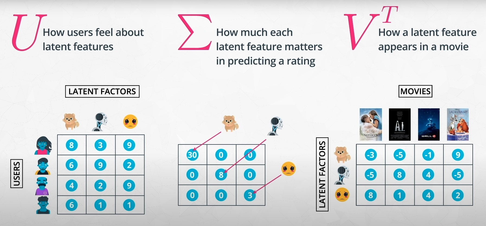

There is a [closed-form solution](http://web.mit.edu/be.400/www/SVD/Singular_Value_Decomposition.htm) to the SVD computation:

> "Calculating the SVD consists of finding the eigenvalues and eigenvectors of AA' and A'A. The eigenvectors of A'A make up the columns of V, the eigenvectors of AA' make up the columns of U. Also, the singular values in S are square roots of eigenvalues from AA' or A'A. The singular values are the diagonal entries of the S matrix and are arranged in descending order. The singular values are always real numbers. If the matrix A is a real matrix, then U and V are also real."

Important additional notes: 

- We choose the number of latent features `k` and we can adjust it depending on the relevance of each latent feature (i.e., their magnitude in the `S` matrix).
- The values `s` of `S` account for the variability explained by each latent factor (we need to square them); it is important to choose the value of `k` according to that, i.e., say we want to explain 95% of all variability.
    - Note that latent features with the smallest `s` values are probably modeling noise!
    - The total variability is the sum of all squared `s`.
- The most common approach is to use gradient descend instead the closed-form solution; that's because:
    - It is more efficient with large datasets.
    - The original SVD computation requires to know the complete `A` matrix, which is not possible; other methods work with `NaN` cells, but use gradient descend.
- [Singular values are always non-negative](https://math.stackexchange.com/questions/2060572/why-are-singular-values-always-non-negative).

#### Notebook: SVD Computation

Notebook: [`1_Intro_to_SVD.ipynb`](./lab/Recommendations/02_Matrix_Factorization_for_Recommendations/1_Intro_to_SVD.ipynb)

In the notebook, the Numpy SSVD is used on a subset of the user-item matrix without missing values.

```python
# Read in the datasets
movies = pd.read_csv('movies_clean.csv')
reviews = pd.read_csv('reviews_clean.csv')

# Create user-by-item matrix
user_items = reviews[['user_id', 'movie_id', 'rating']]
user_by_movie = user_items.groupby(['user_id', 'movie_id'])['rating'].max().unstack()

# Subset dataset
user_movie_subset = user_by_movie[[75314,  68646, 99685]].dropna(axis=0)
user_movie_subset.shape # (6, 3)

# This call returns U (nxn), V^T (mxm) and S (k)
# We need to process the result to select the value for k
# we would like: select according to total explained variance.
# Then, we need to slice the matrices.
# Note that if we take all the latent featues from S
# we still need to truncate U or V^T
u, s, vt = np.linalg.svd(user_movie_subset)
s.shape, u.shape, vt.shape
# ((3,), (6, 6), (3, 3))

# Take all singular values / latent features
# Change the dimensions of u, s, and vt as necessary to use three latent features
# update the shape of u and store in u_new
u_new = u[:, :len(s)]
# update the shape of s and store in s_new
s_new = np.zeros((len(s), len(s)))
s_new[:len(s), :len(s)] = np.diag(s) 
# Because we are using 3 latent features and there are only 3 movies, 
# vt and vt_new are the same
vt_new = vt

# Compute the variance explained with ethe first 2/3 singular values
total_var = np.sum(s**2)
var_exp_comp1_and_comp2 = s[0]**2 + s[1]**2
perc_exp = round(var_exp_comp1_and_comp2/total_var*100, 2) # 99.91%

# Take the first 2 singular values / latent features
# Change the dimensions of u, s, and vt as necessary to use four latent features
# update the shape of u and store in u_new
k = 2
u_2 = u[:, :k]
# update the shape of s and store in s_new
s_2 = np.diag(s)[:k, :k]
# Because we are using 2 latent features, we need to update vt this time
vt_2 = vt[:k, :]

# Compute the error: Sum Square Errors
# Compute the dot product
pred_ratings = np.dot(np.dot(u_2, s_2), vt_2)
# Compute the squared error for each predicted vs. actual rating
sum_square_errs = np.sum(np.sum((user_movie_subset - pred_ratings)**2))

```

### 7.3 FunkSVD

My handwritten notes after watching the lectures from Andrew Ng: [`Matrix_Factorization.pdf`](Matrix_Factorization.pdf).

[FunkSVD](https://sifter.org/~simon/journal/20061211.html)

Lecture video: [Funk SVD](https://www.youtube.com/watch?v=H8gdwXy_npI)

A fast Python implementation of FunkSVD using Numba: [gbolmier/funk-svd](https://github.com/gbolmier/funk-svd).

The FunkSVD algorithm can work with user-item matrices that are not completely filled. It factorizes them to two matrices of lower rank which have as horizontal/vertical size the number of latent factors we would like to have. The steps are the following:

- Given the user-item matrix `A (n x m)` with `NaN`s, choose `k` and define: `A = U * V`, with
    - `U (n x k)`, filled with random numbers,
    - `V (k x m)`, filled with random numbers.
- For each `u_i` row vector in `U` and `v_j` vector in `V`, the dot product give the *predicted* `a_ij = u_i*v_j`.
- Since we have some true `a_ij` values, we compute the error as the squared difference; and the algorithm will consist to minimize that error modifying the values in `U` and `V` in the direction of the total error gradients:
    - `e_ij = (a_ij - u_i*v_j)^2`
    - `E = sum(e_ij, if a_ij != NaN)`
- The gradient is computed as the derivation of the error (I think in the image below there's a typo, `v_i` is used instead of `v_j`):
    - `dE/du_i = -2(a_ij - u_i*v_j)*v_j`
    - `dE/dv_j = -2(a_ij - u_i*v_j)*u_i`
- The gradient descend update occurs in a loop, where
    - we pick `u_i` and `v_j` at each step
    - we apply a learning rate to the error: `alpha`, e.g., `0.01`
    - we first update `u_i` and then `v_j` using the updated `u_i`
    - the update rule is as always: `x_new <- x_old - alpha * dE/dx`
    - the loop goes through all non-missing values of `A` and picks the corresponding `u_i` and `v_j` of each non-missing `a_ij`
        - we go through all non-missing values (1 epoch)
        - we go through the complete `A` multiple times

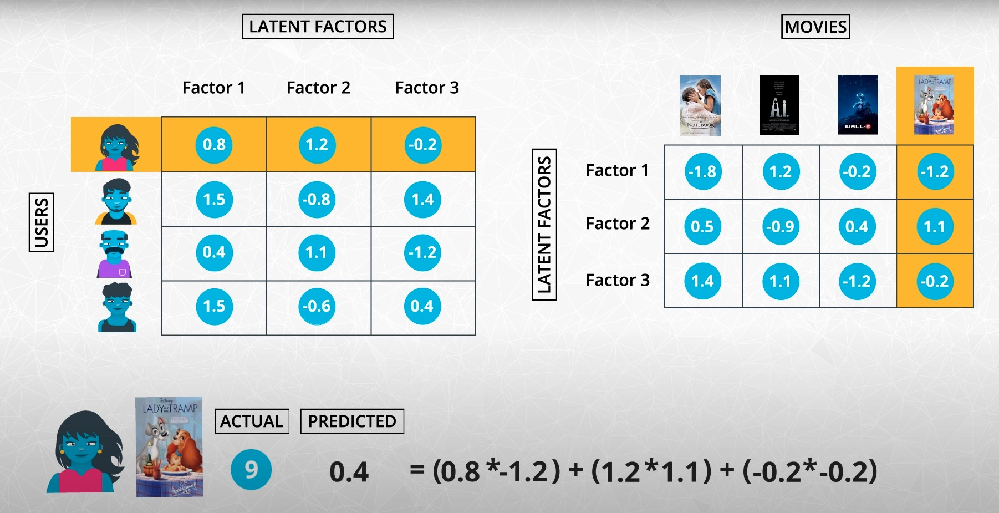

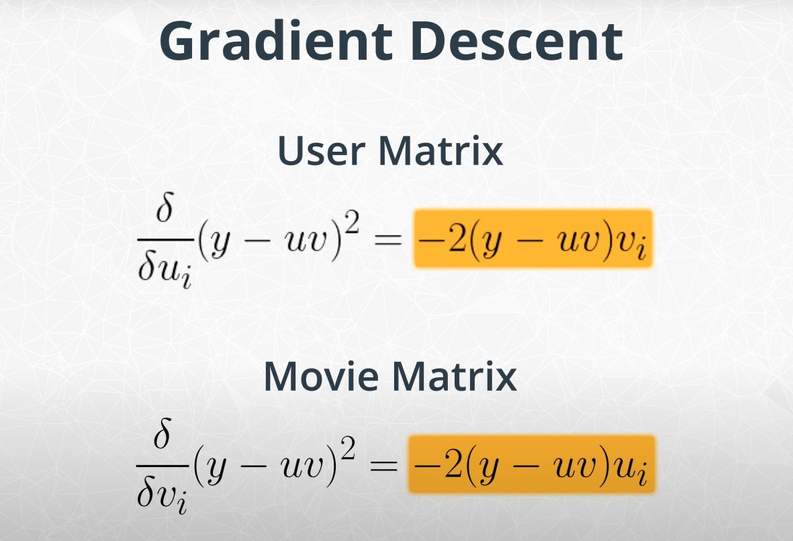

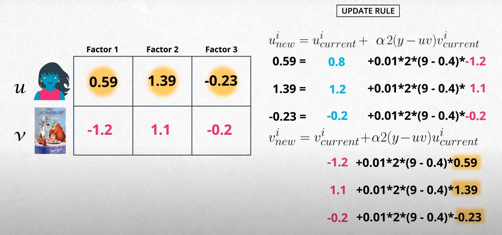

#### Notebook: Implementation of the FunkSVD

Notebook: [`2_Implementing_FunkSVD.ipynb`](./lab/Recommendations/02_Matrix_Factorization_for_Recommendations/2_Implementing_FunkSVD.ipynb).

The algorithm outlined previously is implemented and tested. A subset of the original matrix is taken due to the large size, but it works with any size!

```python
movies = pd.read_csv('movies_clean.csv')
reviews = pd.read_csv('reviews_clean.csv')

user_items = reviews[['user_id', 'movie_id', 'rating', 'timestamp']]
user_by_movie = user_items.groupby(['user_id', 'movie_id'])['rating'].max().unstack()
user_by_movie.shape # (8022, 13850)

# Pick a subset without NaNs
user_movie_subset = user_by_movie[[75314,  68646, 99685]].dropna(axis=0)
ratings_mat = np.matrix(user_movie_subset)
print(ratings_mat)
# [[ 7. 10.  8.]
#  [ 6. 10.  7.]
#  [ 8.  9.  8.]
#  [ 8. 10. 10.]
#  [ 9.  9.  9.]
#  [ 8.  9.  9.]]

# Artifically insert a NaN in [0,0]
# instead of the value 7
ratings_mat[0, 0] = np.nan

# FunfSVD algorithm
def FunkSVD(ratings_mat, latent_features=4, learning_rate=0.0001, iters=100):
    '''
    This function performs matrix factorization using a basic form of FunkSVD with no regularization
    
    INPUT:
    ratings_mat - (numpy array) a matrix with users as rows, movies as columns, and ratings as values
    latent_features - (int) the number of latent features used
    learning_rate - (float) the learning rate 
    iters - (int) the number of iterations
    
    OUTPUT:
    user_mat - (numpy array) a user by latent feature matrix
    movie_mat - (numpy array) a latent feature by movie matrix
    '''
    
    # Set up useful values to be used through the rest of the function
    n_users = ratings_mat.shape[0]
    n_movies = ratings_mat.shape[1]
    n_nan = np.sum(np.sum(np.isnan(ratings_mat), axis=0), axis=1)[0,0]
    num_ratings = n_users*n_movies - n_nan
    # Alternative:
    # num_ratings = np.count_nonzero(~np.isnan(ratings_mat))
    
    # Initialize the user and movie matrices with random values
    # https://numpy.org/doc/stable/reference/random/generated/numpy.random.rand.html
    user_mat = np.random.rand(n_users,latent_features)
    movie_mat = np.random.rand(latent_features, n_movies)
    
    # Initialize sse at 0 for first iteration
    sse_accum = 0
    
    print("Optimizaiton Statistics")
    print("Iterations | Mean Squared Error ")
    
    for it in range(iters):
        # Update our sse
        old_sse = sse_accum
        sse_accum = 0
        
        for i in range(n_users):
            for j in range(n_movies):
                r_ij = ratings_mat[i,j]
                if not np.isnan(r_ij):
                    u_i = user_mat[i,:]
                    v_j = movie_mat[:,j]
                    # Compute the error as the actual minus the dot product
                    # of the user and movie latent features
                    e_ij = (r_ij - np.dot(u_i,v_j))**2
                    # Keep track of the sum of squared errors for the matrix
                    sse_accum += e_ij                    
                    # Update the values in each matrix in the direction of the gradient
                    # dE/du_i = -2(a_ij - u_i*v_j)*v_j
                    # dE/dv_j = -2(a_ij - u_i*v_j)*u_i
                    # x_new <- x_old - alpha * dE/dx
                    u_new = u_i + 2.0*learning_rate*(r_ij - np.dot(u_i,v_j))*v_j
                    v_new = v_j + 2.0*learning_rate*(r_ij - np.dot(u_i,v_j))*u_new
                    user_mat[i,:] = u_new
                    movie_mat[:,j] = v_new

        print(f"{it} | {sse_accum}")

    return user_mat, movie_mat

# Run FunkSVD on subset
user_mat, movie_mat = FunkSVD(ratings_mat=ratings_mat,
                              latent_features=3,
                              learning_rate=0.005,
                              iters=450)
# Optimizaiton Statistics
# Iterations | Mean Squared Error 
# 0 | 1063.8673910732225
# 1 | 866.8323007068128
# ...
# 449 | 3.102148457856114e-06

# Print prediction and real
# Note that the [0,0] NaN is predicted as 6.8
# when the real value was 7!
print(np.dot(user_mat, movie_mat))
print(ratings_mat)
# [[ 6.79927802  9.99644121  8.00370784]
#  [ 5.99733358  9.99990057  7.00172179]
#  [ 7.89279109  8.95792566  8.11035275]
#  [ 8.09221844 10.03864715  9.90468108]
#  [ 9.02236761  9.00802682  8.97747777]
#  [ 7.9786558   8.99231456  9.02113112]]
# [[nan 10.  8.]
#  [ 6. 10.  7.]
#  [ 8.  9.  8.]
#  [ 8. 10. 10.]
#  [ 9.  9.  9.]
#  [ 8.  9.  9.]]

```

#### FunkSVD with Regulatization

```python
def FunkSVD_w_regularization(ratings_mat,
                             latent_features=4,
                             learning_rate=0.005,
                             regularization=0.02,
                             iters=100):
    n_users = ratings_mat.shape[0]
    n_movies = ratings_mat.shape[1]
    n_already_rated = ratings_mat.nonzero()[0].size
    user_mat = np.random.rand(n_users, latent_features)
    movie_mat = np.random.rand(latent_features, n_movies)

    iter_count = 0
    sse_accum = 0
    print("Optimizaiton Statistics")
    print("Iterations | Mean Squared Error ")
    for i in range(iters):
        old_sse = sse_accum
        sse_accum = 0
        
        # For each user-movie pair
        for i in range(n_users):
            for j in range(n_movies):
                
                # if the rating exists
                if ratings_mat[i, j] > 0:
                    
                    # compute the error as the actual minus the dot product of the user and movie latent features
                    diff = ratings_mat[i, j] - np.dot(user_mat[i, :], movie_mat[:, j])
                    
                    # Keep track of the sum of squared errors for the matrix
                    sse_accum += diff**2
                    
                    # update the values in each matrix in the direction of the gradient regularize by how large the value was to begin with
                    for k in range(latent_features):
                        user_mat[i, k] += learning_rate * (2*diff*movie_mat[k, j] - regularization*user_mat[i, k])
                        movie_mat[k, j] += learning_rate * (2*diff*user_mat[i, k] - regularization*movie_mat[k, j])

        # print results
        print("%d \t\t %f" % (iter_count, sse_accum/n_already_rated))
        
        # update iterations
        iter_count += 1
        
    return user_mat, movie_mat
```

#### Notebook: Validation

Notebook: [`3_How_Are_We_Doing.ipynb`](./lab/Recommendations/02_Matrix_Factorization_for_Recommendations/).

In this notebook, a train/test split is performed, taking the newest entries for the test/validation dataset. Then, the model is trained with the train split and evaluated with the test/validation split.

```python
movies = pd.read_csv('movies_clean.csv')
reviews = pd.read_csv('reviews_clean.csv')

def create_train_test(reviews, order_by, training_size, testing_size):
    '''    
    INPUT:
    reviews - (pandas df) dataframe to split into train and test
    order_by - (string) column name to sort by
    training_size - (int) number of rows in training set
    testing_size - (int) number of columns in the test set
    
    OUTPUT:
    training_df -  (pandas df) dataframe of the training set
    validation_df - (pandas df) dataframe of the test set
    '''
    reviews_new = reviews.sort_values(order_by)
    training_df = reviews_new.head(training_size)
    validation_df = reviews_new.iloc[training_size:training_size+testing_size]
    
    return training_df, validation_df

# Use our function to create training and test datasets
# Pick only 10,000 entries, not all: 80%, 20%
train_df, val_df = create_train_test(reviews, 'date', 8000, 2000)
train_df.head()
# 	    user_id	movie_id	rating	    timestamp	date
# 17455	1181	1003052	8	1362063906	2013-02-28  07:05:06
# ...

# Create user-by-item matrix - nothing to do here
train_user_item = train_df[['user_id', 'movie_id', 'rating', 'timestamp']]
train_data_df = train_user_item.groupby(['user_id', 'movie_id'])['rating'].max().unstack()
train_data_df.shape # (1542, 2842): user_id x [movie_id]

train_data_np = np.array(train_data_df)

# Fit FunkSVD with the specified hyper parameters to the training data
user_mat, movie_mat = FunkSVD(train_data_np, 
                              latent_features=15, 
                              learning_rate=0.005, 
                              iters=300)

def predict_rating(user_matrix, movie_matrix, user_id, movie_id):
    '''
    INPUT:
    user_matrix - user by latent factor matrix
    movie_matrix - latent factor by movie matrix
    user_id - the user_id from the reviews df
    movie_id - the movie_id according the movies df
    
    OUTPUT:
    pred - the predicted rating for user_id-movie_id according to FunkSVD
    '''
    # Create series of users and movies in the right order
    user_ids_series = np.array(train_data_df.index)
    movie_ids_series = np.array(train_data_df.columns)
    
    # User row and Movie Column
    user_row = np.where(user_ids_series == user_id)[0][0]
    movie_col = np.where(movie_ids_series == movie_id)[0][0]
    
    # Take dot product of that row and column in U and V to make prediction
    pred = np.dot(user_matrix[user_row, :], movie_matrix[:, movie_col])
    
    return pred

# Test your function with the first user-movie in the user-movie matrix (notice this is a nan)
pred_val = predict_rating(user_mat, movie_mat, 2625, 169547)
pred_val # 8.992688339316702

def validation_comparison(val_df, user_mat, movie_mat):
    '''
    INPUT:
    val_df - the validation dataset created in the third cell above
    user_mat - U matrix in FunkSVD
    movie_mat - V matrix in FunkSVD
        
    OUTPUT:
    rmse - RMSE of how far off each value is from it's predicted value
    perc_rated - percent of predictions out of all possible that could be rated
    actual_v_pred - a 10 x 10 grid with counts for actual vs predicted values (confusion matrix)
    '''
    val_users = np.array(val_df['user_id'])
    val_movies = np.array(val_df['movie_id'])
    val_ratings = np.array(val_df['rating'])
    
    sse = 0
    num_rated = 0
    preds, acts = [], []
    actual_v_pred = np.zeros((10,10))
    for idx in range(len(val_users)):
        try:
            # Sometimes the user-movie item from the validation set
            # cannot be predicted using the train split
            # because that movie/user is new!
            # That's related to the cold start problem
            pred = predict_rating(user_mat, movie_mat, val_users[idx], val_movies[idx])
            sse += (val_ratings[idx]-pred)**2
            num_rated += 1
            preds.append(pred)
            acts.append(val_ratings[idx])
            actual_v_pred[11-int(val_ratings[idx]-1), int(round(pred)-1)]+=1
        
        except:
            continue
    
    rmse = np.sqrt(sse/num_rated)
    perc_rated = num_rated/len(val_users)
    return rmse, perc_rated, actual_v_pred, preds, acts

# How well did we do?
# Confusion matrix of predicted vs actual ratings
rmse, perc_rated, actual_v_pred, preds, acts = validation_comparison(val_df=val_df,
                                                                     user_mat=user_mat, movie_mat=movie_mat)
print(rmse, perc_rated) # 2.9090003487365728 0.5065
sns.heatmap(actual_v_pred);
plt.xticks(np.arange(10), np.arange(1,11));
plt.yticks(np.arange(10), np.arange(1,11));
plt.xlabel("Predicted Values");
plt.ylabel("Actual Values");
plt.title("Actual vs. Predicted Values");

# Histograms of predicted and actual ratings
plt.figure(figsize=(8,8))
plt.hist(acts, density=True, alpha=.5, label='actual');
plt.hist(preds, density=True, alpha=.5, label='predicted');
plt.legend(loc=2, prop={'size': 15});
plt.xlabel('Rating');
plt.title('Predicted vs. Actual Rating');

# Number of items which could not be rated
not_rated = int(len(val_df['rating'])*(1-perc_rated))
rated = int(len(val_df['rating'])*perc_rated)
print("Number not rated {}.".format(not_rated))
print("Number rated {}.".format(rated))
# Number not rated 987.
# Number rated 1012.
```

### 7.4 The Coldstart Problem

The **cold start** problem refers to the initial recommendations, which cannot be done using the collaborative filtering method based on the FunkSVD. In those cases, the other techniques introduced beforehand (i.e., knowledge-based methods, content-based, neighborhood-based) need to be used to predict recommendations. This problem arises typically when we have a new user/movie.

In the following, a notebook which implements the solution for the *cold start* problem is shown.

The **general approach** is the following:

- Use matrix factorization to compute the predicted ratings in the user-item matrix by applying FunkSVD. Do it with a train/test split.
- If we have a new movie/user, we need to apply another technique (e.g., that occurs already when we validate the output from the FunkSVD with the test split which contains new users/movies):
    - For new movies (recall the movies have genre dummy variables), a content-based system is implemented which uses the similarity matrix between movies.
    - For new users, a rank-based system is implemented: the best rated movies are suggested. We could further refine this by suggesting the best movies which are related to selected genres.

#### Notebook: Cold Start Implementation

Notebook: [`4_Cold_Start_Problem.ipynb`](./lab/Recommendations/02_Matrix_Factorization_for_Recommendations/4_Cold_Start_Problem.ipynb).

This notebook continues right after the end of the previous: we have predicted the recommendations of the test split using FunkSVD, but some ratings cannot be predicted because they contain new user/movie ids!

The following is implemented:

- For new movies (recall the movies have genre dummy variables), a content-based system is implemented which uses the similarity matrix between movies.
- For new users, a rank-based system is implemented: the best rated movies are suggested. We could further refine this by suggesting the best movies which are related to selected genres.

```python
# The dataframe movies contains the century and the genre dummy columns
movie_content = np.array(movies.iloc[:,4:])

# Take the dot product to obtain a movie x movie matrix of similarities
dot_prod_movies = movie_content.dot(np.transpose(movie_content))

def find_similar_movies(movie_id):
    '''
    INPUT
    movie_id - a movie_id 
    OUTPUT
    similar_movies - an array of the most similar movies by title
    '''
    # find the row of each movie id
    movie_idx = np.where(movies['movie_id'] == movie_id)[0][0]
    
    # find the most similar movie indices - to start I said they need to be the same for all content
    similar_idxs = np.where(dot_prod_movies[movie_idx] == np.max(dot_prod_movies[movie_idx]))[0]
    
    # pull the movie titles based on the indices
    similar_movies = np.array(movies.iloc[similar_idxs, ]['movie'])
    
    return similar_movies
    
    
def get_movie_names(movie_ids):
    '''
    INPUT
    movie_ids - a list of movie_ids
    OUTPUT
    movies - a list of movie names associated with the movie_ids
    
    '''
    movie_lst = list(movies[movies['movie_id'].isin(movie_ids)]['movie'])
   
    return movie_lst

def create_ranked_df(movies, reviews):
    '''
    INPUT
        movies - the movies dataframe
        reviews - the reviews dataframe

    OUTPUT
        ranked_movies - a dataframe with movies that are sorted by highest avg rating, more reviews, 
                        then time, and must have more than 4 ratings
    '''

    # Pull the average ratings and number of ratings for each movie
    movie_ratings = reviews.groupby('movie_id')['rating']
    avg_ratings = movie_ratings.mean()
    num_ratings = movie_ratings.count()
    last_rating = pd.DataFrame(reviews.groupby('movie_id').max()['date'])
    last_rating.columns = ['last_rating']

    # Add Dates
    rating_count_df = pd.DataFrame({'avg_rating': avg_ratings, 'num_ratings': num_ratings})
    rating_count_df = rating_count_df.join(last_rating)

    # merge with the movies dataset
    movie_recs = movies.set_index('movie_id').join(rating_count_df)

    # sort by top avg rating and number of ratings
    ranked_movies = movie_recs.sort_values(['avg_rating', 'num_ratings', 'last_rating'], ascending=False)

    # for edge cases - subset the movie list to those with only 5 or more reviews
    ranked_movies = ranked_movies[ranked_movies['num_ratings'] > 4]

    return ranked_movies
    

def popular_recommendations(user_id, n_top, ranked_movies):
    '''
    INPUT:
        user_id - the user_id (str) of the individual you are making recommendations for
        n_top - an integer of the number recommendations you want back
        ranked_movies - a pandas dataframe of the already ranked movies based on avg rating, count, and time

    OUTPUT:
        top_movies - a list of the n_top recommended movies by movie title in order best to worst
    '''

    top_movies = list(ranked_movies['movie'][:n_top])

    return top_movies

def make_recommendations(_id, _id_type='movie', train_data=train_data_df, 
                         train_df=train_df, movies=movies, rec_num=5, user_mat=user_mat):
    '''
    INPUT:
    _id - either a user or movie id (int)
    _id_type - "movie" or "user" (str)
    train_data - dataframe of data as user-movie matrix
    train_df - dataframe of training data reviews
    movies - movies df
    rec_num - number of recommendations to return (int)
    user_mat - the U matrix of matrix factorization
    movie_mat - the V matrix of matrix factorization
    
    OUTPUT:
    recs - (array) a list or numpy array of recommended movies like the 
                   given movie, or recs for a user_id given
    '''
    # If the user is available from the matrix factorization data, 
    # I will use this and rank movies based on the predicted values
    # For use with user indexing
    val_users = train_data_df.index
    rec_ids = create_ranked_df(movies, train_df)
    
    if _id_type == 'user':
        if _id in train_data.index: # Use matrix factorization
            # Get the index of which row the user is in for use in U matrix
            idx = np.where(val_users == _id)[0][0]
            
            # Take the dot product of that row and the V matrix
            preds = np.dot(user_mat[idx,:],movie_mat)
            
            # Pull the top movies according to the prediction
            indices = preds.argsort()[-rec_num:][::-1] #indices
            rec_ids = train_data_df.columns[indices]
            rec_names = get_movie_names(rec_ids)
            
        else: # Use ranking system
            # If we don't have this user, give just top ratings back
            rec_names = popular_recommendations(_id, rec_num, rec_ids)
            

    else: # Find similar movies if it is a movie that is passed
        rec_ids = find_similar_movies(_id)
        rec_names = get_movie_names(rec_ids)
    
    return rec_ids, rec_names

# Make recommendations
user_recs_dict_with_top = dict()
for user_id in set(val_df['user_id']):
    user_recs_dict_with_top[user_id] = make_recommendations(user_id, 'user')[1]

cnter = 0
for user, rec in user_recs_dict_with_top.items():
    if cnter < 12:
        print("For user {}, our recommendations are: \n {}".format(user, rec))
        cnter+=1
    else:
        break
# For user 4096, our recommendations are: 
#  ['Rocky (1976)', 'Va, vis et deviens (2005)', 'Beastly (2011)', 'Les amours imaginaires (2010)', 'La voz dormida (2011)']
# For user 4104, our recommendations are: 
#  ['Jubal (1956)', 'Rocky (1976)', 'Va, vis et deviens (2005)', 'The Town (2010)', 'Beastly (2011)']
# ...
```

### 7.5 Putting It All Together: A Module


Lecture videos:

- [Putting It All Together](https://www.youtube.com/watch?v=r5jfD2uKnbQ)
- [Recommendations Module](https://www.youtube.com/watch?v=zgz5WYlI5fE)


## 8. Project: Recommendation Engines

Project repository: []().
