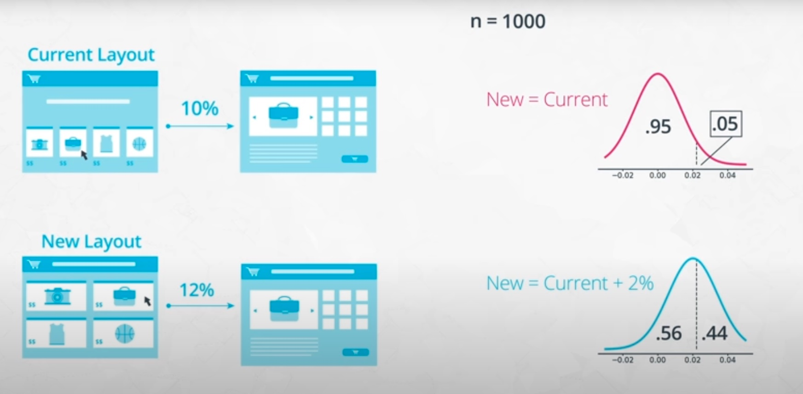

# Udacity Data Science Nanodegree: Data Engineering

These are my personal notes taken while following the [Udacity Data Science Nanodegree](https://www.udacity.com/course/data-scientist-nanodegree--nd025).

The Nanodegree assumes basic data analysis skills with python libraries (pandas, numpy, matplotlib, sklearn, etc.) and has 5 modules that build up on those skills:

1. Introduction to Data Science
2. Software Engineering
3. Data Engineering
4. Experimental Design & Recommendations
5. Data Scientist Capstone

This folder & guide refer to the **fourth module**: Experimental Design & Recommendations.

Mikel Sagardia, 2022.
No guarantees.

Overview of Contents:

- [Udacity Data Science Nanodegree: Data Engineering](#udacity-data-science-nanodegree-data-engineering)
  - [1. Introduction to Experiment Design and Recommendation Engines](#1-introduction-to-experiment-design-and-recommendation-engines)
  - [2. Concepts in Experiment Design](#2-concepts-in-experiment-design)
    - [2.1 What Is an Experiment?](#21-what-is-an-experiment)
    - [2.2 Types of Experiment](#22-types-of-experiment)
    - [2.3 SMART Experiments](#23-smart-experiments)
    - [2.4 Types of Sampling](#24-types-of-sampling)
    - [2.5 Measuring Outcomes](#25-measuring-outcomes)
    - [2.6 Creating Metrics](#26-creating-metrics)
    - [2.7 Controlling Variables](#27-controlling-variables)
    - [2.8 Checking Validity](#28-checking-validity)
    - [2.9 Checking Bias](#29-checking-bias)
    - [2.10 Ethics in Experimentation](#210-ethics-in-experimentation)
  - [3. Statistical Considerations in Testing](#3-statistical-considerations-in-testing)
  - [4. A/B Testing Case Study](#4-ab-testing-case-study)


## 1. Introduction to Experiment Design and Recommendation Engines

In a nutshell:

- Experiments: A/B tests = hypothesis tests, ANOVAs, etc.
- Recommendation engines: suggesting items a user might like.

Experiments can be used to evaluate the quality of the recommendations.

Experiments are broken into 2 groups:

- Treatment
- Control

How can we determine when an experiment has completed?

- Define metrics beforehand.
- Choose 1-2 metrics and their threshold values, which are the flags.
- Make sure we collect enough data to make a recommendation.

How to decided what to test?

- Often marketing decides according to their priorities.
- We need to consider the impact of the test in the operations.

In every new experiment, you need to consider

- All data sources and all data that is incoming: shops, inventories, etc.
- How can be measured whether an experiment worked or not.

Most experiments fail: the outcome is there is no significant difference between the treatment and the control group. That is normal, because we're trying to discover things that are not so obvious; if they were easy, why aren't we using them?

When creating the control/treatment groups:

- Be mindful of the time of year if the business has seasonal patterns.
- Consider the users' past behavior: maybe they have significant patterns that affect the group result.

### Lab Exercises

The folder [`lab`](./lab/) contains 2 sub-folders:

- [`lab/Experiments`](./lab/Experiments/): exercises of sections 3-5
- [`lab/Recommendations`](./lab/Recommendations/): exercises of sections 6 and 7

## 2. Concepts in Experiment Design

### 2.1 What Is an Experiment?

Experiments are run to check hypotheses; however, we need to take into account that **correlation does not imply causation**.

Example: we have an online store and we want to check which UX leads to more purchases: (i) clicking on a product opens a new product tab or (ii) clicking on a product opens an overlay. To perform the experiment which answers the question:

1. We need to compare two groups: one with treatment (i) or control, one for treatment (ii) or overlay.
2. We need to make sure that the only difference between the groups is the feature in question, i.e., we need to control that there are no other differences. One way to achieve that is to do it randomly.


However, often it's not possible to run a true experiment, which requires at least two groups of users randomly selected, one of the groups being the control group. We can say there's a spectrum of experiments:

- **Experiments** (one extreme): two groups, randomly generated, one of them control; we have full control over the features. This is typical in medical sciences.
- **Observational studies** (the other extreme): not possible to have two random groups, so we don't have control over the features. Sometimes, the reason for having an observational study are ethical issues. We cannot infer any causation, but we can use them to understand dynamics and formulate hypotheses to be tested.
- **Quasi-experiments** (between the extremes): we have some control over the features; e.g., we implement a new feature and test it without control group, or the group with the new feature is not random. Depending on the product, this can be quite common: for instance, if we launch a feature in *beta* and customers try it, the group is not random anymore!

Lecture videos:

- [What Is An Experiment](https://www.youtube.com/watch?v=fH_xF5_SDCE&t=106s)
- [What Is An Experiment Pt 2](https://www.youtube.com/watch?v=PYzN1usi7QY&t=185s)

### 2.2 Types of Experiment

The two most important typed of experiments are:

- **Between**: each group A/B tries one treatment control/experiment.
- **Within**: each group A/B tries both treatments; the advantage of this type of experiment is that we can account for the variance introduced by the subjects. However, not always is possible to design a *within* study.


Another type of experiments are **factorial**: we test several factors, not only one; these lead to ANOVA analyses and require a stricter control.

Lecture video: [Types Of Experiments](https://www.youtube.com/watch?v=7ihDj4M7EiU&t=190s)

### 2.3 SMART Experiments

Experiments should be designed in a SMART way:

> - Specific: Make sure the goals of your experiment are specific.
> - Measurable: Outcomes must be measurable using objective metrics
> - Achievable: The steps taken for the experiment and the goals must be realistic.
> - Relevant: The experiment needs to have a purpose behind it.
> - Timely: Results must be obtainable in a reasonable time frame.

### 2.4 Types of Sampling

The most common way of random sampling is **Simple Random Sampling**: we have a population and give each individual an equal chance of being selected. However, sometimes (often) that is not completely possible. For instance, we might have a population divided in different living regions (urban 50%, suburban 30%, rural 20%), so some regions are unrepresented. In those cases, instead of choosing randomly from the total population, we allocate a given amount of people to each region relative to the percentage of people living there; that way, we assure a representative amount in each region instead of leaving the selection completely to chance. That is called **Stratified Random Sampling**.


Both Simple Random Sampling and Stratified Random Sampling are **probabilistic sampling methods**; however, there exist also **non-probabilistic sampling methods**, such as **Convenience Sampling**: record information from available units, e.g., college students in a university study. These sometimes are the only way of of conducting the experiment, but they might lead to false results, because they use non-representative samplings.

Lecture video: [Types of Sampling](https://www.youtube.com/watch?v=GF_eQqNoarI&t=1s).

### 2.5 Measuring Outcomes

How can we measure the effectiveness of a video recommendation engine? We need to define measurable **evaluation metrics** beforehand, e.g.:

- Video watch time: the longer, the better.
- Video ranking: the higher, the better.
- Number of search queries after watching the video: the more the better, because the video might have arisen curiosity.

However, **those metrics might be misleading**:

- The engine suggests only longer videos, not better ones.
- The engine suggests videos which have a high ranking, ignoring the ones with few rankings.
- The engine suggests videos which originate many queries, but because they are confusing or not good enough.

So what should we do? Consider goals of the study separate from the metrics: the metric might be a proxy to what is being measured. Additionally, consider all implications of a metric value.

Lecture videos:

- [Measuring Outcomes Pt 1](https://www.youtube.com/watch?v=HPmMEkbT2uE&t=5s)
- [Measuring Outcomes Pt 2](https://www.youtube.com/watch?v=yLdXcRXcfPw&t=2s)

### 2.6 Creating Metrics

Going back to the online store example, we need to find a way to divide the two groups; notes:

- The flow of steps the user follows from start to end are called **user funnel**, because we loose users from step to step.
- Two groups mean two different funnels.
- In the case of an online store, we can implement the separation with a cookie in the beginning: when the user opens the page/starts a session, a cookie which randomly assigns the user to groups A/B is created, which is permanently stored for that user. The cookie is **unit of diversion** and it should be unnoticeable for the user; depending on the experiment, we might have different types of diversions:
  - Event-based: when opening page.
  - Cookie-based: a user has one permanent cookie.
  - Account-based: every logged user has a group assigned.

We need to track two kinds of metrics:

1. Evaluation metrics: metrics we expect to change due to the treatment. We compare the groups with them.
2. Invariant metrics: metrics we expect to be constant; we measure them to make sure that the groups are the same, treatment aside.


Lecture video: [Creating Metrics](https://www.youtube.com/watch?v=__7tzDUY870&t=7s)

### 2.7 Controlling Variables

As mentioned before, *correlation does not mean causation*. Sometimes variables are correlated, but that relationship can be:

- by chance
- or caused by a **confounding variable**: a confounding variable is a hidden factor which influences both correlated variables.

Example: ice cream consumption and crime rates are correlated; the confounding variable can be the temperature: the hotter it is, the more ice cream people eat and more crimes occur, without both being related more than by the temperature.

If we want to argue causality, we need to change only one factor/variable and control the experiment very thoroughly.

Lecture video: [Controlling Variables](https://www.youtube.com/watch?v=pLTneSg2MRY)

### 2.8 Checking Validity

Validity is related to how well the conclusions of the experiment can be supported.

There are 3 types of validity measures:

1. Construct validity: degree to which an experiment's metric result supports the goals of the study; a bad construct validity example is the number of search queries in the online store example.
2. Internal validity: degree to which a causality claim can be supported. If we have 2 correlated variables, but we don't account for any other variables, the causation is not well supported; we need to consider other variables to state causation.
3. External validity: how generalizable the results are. This is related to the representativeness of the sample: the more representative, the more generalizable.

Lecture video: [Checking Validity](https://www.youtube.com/watch?v=H3H1SZXqDmQ&t=2s).

### 2.9 Checking Bias

In addition to checking the validity, we need to check the biases of our experiments.

Bias, definition: systematic error that affects the interpretability of the experiment.

Examples of frequent biases:

- Sampling bias: sample is not representative of the population. For instance:
  - With questionnaires, some strata of people don't answer some questions, so if we take only the answers, we're introducing bias!
  - With the online store example, if the A/B groups are decided depending on the daytime (AM, PM), we can expect them to be two different populations!
- Novelty bias: when we introduce something new to the customers (e.g., overlay), the user behavior might deviate from the regular; then, when the novelty is gone, we get the stationary behavior, which might be different than before introducing the new feature.
- Order biases: biases that occur when the order in which administer different treatment conditions is relevant:
  - Primacy bias: condition is presented first, novelty bias
  - Recency bias: condition is presented last
  - Example: when 5 products are presented to the users sequentially and their feedback is asked.
- Experimenter bias: when the presence of the experimenter affects the participants' behavior.

Techniques to avoid bias: single/double blinding.

Interesting links:

- [Wikipedia: List of cognitive biases](https://en.wikipedia.org/wiki/List_of_cognitive_biases)
- [Blinded experiment](https://en.wikipedia.org/wiki/Blinded_experiment)

Lecture video: [Checking Bias](https://www.youtube.com/watch?v=ppjNNY4DhPw&t=1s).

### 2.10 Ethics in Experimentation

Ethical issues need to be examined before conducting an experiment:

1. Minimize participant risk; emotional stress is also a form of harm.
2. Clear the benefits for the risks taken. Are the benefits worth taking?
3. Provide an informed consent. A debriefing is necessary, and a signed agreement; users need to be able to opt-out whenever they want.
4. Handle sensitive data appropriately. Secure the information and anonymize it.

Examples in experimental ethics, interesting links:

- [Tuskegee Syphilis Study](https://en.wikipedia.org/wiki/Tuskegee_Syphilis_Study)
- [Milgram experiment](https://en.wikipedia.org/wiki/Milgram_experiment)
- [Stanford prison experiment](https://en.wikipedia.org/wiki/Stanford_prison_experiment)
- [The Morality Of A/B Testing](https://techcrunch.com/2014/06/29/ethics-in-a-data-driven-world/?guccounter=1)
- [The Belmont Report](https://www.hhs.gov/ohrp/regulations-and-policy/belmont-report/index.html)
- [APA Ethics Code](https://www.apa.org/ethics/code/)

Lecture videos:

- [Ethics In Experimentation Pt 1](https://www.youtube.com/watch?v=cWB1jQgcQ1g&t=1s)
- [Ethics In Experimentation Pt 2](https://www.youtube.com/watch?v=0qcJ_oggdKw)
- [Ethics In Experimentation Pt 3](https://www.youtube.com/watch?v=_HTolKktaC4)

## 3. Statistical Considerations in Testing

Check also my notes on statistics:

- [Statistics_Python_2_Inference.md](https://github.com/mxagar/statistics_with_python_coursera/blob/main/02_Inference/Statistics_Python_2_Inference.md).
- [Statistical_Analysis_Notes.pdf](https://github.com/mxagar/statistics_with_python_coursera/blob/main/Statistical_Analysis_Notes.pdf)

### 3.1 Statistical Significance Refresher Notebook

Notebook: [L2_Statistical_Significance_Solution.ipynb](./lab/Experiments/L2_Statistical_Significance_Solution.ipynb).

Notes on statistical testing:

- [Statistics_Python_2_Inference.md](https://github.com/mxagar/statistics_with_python_coursera/blob/main/02_Inference/Statistics_Python_2_Inference.md).
- [Statistical_Analysis_Notes.pdf](https://github.com/mxagar/statistics_with_python_coursera/blob/main/Statistical_Analysis_Notes.pdf)

Problem: we have a new layout and want to check whether it leads to more download clicks; we run an A/B test with cookies, i.e., each user gets a random layout and we collect their response.

- Experiment: Does layout change lead to more clicks on download?
- Variable `condition`: layout changed or not
- Variable `click`: whether download clicked or not

A Z-test is performed with 2 proportions, using two approaches: 

- (1) analytical, i.e., Z-test with binomial distribution variance,
- (2) simulation, i.e., a large amount of samples are taken from the data to arrive at the same conclusion.

```python
# Experiment: Does layout change lead to more clicks on download?
# condition: layout changed or not
# click: whether download clicked or not
data = pd.read_csv('./data/statistical_significance_data.csv')
data.head(10)
# 	condition	click
# 0	1	        0
# ...

# INVARIANT metric: the condition
# The size of both groups should not be significantly different
# Get number of trials and number of 'successes'
n_obs = data.shape[0]
n_control = data.groupby('condition').size()[0]

print(n_obs) # 999
print(n_control) # 491: approx. 1/2, ok

# Compute a z-score and p-value
# H0: new layout doesn't have more/less entries 
# Ha: new layout leads to more/less entries
p = 0.5
sd = np.sqrt(p * (1-p) * n_obs)

z_score = ((n_control + 0.5) - p * n_obs) / sd
p_value = 2*stats.norm.cdf(z_score)

print("z-score: {z}".format(z=z_score))
print("p-value from z-score: {p}".format(p=p_value)) # 0.61, we cannot reject H0

# EVALUATION metric: downloads
# Get p(click) in each condition
p_click = data.groupby('condition').mean()['click']
p_click
# 0    0.079430
# 1    0.112205

# Get number of trials and overall 'success' rate under null
n_control = data.groupby('condition').size()[0]
n_exper = data.groupby('condition').size()[1]
p_null = data['click'].mean()

# Compute standard error, z-score, and p-value
# H0: new layout doesn't lead to more/less clicks
# Ha: new layout leads to more/less download clicks
se_p = np.sqrt(p_null * (1-p_null) * (1/n_control + 1/n_exper))

z_score = (p_click[1] - p_click[0]) / se_p
p_val = 1-stats.norm.cdf(z_score)

print("z-score: {z}".format(z=z_score))
print("p-value from z-score: {p}".format(p=p_val)) # p = 0.039; we can reject H0
```

### 3.2 Practical Significance

Sometimes our experiments are significant and we conclude the change we would need to be more successful; however, implementing those changes might be very costly, more than the revenue they would bring. Thus, it doesn't make sense to implement them; that's **practical significance**: when in practice it doesn't make sense to modify something even though the experiments show it would be significantly beneficial. 

Lecture video: [Practical Significance](https://www.youtube.com/watch?v=eJ3idt3AJ7E&t=1s)

One way of dealing with the practical significance is the following:

- Given the risks we want to take and the costs we want to assume to implement the change, we compute the minimum impact we expect, e.g., number of sold products.
- Then, we compute the confidence interval (CI) of the metrics from our experiment.
- Depending on the location of the expected impact wrt. the CI, we decide.

### 3.3 Experiment Size: Statistical Power

Lecture video: [Experiment Size](https://www.youtube.com/watch?v=sImRm8e01jA&t=2s).

How long should we run an experiment to draw meaningful conclusions? How many recordings do we need?

These questions are related to the statistical power.

Example: we have an online store and we want to test whether a new layout leads to more buys; the current click-through rate is 10%, and we want to see an increase to 12%, that's the practical boundary. How many data-points do we need to record in order to reliably detect that change?

We use the **statistical power**, `1 - beta`: the likelihood of a hypothesis test detecting a true effect if there is one, i.e., given the true mean (different from the H0), the probability of rejecting the null hypothesis.

To compute it, we use the distributions of the two layouts/conditions:

- We have the distributions of the click-through rates hypotheses with the current and the new layouts.
- We select `alpha = 0.05` and draw the boundary in the current layout distribution.
- The same boundary value is used to compute the power, which is the area below the curve starting at the boundary, e.g., `0.8 = 80%`.
- The more data-points we take, the narrower and more disjoint the distributions become, so the power increases!
- Thus, we can define the power we want and, from it, derivate the number of data-points we need to reach it.
- with the number of data-points, we can calculate the duration of the experiment, because we know the number of visitors/day, approx.; but:
  - Consider seasonal effects, weekends, etc. Which impact do they have on the results?
  - If the experiment needs to be run too long, maybe we need to change the power?




#### Example Notebook: Statistical Power and Experiment Size

Notebook: [L2_Experiment_Size_Solution.ipynb](./lab/Experiments/L2_Experiment_Size_Solution.ipynb).

This is a very interesting notebook in which two functions are defined and used in the context of the example above:

- `power(p_null, p_alt, n, alpha = .05)`: given all the arguments, compute the power `1 - beta` of the experiment, i.e., the probability of a hypothesis test detecting a true effect if there is one. The hypotheses distributions are plotted.
- `experiment_size(p_null, p_alt, alpha = .05, beta = .20)`: analytically compute the required sample size to reach a power (closed-form).


```python
def power(p_null, p_alt, n, alpha = .05, plot = True):
    """
    Compute the power of detecting the difference in two populations with 
    different proportion parameters, given a desired alpha rate.
    
    Input parameters:
        p_null: base success rate under null hypothesis
        p_alt : desired success rate to be detected, must be larger than
                p_null
        n     : number of observations made in each group
        alpha : Type-I error rate
        plot  : boolean for whether or not a plot of distributions will be
                created
    
    Output value:
        power : Power to detect the desired difference, under the null.
    """
    
    # Compute the power
    se_null = np.sqrt((p_null * (1-p_null) + p_null * (1-p_null)) / n)
    null_dist = stats.norm(loc = 0, scale = se_null)
    p_crit = null_dist.ppf(1 - alpha)
    
    se_alt  = np.sqrt((p_null * (1-p_null) + p_alt  * (1-p_alt) ) / n)
    alt_dist = stats.norm(loc = p_alt - p_null, scale = se_alt)
    beta = alt_dist.cdf(p_crit)
    
    if plot:
        # Compute distribution heights
        low_bound = null_dist.ppf(.01)
        high_bound = alt_dist.ppf(.99)
        x = np.linspace(low_bound, high_bound, 201)
        y_null = null_dist.pdf(x)
        y_alt = alt_dist.pdf(x)

        # Plot the distributions
        plt.plot(x, y_null)
        plt.plot(x, y_alt)
        plt.vlines(p_crit, 0, np.amax([null_dist.pdf(p_crit), alt_dist.pdf(p_crit)]),
                   linestyles = '--')
        plt.fill_between(x, y_null, 0, where = (x >= p_crit), alpha = .5)
        plt.fill_between(x, y_alt , 0, where = (x <= p_crit), alpha = .5)
        
        plt.legend(['null','alt'])
        plt.xlabel('difference')
        plt.ylabel('density')
        plt.show()
    
    # return power
    return (1 - beta)

power(.1, .12, 1000) # 0.44122379261151545


def experiment_size(p_null, p_alt, alpha = .05, beta = .20):
    """
    Compute the minimum number of samples needed to achieve a desired power
    level for a given effect size.
    
    Input parameters:
        p_null: base success rate under null hypothesis
        p_alt : desired success rate to be detected
        alpha : Type-I error rate
        beta  : Type-II error rate
    
    Output value:
        n : Number of samples required for each group to obtain desired power
    """
    
    # Get necessary z-scores and standard deviations (@ 1 obs per group)
    z_null = stats.norm.ppf(1 - alpha)
    z_alt  = stats.norm.ppf(beta)
    sd_null = np.sqrt(p_null * (1-p_null) + p_null * (1-p_null))
    sd_alt  = np.sqrt(p_null * (1-p_null) + p_alt  * (1-p_alt) )
    
    # Compute and return minimum sample size
    p_diff = p_alt - p_null
    n = ((z_null*sd_null - z_alt*sd_alt) / p_diff) ** 2
    return np.ceil(n)

experiment_size(.1, .12) # 2863.0
```

### 3.3 Using Dummy Tests: A/A Tests

Lecture video: [Using Dummy Tests](https://www.youtube.com/watch?v=rURTLjh3Hlc&t=85s).

Comparison between equivalent groups for two main purposes:

1. Test that everything is working as expected; we should not see significant differences between the groups. However, some Type I errors might arise, so one large deviation is not necessarily reason for concern.
2. Collect distributions of variables under non changes, for reference. That way, we can more easily compute experiment size in the future.

### 3.4 Non-Parametric Tests

Non-parametric tests make no assumption of the underlying distribution.

Check also my notes on statistics:

- [Statistics_Python_2_Inference.md](https://github.com/mxagar/statistics_with_python_coursera/blob/main/02_Inference/Statistics_Python_2_Inference.md).
- [Statistical_Analysis_Notes.pdf](https://github.com/mxagar/statistics_with_python_coursera/blob/main/Statistical_Analysis_Notes.pdf)

### Notebook 1: CI and P-Value of Quantiles

Notebook: [L2_Non-Parametric_Tests_Part_1_Solution.ipynb](./lab/Experiments/L2_Non-Parametric_Tests_Part_1_Solution.ipynb).

Two non-parametric functions are presented in the notebook:

- `quantile_ci(data, q, c = .95, n_trials = 1000)`: [Bootstrapping](https://en.wikipedia.org/wiki/Bootstrapping_(statistics)): Compute a confidence interval for a quantile of a dataset using a bootstrap method. Bootstrapping is used to estimate sampling distributions by using the actually collected data to generate new samples that could have been hypothetically collected. In a standard bootstrap, a bootstrapped sample means drawing points from the original data with replacement until we get as many points as there were in the original data. With it, we can estimate the sampling distribution and obtain the CI of a quantile.
- `quantile_permtest(x, y, q, alternative = 'less', n_trials = 10_000)`: [Permutation test](https://en.wikipedia.org/wiki/Permutation_test): Compute the p-value of the difference between 2 groups given a quantile. The permutation test is a resampling-type test used to compare the values on an outcome variable between two or more groups; under the null hypothesis, the outcome distribution should be the same for all groups.

```python
def quantile_ci(data, q, c = .95, n_trials = 1000):
    """
    Compute a confidence interval for a quantile of a dataset using a bootstrap
    method.
    
    Input parameters:
        data: data in form of 1-D array-like (e.g. numpy array or Pandas series)
        q: quantile to be estimated, must be between 0 and 1
        c: confidence interval width
        n_trials: number of bootstrap samples to perform
    
    Output value:
        ci: Tuple indicating lower and upper bounds of bootstrapped
            confidence interval
    """
    
    # initialize storage of bootstrapped sample quantiles
    n_points = data.shape[0]
    sample_qs = []
    
    # For each trial...
    for _ in range(n_trials):
        # draw a random sample from the data with replacement...
        sample = np.random.choice(data, n_points, replace = True)
        
        # compute the desired quantile...
        sample_q = np.percentile(sample, 100 * q)
        
        # and add the value to the list of sampled quantiles
        sample_qs.append(sample_q)
        
    # Compute the confidence interval bounds
    lower_limit = np.percentile(sample_qs, (1 - c)/2 * 100)
    upper_limit = np.percentile(sample_qs, (1 + c)/2 * 100)
    
    return (lower_limit, upper_limit)

def quantile_permtest(x, y, q, alternative = 'less', n_trials = 10_000):
    """
    Compute the p-value of the difference between 2 groups given a quantile.
    
    Input parameters:
        x: 1-D array-like of data for independent / grouping feature as 0s and 1s
        y: 1-D array-like of data for dependent / output feature (continuous values)
        q: quantile to be estimated, must be between 0 and 1
        alternative: type of test to perform, {'less', 'greater'}
        n_trials: number of permutation trials to perform
    
    Output value:
        p: estimated p-value of test
    """
    
    
    # initialize storage of bootstrapped sample quantiles
    sample_diffs = []
    
    # For each trial...
    for _ in range(n_trials):
        # randomly permute the grouping labels
        labels = np.random.permutation(x)
        
        # compute the difference in quantiles
        cond_q = np.percentile(y[labels == 0], 100 * q)
        exp_q  = np.percentile(y[labels == 1], 100 * q)
        
        # and add the value to the list of sampled differences
        sample_diffs.append(exp_q - cond_q)
    
    # compute observed statistic
    cond_q = np.percentile(y[x == 0], 100 * q)
    exp_q  = np.percentile(y[x == 1], 100 * q)
    obs_diff = exp_q - cond_q
    
    # compute a p-value
    if alternative == 'less':
        hits = (sample_diffs <= obs_diff).sum()
    elif alternative == 'greater':
        hits = (sample_diffs >= obs_diff).sum()
    
    return (hits / n_trials)
```

#### Notebook 2: Mean Differences

Notebook: [`L2_Non-Parametric_Tests_Part_2_Solution.ipynb`](./lab/Experiments/L2_Non-Parametric_Tests_Part_2_Solution.ipynb).

- `ranked_sum(df.x, df.y, alternative = 'two-sided')`: [Rank-Sum Test (Mann-Whitney U test)](https://en.wikipedia.org/wiki/Mann–Whitney_U_test). We pass `y = {0,1}` and `x in R` and evaluate whether the groups belong to a different distribution without any assumption.
- `scipy.stats.mannwhitneyu(df.x[df.y==0], df.x[df.y==1], alternative = 'greater')`: equivalent to the previous, but `scipy` is used, and the function considers more factors.
- `sign_test(x, y, alternative = 'two-sided')`: [Sign test](https://en.wikipedia.org/wiki/Sign_test): it requires that there be paired values between two groups to compare, and tests whether one group's values tend to be higher than the other's. The test is quite weak but can be applied very broadly.

```python
import scipy.stats as stats

data = pd.read_csv('./data/permutation_data.csv')
data.head()
# 	  condition	time
#  0	0	        5940
#  1	0	        666
#  2	1	        571
#  ...

# Data visualization: two Poisson-like distributions
bin_borders = np.arange(0, data['time'].max()+400, 400)
plt.hist(data[data['condition'] == 0]['time'], alpha = 0.5, bins = bin_borders)
plt.hist(data[data['condition'] == 1]['time'], alpha = 0.5, bins = bin_borders)
plt.legend(labels = ['control', 'experiment'])

stats.mannwhitneyu(data[data['condition'] == 0]['time'],
                   data[data['condition'] == 1]['time'],
                   alternative = 'greater')
# MannwhitneyuResult(statistic=3273546.0, pvalue=0.001752280226004597)
```

### 3.5 Missing Data

Missing data is data itself: if we have a questionnaire with difficult/sensitive questions, when a participant decides not to answer some, the missing value is related to their personality. If we're excluding the fact that they didn't answer, we are inserting bias; and if we're completely dropping the user, the bias is larger.

Therefore, always consider:

- Why do we have missing data?
- Store with `Missing` variables the number or the columns/fields which are missing.
- Which bias are we introducing when dropping/imputing?

When should we prefer dropping vs. imputing?

- Mechanical failures, e.g., no GPS data in forests.
- The missing data is in the target.

Other cases in which it is good practice dropping data:

- Columns with no variability.
- Values that we know are not correct.
- If a column has a large percentage of missing values, we can remove it.

But, always: **track missing values with dummy variables, either when we remove or impute them!**

Lecture videos:

- [Missing Data](https://www.youtube.com/watch?v=zAKd2WwSHfs&t=4s)
- [Removing Data - When Is It OK?](https://www.youtube.com/watch?v=oQhIPq5AccU)
- [Removing Data - Other Considerations](https://www.youtube.com/watch?v=xrXk_Tvi0oQ)

### 3.6 Analyzing Multiple Metrics

Usually we measure several metrics; if we perform several comparisons, the `alpha` needs to be corrected, because the combined probability of the Type I error increases with the number of variables.

Example: We measure the ratio of adding to a cart and buying for web layouts A and B. The experiment is a success if either metric (cart or buy) is statistically significant. With `alpha = 5%` Type I error rate, how likely is to falsely declare a significant effect?

    p(both not significant) = (1-0.05)*(1-0.05) = 0.9025
    p(at least one significant) = 1 - 0.9025 = 0.0975
    p(false significant effect) = 9.75%


Thus, we take `alpha = 0.05`, but the combined error is larger: `alpha* = 0.0975`. Therefore, we need to correct the `alpha` value!


One approach to correct the `alpha` value is the [**Bonferroni correction**](https://en.wikipedia.org/wiki/Bonferroni_correction):

    alpha* = alpha / k
    k: number of comparisons = number of metrics


If we assume independence between metrics, we can also use the **Sidak correction**, which is less conservative:

    alpha* = 1 - (1 - alpha)^(1/k)
    k: number of comparisons = number of metrics

Note that:

- Metrics tend to be correlated in real life, so we need to take a conservative correction like Bonferroni.
- Reducing Type I error (smaller `alpha`) increases Type II error!

Lecture videos:

- [Analyzing Multiple Metrics Pt 1](https://www.youtube.com/watch?v=SNFHYbJvlZU)
- [Analyzing Multiple Metrics Pt 2](https://www.youtube.com/watch?v=x7foG7murvU)

### 3.7 Early Stopping

Stopping an A/B test early because the results are statistically significant is usually a bad idea, because those observed effects can easily become smaller when the experiment is complete. We should instead define the experiment size/length in terms of the power we want to achieve and complete the experiment without peeking and early stopping.

Notebook: [`L2_Early_Stopping_Solution.ipynb`](./lab/Experiments/L2_Early_Stopping_Solution.ipynb).

More information:

- [How Not To Run an A/B Test](https://www.evanmiller.org/how-not-to-run-an-ab-test.html)
- [Simple Sequential A/B Testing](https://www.evanmiller.org/sequential-ab-testing.html)
- [Sequential probability ratio test](https://en.wikipedia.org/wiki/Sequential_probability_ratio_test)

Lecture video: [Early Stopping](https://www.youtube.com/watch?v=taIJZMNwRsI).

### 3.8 Glossary

> - Bootstrapping: Estimate sampling distributions by using actually collected data to generate new samples that could have been hypothetically collected.
> - Non-parametric tests: Tests that don't rely on many assumptions of the underlying population, and so can be used in a wider range of circumstances compared to standard tests.
> - Permutation Tests: A resampling-type test used to compare the values on an outcome variable between two or more groups.
> - Practical significance: Refers to the level of effect that you need to observe in order for the experiment to be called a true success and implemented in truth.
> - Rank-Sum test: This test is performed only on the data present. Also known as the Mann-Whitney U test, is not a test of any particular statistic like the mean or median. Instead, it's a test of distributions.
> - Sign test: This test only requires that there be paired values between two groups to compare, and tests whether one group's values tend to be higher than the other's.


## 4. A/B Testing Case Study

## 5. Portfolio Exercise: Starbucks

## 6. Introduction to Recommendation Engines

## 7. Matrix Factorization Recommendations

## 8. Project: Recommendation Engines

